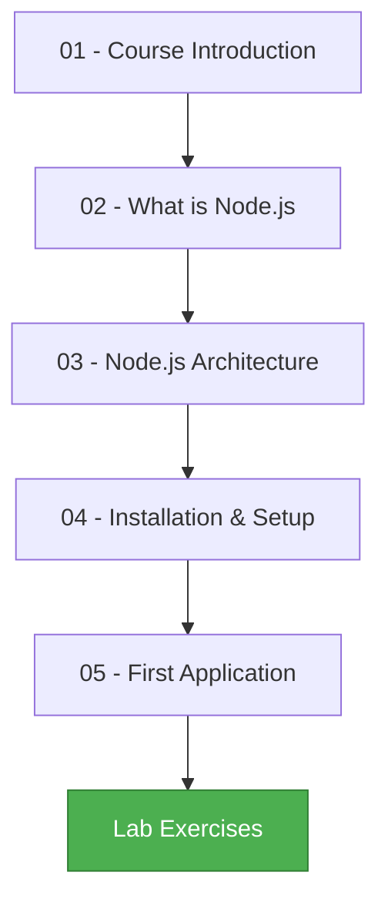

# 📘 Chapter 1: Introduction and Installation

<div style="background: linear-gradient(135deg, #667eea 0%, #764ba2 100%); padding: 30px; border-radius: 15px; color: white; text-align: center;">

## Welcome to Node.js! 🚀

Your journey into backend JavaScript development starts here!

</div>

---

## 📚 Chapter Overview

This chapter introduces you to **Node.js**, explains how it works, and guides you through setting up your development environment. By the end, you'll have created your first Node.js application!

---

## 🗂️ Chapter Contents

<div style="display: grid; grid-template-columns: repeat(2, 1fr); gap: 20px; margin: 20px 0;">

<div style="background-color: #e3f2fd; padding: 20px; border-radius: 10px;">

### 📄 [01 - Course Introduction](./01-course-introduction.md)

- 👨‍🏫 Meet your lecturers
- 📋 Ground rules & grading
- 🔄 Git recap
- 💬 Communication channels

</div>

<div style="background-color: #f3e5f5; padding: 20px; border-radius: 10px;">

### 📄 [02 - What is Node.js](./02-what-is-nodejs.md)

- 🟢 Understanding Node.js
- 🎯 What it's used for
- 🏢 Companies using Node.js
- ⭐ Key benefits

</div>

<div style="background-color: #fff3e0; padding: 20px; border-radius: 10px;">

### 📄 [03 - Node.js Architecture](./03-nodejs-architecture.md)

- 🕰️ History & evolution
- ⚙️ How Node.js works
- 🔄 Async vs Sync
- ✅ When to use Node.js
- ❌ When not to use it

</div>

<div style="background-color: #e8f5e9; padding: 20px; border-radius: 10px;">

### 📄 [04 - Installation & Setup](./04-installation-setup.md)

- 💻 Installing Node.js
- 🛠️ IDE setup (VS Code)
- 🔌 Essential extensions
- ⌨️ Keyboard shortcuts

</div>

<div style="background-color: #fce4ec; padding: 20px; border-radius: 10px;">

### 📄 [05 - First Application](./05-first-application.md)

- 🚀 Creating your first app
- 📝 Writing & running code
- 💡 Understanding the difference
- 🧪 Lab exercises

</div>

</div>

---

## 🎯 Learning Objectives

By completing this chapter, you will:

<div style="background-color: #f5f5f5; padding: 20px; border-radius: 10px;">

✅ **Understand** what Node.js is and why it's important  
✅ **Explain** how Node.js works (architecture & async model)  
✅ **Identify** when to use (and when not to use) Node.js  
✅ **Install** Node.js and set up your development environment  
✅ **Create** and run your first Node.js application  
✅ **Use** basic Node.js features like console.log and modules

</div>

---

## ⏱️ Estimated Time

| Activity                | Time         |
| ----------------------- | ------------ |
| 📖 Reading              | 45 minutes   |
| 💻 Setup & Installation | 30 minutes   |
| 🧪 Lab Exercises        | 45 minutes   |
| **Total**               | **~2 hours** |

---

## 🛠️ Prerequisites

<div style="background-color: #fff3e0; padding: 20px; border-radius: 10px; border-left: 5px solid #ff9800;">

### Before Starting This Chapter

✅ Basic understanding of **JavaScript**  
✅ Familiarity with the **command line/terminal**  
✅ Basic knowledge of **Git** (init, add, commit, push)  
✅ Text editor installed (VS Code recommended)

**New to JavaScript?** Review your web development course materials first!

</div>

---

## 📖 Reading Order

Follow the materials in this order for the best learning experience:



---

## 🧪 Lab Exercises

<div style="background: linear-gradient(135deg, #f093fb 0%, #f5576c 100%); padding: 25px; border-radius: 15px; color: white;">

### Hands-On Practice

The chapter includes practical exercises:

1. **Basic Application** - Create and run app.js
2. **Group Assignment** - Calculate student groups from birth dates
3. **User Input** - Make the program interactive
4. **Switch Statements** - Add quotes based on group number

📦 **Get Started:** Download from GitHub Classroom (link on Toledo)

</div>

---

## 💡 Key Concepts

<table style="width: 100%; border-collapse: collapse;">
<tr style="background-color: #e8f5e9;">
<th style="padding: 15px;">Concept</th>
<th style="padding: 15px;">Description</th>
</tr>
<tr>
<td style="padding: 15px;"><strong>Node.js</strong></td>
<td style="padding: 15px;">A JavaScript runtime built on Chrome's V8 engine</td>
</tr>
<tr style="background-color: #f5f5f5;">
<td style="padding: 15px;"><strong>Asynchronous</strong></td>
<td style="padding: 15px;">Non-blocking I/O that allows handling multiple operations simultaneously</td>
</tr>
<tr>
<td style="padding: 15px;"><strong>Event Loop</strong></td>
<td style="padding: 15px;">Single thread that manages all asynchronous operations</td>
</tr>
<tr style="background-color: #f5f5f5;">
<td style="padding: 15px;"><strong>V8 Engine</strong></td>
<td style="padding: 15px;">Google's JavaScript engine that compiles JS to machine code</td>
</tr>
<tr>
<td style="padding: 15px;"><strong>npm</strong></td>
<td style="padding: 15px;">Node Package Manager - installs and manages packages</td>
</tr>
</table>

---

## 🎓 Assessment

<div style="background-color: #e3f2fd; padding: 20px; border-radius: 10px;">

### Self-Check Questions

After completing this chapter, you should be able to answer:

1. What is Node.js and what makes it different from browser JavaScript?
2. Explain the difference between synchronous and asynchronous programming
3. What types of applications is Node.js good for?
4. What types of applications should you avoid building with Node.js?
5. How do you run a JavaScript file with Node.js?
6. What is the difference between `window` and `global` objects?

</div>

---

## 🔗 Additional Resources

<div style="background-color: #f5f5f5; padding: 20px; border-radius: 10px;">

### Want to Learn More?

- 📖 [Official Node.js Documentation](https://nodejs.org/docs/)
- 🎥 [Node.js Tutorial for Beginners - YouTube](https://www.youtube.com)
- 📚 [MDN Web Docs - JavaScript](https://developer.mozilla.org/en-US/docs/Web/JavaScript)
- 💬 [Node.js Community on Discord](https://discord.com/invite/nodejs)
- 📰 [Node.js Blog](https://nodejs.org/en/blog/)

### Tools & Extensions

- 🔧 [VS Code Node.js Extension Pack](https://marketplace.visualstudio.com/)
- 🎨 [Prettier - Code Formatter](https://prettier.io/)
- 🔍 [ESLint - JavaScript Linter](https://eslint.org/)

</div>

---

## ❓ Getting Help

<div style="background-color: #fff3e0; padding: 20px; border-radius: 10px; border-left: 5px solid #ff9800;">

### Stuck? Need Help?

1. **📚 Review the materials** - Read the relevant section again
2. **🔍 Search the forum** - Someone might have had the same question
3. **💬 Ask on Toledo Forum** - Post your question with details
4. **👥 Study group** - Discuss with classmates
5. **📧 Email lecturers** - For private matters only

**When asking for help, include:**

- What you're trying to do
- What you expected to happen
- What actually happened
- Error messages (if any)
- Code you've tried

</div>

---

## ✅ Completion Checklist

Before moving to Chapter 2, make sure you've:

- [ ] Read all 5 sections of this chapter
- [ ] Successfully installed Node.js
- [ ] Set up VS Code (or your chosen IDE)
- [ ] Created and ran your first Node.js application
- [ ] Completed the basic lab exercise
- [ ] (Optional) Completed Extra 1 and Extra 2
- [ ] Pushed your lab code to GitHub
- [ ] Understand the core concepts listed above

---

## 🎯 What's Next?

<div style="background: linear-gradient(135deg, #11998e 0%, #38ef7d 100%); padding: 30px; border-radius: 15px; color: white; text-align: center;">

### Chapter 2: Node Modules & npm

Learn how to:

- Work with built-in Node.js modules
- Create your own modules
- Use npm to install packages
- Manage project dependencies

**Ready?** Let's keep going! 🚀

</div>

---

## 📝 Notes

<div style="background-color: #f5f5f5; padding: 20px; border-radius: 10px;">

Use this space for your own notes and observations:

```
Your notes here...
```

</div>

---

<div style="text-align: center; padding: 20px; color: #666;">

**Node.js Course** | Chapter 1  
VIVES University of Applied Sciences  
Dirk Hostens & Milan Dima

---

[🏠 Course Home](../README.md) | [Next: Chapter 2 ▶️](../02-Node-Module-System/README.md)

</div>
