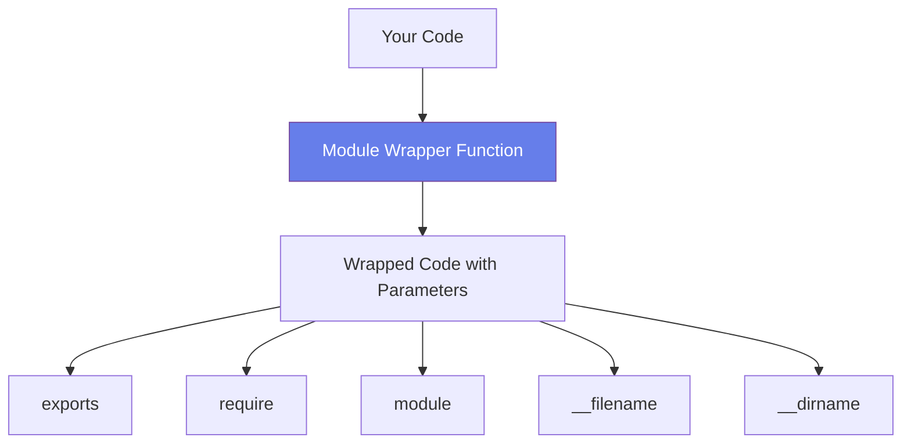

# 📦 The Module System

## 🎯 Understanding Modules

<div style="background: linear-gradient(135deg, #667eea 0%, #764ba2 100%); padding: 30px; border-radius: 15px; color: white; text-align: center;">

### Modularity = Small Building Blocks

Functions and objects encapsulated in separate files

</div>

---

## 📚 What is a Module?

<div style="background-color: #e3f2fd; padding: 25px; border-radius: 10px;">

### Key Concepts

In a Node.js application:
- **Each separate file** is a module
- **Variables** declared in a file have the scope of **that file only**
- In OOP terms: ≈ **private** (not accessible outside the module)
- Variables/functions can be **exported** to make them public
- Every Node app has at least **one main module**

</div>

---

## 🔍 The `module` Object

<div style="background-color: #f5f5f5; padding: 25px; border-radius: 10px;">

### Inspecting the Module Object

The `module` object is **NOT global**! It's specific to each file.

**Create `test.js`:**

```javascript
console.log(module);
```

**Run it:**

```bash
milan@first-app〽 node test.js
```

**Output:**

```javascript
Module {
  id: '.',
  path: '/Users/milan/Dev/first-app',
  exports: {},
  filename: '/Users/milan/Dev/first-app/test.js',
  loaded: false,
  children: [],
  paths: [
    '/Users/milan/Dev/first-app/node_modules',
    '/Users/milan/Dev/node_modules',
    '/Users/milan/node_modules',
    '/Users/node_modules',
    '/node_modules'
  ]
}
```

</div>

---

## 🔑 Module Properties Explained

<table style="width: 100%; border-collapse: collapse;">
<tr style="background-color: #e3f2fd;">
<th style="padding: 15px;">Property</th>
<th style="padding: 15px;">Description</th>
</tr>
<tr>
<td style="padding: 15px;"><code>id</code></td>
<td style="padding: 15px;">Identifier for the module ('.' for main module)</td>
</tr>
<tr style="background-color: #f5f5f5;">
<td style="padding: 15px;"><code>path</code></td>
<td style="padding: 15px;">Directory path of the module</td>
</tr>
<tr>
<td style="padding: 15px;"><code>exports</code></td>
<td style="padding: 15px;">Object containing exported values (initially empty)</td>
</tr>
<tr style="background-color: #f5f5f5;">
<td style="padding: 15px;"><code>filename</code></td>
<td style="padding: 15px;">Full path to the module file</td>
</tr>
<tr>
<td style="padding: 15px;"><code>loaded</code></td>
<td style="padding: 15px;">Whether the module has finished loading</td>
</tr>
<tr style="background-color: #f5f5f5;">
<td style="padding: 15px;"><code>children</code></td>
<td style="padding: 15px;">Array of modules required by this module</td>
</tr>
<tr>
<td style="padding: 15px;"><code>paths</code></td>
<td style="padding: 15px;">Paths where Node looks for modules</td>
</tr>
</table>

---

## ❌ Module is NOT Global

<div style="background-color: #ffebee; padding: 25px; border-radius: 10px; border-left: 5px solid #f44336;">

### Try This

```javascript
console.log(global.module);
```

**Result:**

```bash
milan@first-app〽 node test.js
undefined
milan@first-app〽
```

### Why?

`module` is **not a global object**! It's scoped to each module file.

</div>

---

## 🔄 How Node Keeps Scope Private

<div style="background-color: #fff3e0; padding: 25px; border-radius: 10px;">

### The Module Wrapper Function

At runtime, your code is wrapped in a function:

```javascript
(function(exports, require, module, __filename, __dirname) {
    // Your code here
    var message = 'test';
    console.log(message);
})
```

This is called an **IIFE** (Immediately Invoked Function Expression)

### What This Means

The following are **NOT global**, but **local to each module**:
- ✅ `exports`
- ✅ `require`
- ✅ `module`
- ✅ `__filename`
- ✅ `__dirname`

</div>

---

## 📍 Special Module Variables

<div style="background-color: #e8f5e9; padding: 25px; border-radius: 10px;">

### `__filename` and `__dirname`

These special variables are available in every module:

```javascript
console.log(__filename);
console.log(__dirname);
```

**Output:**

```bash
/Users/milan/Dev/first-app/test.js
/Users/milan/Dev/first-app
```

### Usage

- `__filename` - Full path to the current file
- `__dirname` - Directory path containing the current file

Great for working with paths relative to your module!

</div>

---

## 🎨 Visualizing the Module Wrapper



---

## 🔑 Key Insights

<div style="background-color: #f5f5f5; padding: 20px; border-radius: 10px;">

### Understanding the Wrapper

1. **Why variables are private**: They're inside a function scope
2. **Why `require` works**: It's passed as a parameter
3. **Why `module.exports` works**: `module` is a parameter
4. **Why `__dirname` exists**: It's passed by Node.js

### The Benefits

✅ **Encapsulation** - Variables don't leak to global scope  
✅ **No conflicts** - Each module has its own scope  
✅ **Clean code** - Explicit imports and exports  
✅ **Maintainability** - Easy to understand dependencies

</div>

---

## 💡 Module Best Practices

<div style="background-color: #e3f2fd; padding: 20px; border-radius: 10px;">

### DO ✅

- Keep modules focused on a single responsibility
- Use descriptive module names
- Export only what's necessary
- Document what your module does

### DON'T ❌

- Create huge monolithic modules
- Export too many things
- Mix unrelated functionality
- Forget to document exports

</div>

---

## 🧪 Try It Yourself

<div style="background-color: #fff3e0; padding: 25px; border-radius: 10px; border-left: 5px solid #ff9800;">

### Exercise

Create a file and experiment with the module object:

```javascript
// test.js
console.log('Module ID:', module.id);
console.log('Module filename:', __filename);
console.log('Module dirname:', __dirname);
console.log('Module exports:', module.exports);
```

**Questions to explore:**
1. What is the `id` of your main module?
2. Where does Node.js look for modules (check `paths`)?
3. What's in `module.exports` before you add anything?

</div>

---

## 🔜 What's Next?

Now that you understand **what** modules are and **how** they work internally, let's learn how to **create and use** your own modules!

---

<div style="text-align: center; padding: 20px; color: #666;">

[🏠 Course Home](../README.md) | [📘 Chapter 2 Home](./README.md)

[← Previous: Global Objects](./01-global-objects.md) | [Next: Creating Modules →](./03-creating-modules.md)

</div>
