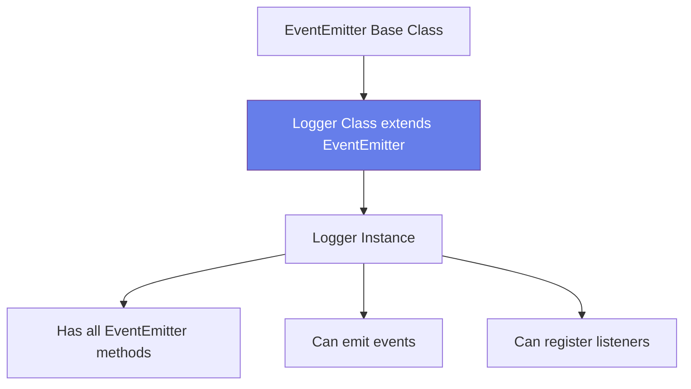

# ⚡ Events & EventEmitter

## 🎯 Understanding Events

<div style="background: linear-gradient(135deg, #667eea 0%, #764ba2 100%); padding: 30px; border-radius: 15px; color: white; text-align: center;">

### Core Concept in Node.js

Events signal that something happened in your application

</div>

---

## 🔔 What is an Event?

<div style="background-color: #e3f2fd; padding: 25px; border-radius: 10px;">

An **event** is a signal that something happened in your application.

### Examples

- 🌐 Web server received a request
- 📁 File finished reading
- ⏰ Timer completed
- 🔌 Connection established

### Response

We need to **listen** for events and **react** accordingly!

</div>

---

## 📚 Events Module

<div style="background-color: #f5f5f5; padding: 25px; border-radius: 10px;">

### EventEmitter Class

```javascript
const EventEmitter = require('events');
```

**Convention:** Capital letters = Class

A class has:
- Properties (data)
- Methods (functions)

</div>

> 📖 [Events Module Docs](https://nodejs.org/dist/latest/docs/api/events.html)

---

## 🎬 Creating an EventEmitter

<div style="background-color: #e8f5e9; padding: 25px; border-radius: 10px;">

### Basic Usage

```javascript
const EventEmitter = require('events');
const emitter = new EventEmitter();  // Create object

// Register a listener
emitter.on('messageLogged', function() {
    console.log('Listener called');
});

// Emit (raise) an event
emitter.emit('messageLogged');
```

**Output:**

```bash
Listener called
```

</div>

---

## ⚠️ Order Matters!

<div style="background-color: #fff3e0; padding: 25px; border-radius: 10px; border-left: 5px solid #ff9800;">

### Listener MUST Be Registered First

```javascript
// ❌ WRONG: Emitting before registering listener
emitter.emit('messageLogged');

emitter.on('messageLogged', function() {
    console.log('Listener called');
});
// Nothing happens!
```

```javascript
// ✅ CORRECT: Register listener first
emitter.on('messageLogged', function() {
    console.log('Listener called');
});

emitter.emit('messageLogged');
// Listener called
```

</div>

---

## 📦 Event Arguments

<div style="background-color: #e3f2fd; padding: 25px; border-radius: 10px;">

### Sending Data with Events

Sometimes you need to send data along with the event (like ID, URL, etc.)

```javascript
const EventEmitter = require('events');
const emitter = new EventEmitter();

// Listener receives the argument
emitter.on('messageLogged', function(arg) {
    console.log('Listener called', arg);
});

// Emit with data (object recommended for multiple values)
emitter.emit('messageLogged', { id: 1, url: 'http://...' });
```

**Output:**

```bash
milan@les2〽 node eventargvb.js
Listener called { id: 1, url: 'http://...' }
milan@les2〽
```

### Best Practice

Use an **object** for multiple values instead of separate parameters.

</div>

---

## 🏗️ Extending EventEmitter

<div style="background-color: #f3e5f5; padding: 25px; border-radius: 10px;">

### Real-World Pattern

Let's build a Logger class that emits events.

**Problem:** Two separate EventEmitter instances don't communicate!

```javascript
// app.js
const EventEmitter = require('events');
const emitter = new EventEmitter();

emitter.on('messageLogged', (arg) => {
    console.log('Listener called', arg);
});

const log = require('./logger');
log('message'); // Only shows 'message', no event!
```

```javascript
// logger.js
const EventEmitter = require('events');
const emitter = new EventEmitter();  // Different instance!

function log(message) {
    console.log(message);
    emitter.emit('messageLogged', {id: 1, url: 'http//...'});
}

module.exports = log;
```

**Problem:** The emitters in `app.js` and `logger.js` are different objects!

</div>

---

## ✅ Solution: Create a Custom Class

<div style="background-color: #e8f5e9; padding: 25px; border-radius: 10px; border-left: 5px solid #4caf50;">

### Using ES6 Classes

**logger.js:**

```javascript
const EventEmitter = require('events');

// ES6 Class (PascalCase naming convention)
class Logger extends EventEmitter {
    log(message) {
        // Send HTTP request
        console.log(message);
        
        // Raise event (use 'this' to refer to current instance)
        this.emit('messageLogged', {id: 1, url: 'http://...'});
    }
}

module.exports = Logger;
```

**app.js:**

```javascript
const Logger = require('./logger');
const logger = new Logger();

// Register listener
logger.on('messageLogged', (arg) => {
    console.log('Listener called', arg);
});

// Call the method
logger.log('message');
```

**Output:**

```bash
milan@les2〽 node app.js
message
Listener called { id: 1, url: 'http//...' }
milan@les2〽
```

</div>

---

## 🎨 How It Works



---

## 🔑 Key Concepts

<div style="background-color: #f5f5f5; padding: 20px; border-radius: 10px;">

### Understanding the Pattern

| Concept | Explanation |
|---------|-------------|
| **EventEmitter** | Base class for event handling |
| **extends** | Inherits all functionality from EventEmitter |
| **emit()** | Raises (triggers) an event |
| **on()** | Registers a listener (event handler) |
| **this** | Refers to the current instance |

</div>

---

## 💡 Best Practices

<div style="background-color: #e3f2fd; padding: 20px; border-radius: 10px;">

### DO ✅

- Use PascalCase for class names (Logger, not logger)
- Extend EventEmitter for event-driven classes
- Register listeners before emitting events
- Use objects for event data with multiple properties
- Use arrow functions `() =>` for concise listeners

### DON'T ❌

- Don't create separate EventEmitter instances
- Don't emit events before registering listeners
- Don't use too many arguments (use an object instead)
- Don't forget `this` when emitting from a class

</div>

---

## 🧪 Practice Exercise

<div style="background: linear-gradient(135deg, #f093fb 0%, #f5576c 100%); padding: 25px; border-radius: 15px; color: white;">

### Build a Ticket System

Create a `TicketSystem` class that:
1. Extends EventEmitter
2. Has a `newTicket(customer, issue)` method
3. Emits a 'ticketCreated' event with ticket data
4. Listens for the event in your main app
5. Logs ticket information when event fires

</div>

---

<div style="text-align: center; padding: 20px; color: #666;">

[🏠 Course Home](../README.md) | [📘 Chapter 2 Home](./README.md)

[← Previous: Built-in Modules](./04-builtin-modules.md) | [Next: HTTP Module →](./06-http-module.md)

</div>
