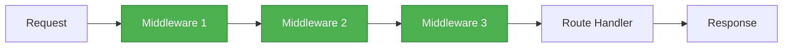

# 🔌 Middleware Basics

## 🎯 Understanding Middleware

<div style="background: linear-gradient(135deg, #667eea 0%, #764ba2 100%); padding: 30px; border-radius: 15px; color: white; text-align: center;">

### Request Processing Pipeline

Functions that execute during the request-response cycle

</div>

---

## 📖 What is Middleware?

<div style="background-color: #e3f2fd; padding: 25px; border-radius: 10px;">

### Definition

**Middleware** functions are functions that have access to:
- The **request object** (req)
- The **response object** (res)
- The **next** middleware function in the cycle

### Basic Middleware Function

```javascript
app.use((req, res, next) => {
    console.log('Processing request...');
    next(); // Pass control to next middleware
});
```

### Without next()

```javascript
app.use((req, res, next) => {
    res.send('Request ended here');
    // No next() - pipeline stops
});
```

</div>

---

## 🔄 The Request Pipeline

<div style="background-color: #f5f5f5; padding: 25px; border-radius: 10px;">

### How It Works



Each middleware can:
1. Execute any code
2. Make changes to req/res objects
3. End the request-response cycle
4. Call the next middleware function

</div>

---

## 🏗️ Creating Custom Middleware

<div style="background-color: #fff3e0; padding: 25px; border-radius: 10px;">

### Example: Logger Middleware

**Create `logger.js`:**

```javascript
function log(req, res, next) {
    console.log('Logging...');
    next(); // IMPORTANT: Pass to next middleware
}

module.exports = log;
```

**Use in `index.js`:**

```javascript
const express = require('express');
const logger = require('./logger');
const app = express();

app.use(logger); // Apply to all routes

app.get('/', (req, res) => {
    res.send('Hello World');
});
```

**Output when visiting `/`:**
```
Logging...
```

</div>

---

## ⚠️ Common Middleware Mistakes

<div style="background-color: #ffebee; padding: 25px; border-radius: 10px; border-left: 5px solid #f44336;">

### Forgetting next()

```javascript
// ❌ BAD: Forgot next()
app.use((req, res, next) => {
    console.log('Logging...');
    // Request hangs!
});
```

### Calling next() After Sending Response

```javascript
// ❌ BAD: Can't send response after next()
app.use((req, res, next) => {
    res.send('Done');
    next(); // Error! Response already sent
});
```

### ✅ Correct Pattern

```javascript
// Choose one: either send response OR call next()
app.use((req, res, next) => {
    console.log('Logging...');
    next(); // Continue to next middleware
});
```

</div>

---

## 🎯 Types of Middleware

<div style="background-color: #e8f5e9; padding: 25px; border-radius: 10px;">

### 1. Application-Level Middleware

Applied to the app instance:

```javascript
app.use((req, res, next) => {
    console.log('Time:', Date.now());
    next();
});
```

### 2. Router-Level Middleware

Applied to router instance:

```javascript
const router = express.Router();

router.use((req, res, next) => {
    console.log('Router middleware');
    next();
});
```

### 3. Error-Handling Middleware

Has 4 parameters:

```javascript
app.use((err, req, res, next) => {
    console.error(err.stack);
    res.status(500).send('Something broke!');
});
```

</div>

---

## 📍 Middleware Order Matters!

<div style="background-color: #e3f2fd; padding: 25px; border-radius: 10px;">

### Example

```javascript
const express = require('express');
const app = express();

// Middleware 1
app.use((req, res, next) => {
    console.log('First');
    next();
});

// Middleware 2
app.use((req, res, next) => {
    console.log('Second');
    next();
});

// Route
app.get('/', (req, res) => {
    console.log('Route handler');
    res.send('Hello');
});
```

**Output:**
```
First
Second
Route handler
```

⚠️ Middleware is executed in the order it's defined!

</div>

---

## 🛣️ Route-Specific Middleware

<div style="background-color: #f5f5f5; padding: 25px; border-radius: 10px;">

### Apply to Specific Routes

```javascript
function authenticate(req, res, next) {
    console.log('Authenticating...');
    next();
}

// Only for /admin routes
app.get('/admin', authenticate, (req, res) => {
    res.send('Admin Page');
});

// Public route (no authentication)
app.get('/', (req, res) => {
    res.send('Public Page');
});
```

### Multiple Middleware for One Route

```javascript
const auth = (req, res, next) => { next(); };
const log = (req, res, next) => { next(); };

app.get('/profile', [auth, log], (req, res) => {
    res.send('Profile');
});
```

</div>

---

## 💡 Best Practices

<div style="background-color: #e8f5e9; padding: 20px; border-radius: 10px; border-left: 5px solid #4caf50;">

### Middleware Guidelines

✅ **DO:** Always call `next()` unless ending the response  
✅ **DO:** Order middleware properly  
✅ **DO:** Keep middleware functions focused  
✅ **DO:** Create reusable middleware  
✅ **DO:** Handle errors in error middleware

❌ **DON'T:** Forget to call next()  
❌ **DON'T:** Send response after calling next()  
❌ **DON'T:** Put slow operations in middleware  
❌ **DON'T:** Modify req/res unnecessarily

</div>

---

## 🎯 Key Takeaways

<div style="background-color: #f5f5f5; padding: 20px; border-radius: 10px;">

### Middleware Essentials

- Middleware functions process requests in a **pipeline**
- Each middleware has access to **req**, **res**, and **next**
- Must call **next()** to pass control to next middleware
- Order of middleware **matters**
- Can be applied **globally** or to **specific routes**
- Express has **built-in**, **third-party**, and **custom** middleware

</div>

---

<div style="text-align: center; padding: 20px; color: #666;">

[🏠 Course Home](../README.md) | [📘 Chapter 5 Home](./README.md)

[← Previous: Chapter 5 Intro](./README.md) | [Next: Built-in Middleware →](./02-builtin-middleware.md)

</div>
