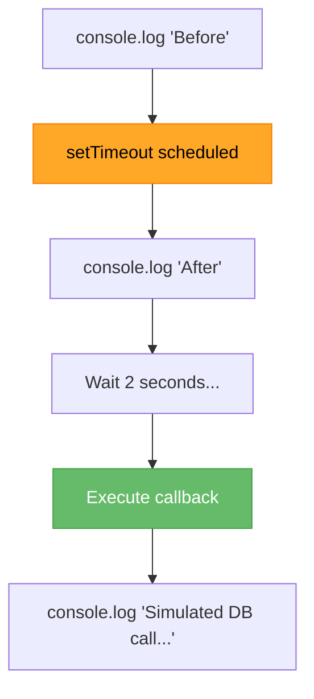

# ⏱️ Synchronous vs Asynchronous

## 🎯 Understanding Async Programming

<div style="background: linear-gradient(135deg, #667eea 0%, #764ba2 100%); padding: 30px; border-radius: 15px; color: white; text-align: center;">

### Blocking vs Non-Blocking Code

The foundation of Node.js performance

</div>

---

## 📖 Synchronous Code

<div style="background-color: #e3f2fd; padding: 25px; border-radius: 10px;">

### Blocking Execution

**Synchronous** = Code executes line by line, waiting for each operation to complete.

```javascript
console.log('First');
console.log('Second');
console.log('Third');
```

**Output:**
```
First
Second
Third
```

✅ Predictable order  
❌ Blocks execution

</div>

---

## ⚡ Asynchronous Code

<div style="background-color: #f5f5f5; padding: 25px; border-radius: 10px;">

### Non-Blocking Execution

**Asynchronous** = Code doesn't wait for operations to complete.

### Example with setTimeout()

```javascript
console.log('Before');

setTimeout(() => {
    console.log('Simulated DB call...');
}, 2000);

console.log('After');
```

**What's the output?**

</div>

---

## 🤔 Guess the Output

<div style="background-color: #fff3e0; padding: 25px; border-radius: 10px;">

### Will it be?

```
Before
Simulated DB call...
After
```

### ❌ NO! Actual output:

```bash
milan@async-test〽 node index.js
Before
After
Simulated DB call...
```

The setTimeout doesn't block!

</div>

---

## 🔍 Analyzing setTimeout()

<div style="background-color: #e8f5e9; padding: 25px; border-radius: 10px;">

### Function Breakdown

```javascript
setTimeout(
    () => { console.log('Simulated DB call...'); },
    2000
);
```

**Two arguments:**

1. **Callback function** - Code to execute later
   ```javascript
   () => { console.log('Simulated DB call...'); }
   ```

2. **Delay in milliseconds** - 2000 ms = 2 seconds
   ```javascript
   2000
   ```

### What setTimeout Does

Schedules a function to be executed **after** a delay, without blocking!

</div>

---

## 🔄 How Async Works

<div style="background-color: #e3f2fd; padding: 25px; border-radius: 10px;">

### Execution Flow



**Key Point:** The program doesn't wait for setTimeout!

</div>

---

## 🎯 Real-World Example

<div style="background-color: #f5f5f5; padding: 25px; border-radius: 10px;">

### Why Async Matters

**Synchronous (Blocking):**
```javascript
const data = readFromDatabase();  // Takes 2 seconds - BLOCKS!
console.log(data);
// Nothing else can run during these 2 seconds
```

**Asynchronous (Non-Blocking):**
```javascript
readFromDatabase((data) => {
    console.log(data);  // Runs when ready
});
// Other code continues immediately
console.log('Other work...');
```

### Benefits

✅ Better performance  
✅ Handle multiple operations  
✅ Responsive applications  
✅ Efficient resource usage

</div>

---

## 📊 Sync vs Async Comparison

<table style="width: 100%; border-collapse: collapse;">
<tr style="background-color: #e8f5e9;">
<th style="padding: 15px;">Aspect</th>
<th style="padding: 15px;">Synchronous</th>
<th style="padding: 15px;">Asynchronous</th>
</tr>
<tr>
<td style="padding: 15px;"><strong>Execution</strong></td>
<td style="padding: 15px;">Sequential</td>
<td style="padding: 15px;">Concurrent</td>
</tr>
<tr style="background-color: #f5f5f5;">
<td style="padding: 15px;"><strong>Blocking</strong></td>
<td style="padding: 15px;">Yes</td>
<td style="padding: 15px;">No</td>
</tr>
<tr>
<td style="padding: 15px;"><strong>Performance</strong></td>
<td style="padding: 15px;">Slower</td>
<td style="padding: 15px;">Faster</td>
</tr>
<tr style="background-color: #f5f5f5;">
<td style="padding: 15px;"><strong>Complexity</strong></td>
<td style="padding: 15px;">Simple</td>
<td style="padding: 15px;">More complex</td>
</tr>
<tr>
<td style="padding: 15px;"><strong>Use Case</strong></td>
<td style="padding: 15px;">Quick operations</td>
<td style="padding: 15px;">I/O, API calls, timers</td>
</tr>
</table>

---

## 🚀 Node.js is Asynchronous

<div style="background-color: #fff3e0; padding: 25px; border-radius: 10px; border-left: 5px solid #ff9800;">

### Why Node.js Uses Async

Node.js is built for I/O-heavy operations:
- Database queries
- File system operations
- HTTP requests
- Network operations

### Single-Threaded Event Loop

Node.js uses a single thread but handles multiple operations through:
- **Event Loop** - Manages async operations
- **Non-blocking I/O** - Doesn't wait for operations
- **Callbacks/Promises** - Handle results when ready

This makes Node.js **extremely efficient** for web servers!

</div>

---

## 💡 Best Practices

<div style="background-color: #e8f5e9; padding: 20px; border-radius: 10px; border-left: 5px solid #4caf50;">

### When to Use Async

✅ **DO use async for:**
- Database operations
- API calls
- File I/O
- Network requests
- Timers

❌ **DON'T use async for:**
- Simple calculations
- Variable assignments
- Array operations (unless huge datasets)

</div>

---

## 🎯 Key Takeaways

<div style="background-color: #e3f2fd; padding: 20px; border-radius: 10px;">

### Remember

- **Synchronous** = Blocking, waits for completion
- **Asynchronous** = Non-blocking, continues execution
- **setTimeout()** schedules code to run later
- Async code doesn't execute in written order
- Node.js is built for asynchronous operations
- Async makes applications **fast and responsive**

</div>

---

<div style="text-align: center; padding: 20px; color: #666;">

[🏠 Course Home](../README.md) | [📘 Chapter 6 Home](./README.md)

[← Previous: Chapter 6 Intro](./README.md) | [Next: Callbacks →](./02-callbacks.md)

</div>
