# 🎁 Promises

## 🎯 Modern Async Solution

<div style="background: linear-gradient(135deg, #667eea 0%, #764ba2 100%); padding: 30px; border-radius: 15px; color: white; text-align: center;">

### Promise Objects

The better way to handle async operations

</div>

---

## 📖 What is a Promise?

<div style="background-color: #e3f2fd; padding: 25px; border-radius: 10px;">

### Definition

A **Promise** is an object representing the eventual completion (or failure) of an asynchronous operation and its resulting value.

### Promise States

A Promise can be in one of three states:

1. **Pending** ⏳ - Initial state, operation not yet complete
2. **Fulfilled** ✅ - Operation completed successfully
3. **Rejected** ❌ - Operation failed with an error

### Advantages

✅ Better than callbacks for async code  
✅ Chainable with `.then()`  
✅ Error handling with `.catch()`  
✅ Avoids callback hell

</div>

---

## 🏗️ Creating a Promise

<div style="background-color: #f5f5f5; padding: 25px; border-radius: 10px;">

### Basic Promise Structure

```javascript
const p = new Promise((resolve, reject) => {
    // Async code here
});
```

**Two parameters:**
- `resolve` - Function to call on success
- `reject` - Function to call on failure

### Example: Success

```javascript
const p = new Promise((resolve, reject) => {
    // Async work
    resolve(1);  // Success!
});
```

### Example: Failure

```javascript
const p = new Promise((resolve, reject) => {
    reject(new Error('Something went wrong'));
});
```

⚠️ **Best practice:** Use `Error` object, not string

</div>

---

## 📥 Consuming a Promise

<div style="background-color: #fff3e0; padding: 25px; border-radius: 10px;">

### Using .then() and .catch()

```javascript
const p = new Promise((resolve, reject) => {
    resolve(1);
});

p.then(result => console.log('Result', result));
```

**Output:**
```
Result 1
```

### With setTimeout (More Realistic)

```javascript
const p = new Promise((resolve, reject) => {
    setTimeout(() => {
        resolve(1);
    }, 2000);
});

p.then(result => console.log('Result', result));
```

**Output (after 2 seconds):**
```
Result 1
```

</div>

---

## ❌ Handling Errors

<div style="background-color: #ffebee; padding: 25px; border-radius: 10px; border-left: 5px solid #f44336;">

### Using reject() and .catch()

```javascript
const p = new Promise((resolve, reject) => {
    setTimeout(() => {
        reject(new Error('message'));
    }, 2000);
});

p
    .then(result => console.log('Result', result))
    .catch(err => console.log('Error', err.message));
```

**Output:**
```
Error message
```

### Error Object Properties

```javascript
err.message  // "message"
err.stack    // Stack trace
```

</div>

---

## 🔄 Promise Lifecycle

<div style="background-color: #e8f5e9; padding: 25px; border-radius: 10px;">

### State Transitions

```mermaid
graph LR
    A[Pending ⏳] --> B[Fulfilled ✅]
    A --> C[Rejected ❌]
    B --> D[resolve result]
    C --> E[reject error]
    style A fill:#ffd54f,stroke:#fbc02d,color:#000
    style B fill:#81c784,stroke:#66bb6a,color:#fff
    style C fill:#e57373,stroke:#f44336,color:#fff
```



**Important:**
- Starts as **Pending**
- Either becomes **Fulfilled** or **Rejected**
- Once settled, state cannot change
- You write the logic for resolve/reject

</div>

---

## 🔄 Converting Callbacks to Promises

<div style="background-color: #e3f2fd; padding: 25px; border-radius: 10px;">

### Before (Callback)

```javascript
function getUser(id, callback) {
    setTimeout(() => {
        console.log('Reading a user from database...');
        callback({ id: id, gitHubUsername: 'MilanVives' });
    }, 2000);
}
```

### After (Promise)

```javascript
function getUser(id) {
    return new Promise((resolve, reject) => {
        setTimeout(() => {
            console.log('Reading a user from database...');
            resolve({ id: id, gitHubUsername: 'MilanVives' });
        }, 2000);
    });
}
```

**Key Change:** Return a Promise instead of calling callback!

</div>

---

## 🔗 Chaining Promises

<div style="background-color: #f5f5f5; padding: 25px; border-radius: 10px;">

### From Callback Hell to Promise Chain

**Callback Hell:**
```javascript
getUser(1, function(user) {
    getRepositories(user.gitHubUsername, (repos) => {
        getCommits(repos[0], (commits) => {
            console.log('Repos', repos);
        });
    });
});
```

**Promise Chain:**
```javascript
getUser(1)
    .then(user => getRepositories(user.gitHubUsername))
    .then(repos => getCommits(repos[0]))
    .then(commits => console.log('Commits', commits))
    .catch(err => console.log('Error', err.message));
```

✅ Flat structure  
✅ Much more readable  
✅ Single `.catch()` handles all errors

</div>

---

## 📝 Complete Promise Example

<div style="background-color: #fff3e0; padding: 25px; border-radius: 10px;">

### Full Code

```javascript
console.log('Before');

getUser(1)
    .then(user => getRepositories(user.gitHubUsername))
    .then(repos => getCommits(repos[0]))
    .then(commits => console.log('Commits', commits))
    .catch(err => console.log('Error', err.message));

console.log('After');

function getUser(id) {
    return new Promise((resolve, reject) => {
        setTimeout(() => {
            console.log('Reading a user from database...');
            resolve({ id: id, gitHubUsername: 'MilanVives' });
        }, 2000);
    });
}

function getRepositories(username) {
    return new Promise((resolve, reject) => {
        setTimeout(() => {
            console.log('Calling Github API...');
            resolve(['repo1', 'repo2', 'repo3']);
        }, 2000);
    });
}

function getCommits(repo) {
    return new Promise((resolve, reject) => {
        setTimeout(() => {
            console.log('Getting commits...');
            resolve(['commit1', 'commit2', 'commit3']);
        }, 2000);
    });
}
```

</div>

---

## ⚡ Parallel Promises with Promise.all()

<div style="background-color: #e8f5e9; padding: 25px; border-radius: 10px;">

### Running Promises Concurrently

```javascript
const p1 = new Promise((resolve) => {
    setTimeout(() => {
        console.log('Async operation 1...');
        resolve(1);
    }, 2000);
});

const p2 = new Promise((resolve) => {
    setTimeout(() => {
        console.log('Async operation 2...');
        resolve(2);
    }, 2000);
});

Promise.all([p1, p2])
    .then(result => console.log(result));
```

**Output (both run simultaneously):**
```
Async operation 1...
Async operation 2...
[ 1, 2 ]
```

⏱️ Takes 2 seconds total, not 4!

</div>

---

## 🏁 Promise.race()

<div style="background-color: #e3f2fd; padding: 25px; border-radius: 10px;">

### First One Wins

```javascript
Promise.race([p1, p2])
    .then(result => console.log(result));
```

Returns the result of the **first** promise that completes!

### Use Cases

- Timeout implementations
- Fastest response wins
- Fallback mechanisms

</div>

---

## 🚀 Promise API Methods

<div style="background-color: #f5f5f5; padding: 25px; border-radius: 10px;">

### Quick Promise Creation

**Resolved Promise:**
```javascript
const p = Promise.resolve({ id: 1 });
p.then(result => console.log(result));
```

**Rejected Promise:**
```javascript
const p = Promise.reject(new Error('reason'));
p.catch(error => console.log(error));
```

### Useful for Testing

```javascript
// Return a promise immediately
return Promise.resolve(data);
```

</div>

---

## 🔍 Promise Syntax Example

<div style="background-color: #fff3e0; padding: 25px; border-radius: 10px;">

### Real-World Pattern

```javascript
const done = true;  // Toggle to test

const isItDoneYet = new Promise((resolve, reject) => {
    if (done) {
        const workDone = 'Here is the thing I built';
        resolve(workDone);
    } else {
        const why = 'Still working on something else';
        reject(why);
    }
});

// Consume the promise
isItDoneYet
    .then(ok => console.log(ok))
    .catch(err => console.error(err));
```

**With done = true:**
```
Here is the thing I built
```

**With done = false:**
```
Still working on something else
```

</div>

---

## 💡 Best Practices

<div style="background-color: #e8f5e9; padding: 20px; border-radius: 10px; border-left: 5px solid #4caf50;">

### Promise Guidelines

✅ **DO:**
- Use promises instead of callbacks
- Chain with `.then()` for sequential operations
- Use `Promise.all()` for parallel operations
- Always add `.catch()` for error handling
- Reject with Error objects

❌ **DON'T:**
- Nest promises (defeats the purpose!)
- Forget error handling
- Mix callbacks and promises
- Reject with strings (use Error objects)

</div>

---

## 🎯 Key Takeaways

<div style="background-color: #e3f2fd; padding: 20px; border-radius: 10px;">

### Promises Summary

- **Promise** = Object representing eventual result
- Three states: **Pending**, **Fulfilled**, **Rejected**
- Create with `new Promise((resolve, reject) => {})`
- Consume with `.then()` and `.catch()`
- Chain promises to avoid callback hell
- `Promise.all()` for parallel execution
- `Promise.race()` for first-completed
- Much better than callbacks!

**Next:** Learn async/await for even cleaner syntax!

</div>

---

<div style="text-align: center; padding: 20px; color: #666;">

[🏠 Course Home](../README.md) | [📘 Chapter 6 Home](./README.md)

[← Previous: Callbacks](./02-callbacks.md) | [Next: Async/Await →](./04-async-await.md)

</div>
