# 🛠️ Custom Validators

## Creating Custom Validation Logic

<div style="background: linear-gradient(135deg, #667eea 0%, #764ba2 100%); padding: 2rem; border-radius: 10px; color: white; margin: 1rem 0;">
  <h3>🎯 When Built-in Validators Aren't Enough</h3>
  <p>Create custom validators for complex business rules and validation logic.</p>
</div>

---

## 📝 Synchronous Custom Validators

### Basic Syntax

```javascript
tags: {
  type: Array,
  validate: {
    validator: function(v) {
      return v && v.length > 0;
    },
    message: 'A course should have at least one tag.'
  }
}
```

### 🔍 How It Works

```mermaid
graph LR
    A[Value Input] --> B{Custom Validator}
    B -->|Returns true| C[✅ Valid]
    B -->|Returns false| D[❌ Invalid]
    D --> E[Show Error Message]
    style B fill:#667eea,stroke:#764ba2,color:#fff
    style C fill:#10b981,stroke:#059669,color:#fff
    style D fill:#ef4444,stroke:#dc2626,color:#fff
```



---

## 🔄 Asynchronous Custom Validators

For validation that requires external checks (database queries, API calls):

```javascript
tags: {
  type: Array,
  validate: {
    isAsync: true,
    validator: function(v, callback) {
      // Simulate async operation
      setTimeout(() => {
        const result = v && v.length > 0;
        callback(result);
      }, 1000);
    },
    message: 'A course should have at least one tag.'
  }
}
```

<div style="background: #fef3c7; border-left: 4px solid #f59e0b; padding: 1rem; margin: 1rem 0;">
  <strong>⚠️ Important:</strong> Set <code>isAsync: true</code> and use a callback for asynchronous validators.
</div>

---

## 💼 Conditional Required Fields

Make fields required based on other field values:

```javascript
price: {
  type: Number,
  required: function() {
    return this.isPublished;
  },
  min: 10,
  max: 200
}
```

**Example Logic:**
- If `isPublished` is `true` → price is **required**
- If `isPublished` is `false` → price is **optional**

---

## 🎨 SchemaType Properties

### String Transformations

```javascript
name: {
  type: String,
  lowercase: true,    // Convert to lowercase
  uppercase: true,    // Convert to uppercase
  trim: true         // Remove spaces around
}
```

### Number Rounding

```javascript
price: {
  type: Number,
  min: 10,
  max: 200,
  get: v => Math.round(v),    // On read
  set: v => Math.round(v)     // On write/create
}
```

<div style="background: #dbeafe; border-left: 4px solid #3b82f6; padding: 1rem; margin: 1rem 0;">
  <strong>📌 Getters vs Setters:</strong>
  <ul>
    <li><strong>Setter</strong>: Called when creating/updating a document</li>
    <li><strong>Getter</strong>: Called when reading a document</li>
  </ul>
</div>

---

## 📊 Complete Example

```javascript
const courseSchema = new mongoose.Schema({
  name: {
    type: String,
    required: true,
    minlength: 5,
    maxlength: 255,
    trim: true
  },
  category: {
    type: String,
    required: true,
    enum: ['web', 'mobile', 'network'],
    lowercase: true
  },
  tags: {
    type: Array,
    validate: {
      validator: function(v) {
        return v && v.length > 0;
      },
      message: 'A course should have at least one tag.'
    }
  },
  isPublished: Boolean,
  price: {
    type: Number,
    required: function() {
      return this.isPublished;
    },
    min: 10,
    max: 200,
    get: v => Math.round(v),
    set: v => Math.round(v)
  }
});
```

---

[← Previous: Validation in Mongoose](02-validation-mongoose.md) | [🏠 Home](../README.md) | [Next: Adding Persistence →](04-adding-persistence.md)
