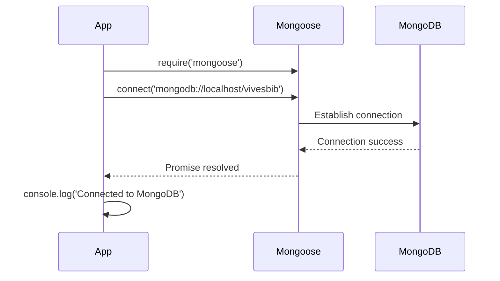

# 💾 Adding Persistence to Our API

## From In-Memory to Database Storage

<div style="background: linear-gradient(135deg, #667eea 0%, #764ba2 100%); padding: 2rem; border-radius: 10px; color: white; margin: 1rem 0;">
  <h3>🎯 Goal</h3>
  <p>Replace in-memory array storage with MongoDB persistence in the Library application</p>
</div>

---

## 🚀 Getting Started

### Prerequisites

- **Starter Code**: Available on GitHub Classroom (see Toledo Ch8-Starter)
- **Focus**: Genres route migration
- **Database**: MongoDB with Mongoose


---

## 📦 Step 1: Install Mongoose

```bash
npm install mongoose
```

<div style="background: #dbeafe; border-left: 4px solid #3b82f6; padding: 1rem; margin: 1rem 0;">
  <strong>⚠️ Important:</strong> Make sure MongoDB is running before starting your application!
</div>

---

## 🔌 Step 2: Connect to MongoDB

### In `index.js`

```javascript
const mongoose = require('mongoose');

mongoose.connect('mongodb://localhost/vivesbib')
  .then(() => console.log('Connected to MongoDB'))
  .catch(err => console.log('Could not connect to MongoDB...'));
```

### Connection Flow



---

## 🗂️ Step 3: Define Schema and Model

### In `routes/genres.js`

```javascript
const mongoose = require('mongoose');

// Define Schema
const genreSchema = new mongoose.Schema({
  name: {
    type: String,
    required: true,
    minlength: 5,
    maxlength: 50
  }
});

// Create Model
const Genre = mongoose.model('Genre', genreSchema);
```

---

## 🎨 Refactoring: Combine Schema and Model

Instead of separate declarations:

```javascript
// ❌ Verbose approach
const genreSchema = new mongoose.Schema({ /* ... */ });
const Genre = mongoose.model('Genre', genreSchema);
```

Use a combined approach:

```javascript
// ✅ Concise approach
const Genre = mongoose.model('Genre', new mongoose.Schema({
  name: {
    type: String,
    required: true,
    minlength: 5,
    maxlength: 50
  }
}));
```

---

## 🗑️ Step 4: Remove In-Memory Storage

Delete the old array:

```javascript
// ❌ Remove this
const genres = [
  { id: 1, name: 'Action' },
  { id: 2, name: 'Horror' },
  { id: 3, name: 'Romance' }
];
```

<div style="background: #f0fdf4; border-left: 4px solid #10b981; padding: 1rem; margin: 1rem 0;">
  <strong>✅ Ready!</strong> Your model is now set up for database operations.
</div>

---

## 📋 Summary

What we've accomplished:

1. ✅ Installed Mongoose
2. ✅ Connected to MongoDB
3. ✅ Defined Genre schema with validation
4. ✅ Created Genre model
5. ✅ Removed in-memory storage

**Next**: Update all CRUD endpoints to use MongoDB!

---

[← Previous: Custom Validators](03-custom-validators.md) | [🏠 Home](../README.md) | [Next: Refactoring GET Endpoints →](05-refactoring-get.md)
