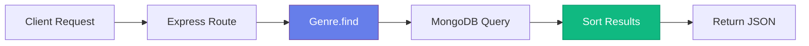

# 📥 Refactoring GET Endpoints

## Updating Read Operations for MongoDB

<div style="background: linear-gradient(135deg, #667eea 0%, #764ba2 100%); padding: 2rem; border-radius: 10px; color: white; margin: 1rem 0;">
  <h3>🎯 Goal</h3>
  <p>Convert GET endpoints from array-based to MongoDB-based queries</p>
</div>

---

## 📋 GET All Genres: `/api/genres`

### ❌ Before (In-Memory Array)

```javascript
router.get('/', (req, res) => {
  res.send(genres);
});
```

### ✅ After (MongoDB)

```javascript
router.get('/', async (req, res) => {
  const genres = await Genre.find().sort('name');
  res.send(genres);
});
```

### 🔍 Key Changes

1. **async/await** - Handle asynchronous database operations
2. **Genre.find()** - Query all documents from MongoDB
3. **sort('name')** - Return results sorted alphabetically



---

## 🔍 GET Single Genre: `/api/genres/:id`

### ❌ Before (Array Search)

```javascript
router.get('/:id', (req, res) => {
  const genre = genres.find(c => c.id === parseInt(req.params.id));
  
  if (!genre) 
    return res.status(404).send('The genre with the given ID was not found.');
  
  res.send(genre);
});
```

### ✅ After (MongoDB Query)

```javascript
router.get('/:id', async (req, res) => {
  const genre = await Genre.findById(req.params.id);
  
  if (!genre) 
    return res.status(404).send('The genre with the given ID was not found.');
  
  res.send(genre);
});
```

### 🔍 Key Changes

1. **async function** - Wait for database query
2. **Genre.findById()** - Find by MongoDB ObjectId
3. **No parseInt()** - MongoDB uses string IDs

---

## 📊 Comparison Table

| Aspect | Array Approach | MongoDB Approach |
|--------|---------------|------------------|
| **Data Source** | In-memory array | Database |
| **ID Type** | Integer | ObjectId (string) |
| **Search Method** | `find()` + condition | `findById()` |
| **Persistence** | ❌ Lost on restart | ✅ Permanent |
| **Async** | ❌ Synchronous | ✅ Asynchronous |

---

## 🎯 Query Methods Reference

```javascript
// Find all
await Genre.find();

// Find with filter
await Genre.find({ isPublished: true });

// Find one by ID
await Genre.findById(id);

// Find one by condition
await Genre.findOne({ name: 'Action' });

// Sort results
await Genre.find().sort('name');        // Ascending
await Genre.find().sort('-name');       // Descending

// Limit results
await Genre.find().limit(10);

// Chain methods
await Genre.find()
  .sort('name')
  .limit(10)
  .select('name');
```

---

<div style="background: #dbeafe; border-left: 4px solid #3b82f6; padding: 1rem; margin: 1rem 0;">
  <strong>💡 Pro Tip:</strong> Always use <code>async/await</code> with Mongoose queries for cleaner, more readable code.
</div>

<div style="background: #f0fdf4; border-left: 4px solid #10b981; padding: 1rem; margin: 1rem 0;">
  <strong>✅ Best Practice:</strong> Always check if a document exists before using it to avoid null reference errors.
</div>

---

[← Previous: Adding Persistence](04-adding-persistence.md) | [🏠 Home](../README.md) | [Next: Refactoring POST →](06-refactoring-post.md)
