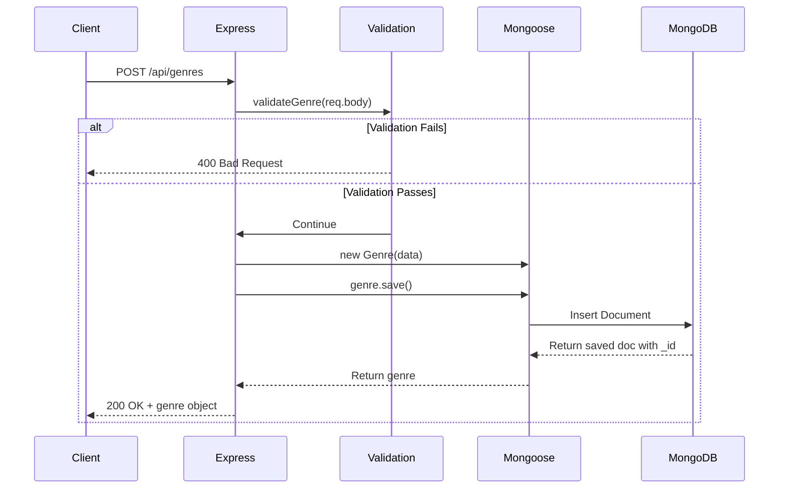

# ➕ Refactoring POST Endpoint

## Creating New Documents in MongoDB

<div style="background: linear-gradient(135deg, #667eea 0%, #764ba2 100%); padding: 2rem; border-radius: 10px; color: white; margin: 1rem 0;">
  <h3>🎯 Goal</h3>
  <p>Convert POST endpoint from array manipulation to MongoDB document creation</p>
</div>

---

## 📝 POST New Genre: `/api/genres`

### ❌ Before (Array Push)

```javascript
router.post('/', (req, res) => {
  const { error } = validateGenre(req.body);
  if (error) 
    return res.status(400).send(error.details[0].message);
  
  const genre = {
    id: genres.length + 1,
    name: req.body.name
  };
  
  genres.push(genre);
  res.send(genre);
});
```

### ✅ After (MongoDB Save)

```javascript
router.post('/', async (req, res) => {
  const { error } = validateGenre(req.body);
  if (error) 
    return res.status(400).send(error.details[0].message);
  
  let genre = new Genre({ name: req.body.name });
  genre = await genre.save();
  
  res.send(genre);
});
```

---

## 🔍 Key Changes Explained

### 1. **Async Function**
```javascript
// Add async keyword
async (req, res) => { /* ... */ }
```

### 2. **Create Model Instance**
```javascript
// Create new Genre object
let genre = new Genre({ name: req.body.name });
```

### 3. **Save to Database**
```javascript
// Save and get the saved document (with _id)
genre = await genre.save();
```

### 4. **No Manual ID**
MongoDB automatically generates `_id` field - no need for `id: genres.length + 1`

---

## 📊 Flow Diagram



---

## 🎯 What Gets Saved?

### Input (Request Body)
```json
{
  "name": "Science Fiction"
}
```

### Output (Response)
```json
{
  "_id": "60660697a67cea840cebd666",
  "name": "Science Fiction",
  "__v": 0
}
```

**Fields Explained:**
- `_id`: MongoDB-generated unique identifier
- `name`: The genre name we provided
- `__v`: Version key (Mongoose internal use)

---

## 🔒 Validation Still Works!

The Joi validation runs **before** MongoDB:

```javascript
const { error } = validateGenre(req.body);
if (error) 
  return res.status(400).send(error.details[0].message);
```

This catches:
- Missing required fields
- Invalid data types
- Business rule violations

Then Mongoose schema validation provides an additional layer:
- minlength/maxlength
- required fields
- Custom validators

---

## 💡 Alternative: Direct Save

You can also save in one line:

```javascript
const genre = await new Genre({ name: req.body.name }).save();
```

But the two-step approach is clearer:

```javascript
let genre = new Genre({ name: req.body.name });
genre = await genre.save();
```

---

<div style="background: #fef3c7; border-left: 4px solid #f59e0b; padding: 1rem; margin: 1rem 0;">
  <strong>⚠️ Important:</strong> Always await <code>.save()</code> to ensure the document is persisted before responding to the client.
</div>

<div style="background: #f0fdf4; border-left: 4px solid #10b981; padding: 1rem; margin: 1rem 0;">
  <strong>✅ Best Practice:</strong> Keep Joi validation for request validation and Mongoose validation for data integrity.
</div>

---

[← Previous: Refactoring GET](05-refactoring-get.md) | [🏠 Home](../README.md) | [Next: Refactoring PUT →](07-refactoring-put.md)
