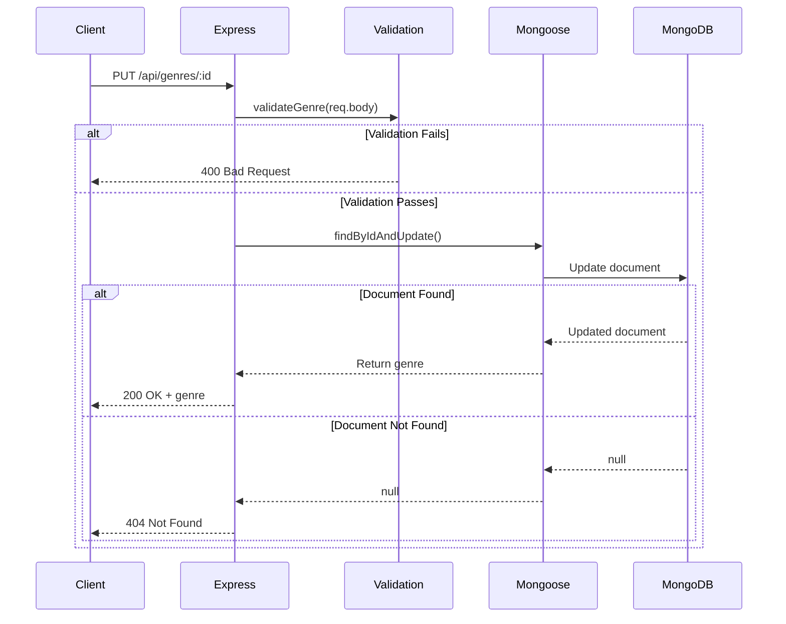

# ✏️ Refactoring PUT Endpoint

## Updating Documents in MongoDB

<div style="background: linear-gradient(135deg, #667eea 0%, #764ba2 100%); padding: 2rem; border-radius: 10px; color: white; margin: 1rem 0;">
  <h3>🎯 Goal</h3>
  <p>Convert PUT endpoint from array mutation to MongoDB update operations</p>
</div>

---

## 🔄 PUT Update Genre: `/api/genres/:id`

### ❌ Before (Array Manipulation)

```javascript
router.put('/:id', (req, res) => {
  const genre = genres.find(c => c.id === parseInt(req.params.id));
  if (!genre) 
    return res.status(404).send('The genre with the given ID was not found.');
  
  const { error } = validateGenre(req.body);
  if (error) 
    return res.status(400).send(error.details[0].message);
  
  genre.name = req.body.name;
  res.send(genre);
});
```

### ✅ After (MongoDB Update)

```javascript
router.put('/:id', async (req, res) => {
  const { error } = validateGenre(req.body);
  if (error) 
    return res.status(400).send(error.details[0].message);
  
  const genre = await Genre.findByIdAndUpdate(
    req.params.id,
    { name: req.body.name },
    { new: true }
  );
  
  if (!genre) 
    return res.status(404).send('The genre with the given ID was not found.');
  
  res.send(genre);
});
```

---

## 🔍 Key Changes Explained

### 1. **Validate First**
```javascript
// Move validation to the top (fail fast)
const { error } = validateGenre(req.body);
if (error) return res.status(400).send(error.details[0].message);
```

### 2. **Update-First Approach**
```javascript
const genre = await Genre.findByIdAndUpdate(
  req.params.id,           // Which document to update
  { name: req.body.name }, // What to update
  { new: true }            // Return updated document
);
```

### 3. **Check After Update**
```javascript
// Check if document was found
if (!genre) 
  return res.status(404).send('The genre with the given ID was not found.');
```

---

## 🎯 findByIdAndUpdate Options

```javascript
Genre.findByIdAndUpdate(id, update, options)
```

### Common Options

| Option | Default | Description |
|--------|---------|-------------|
| `new` | `false` | Return updated document (instead of original) |
| `runValidators` | `false` | Run schema validators on update |
| `upsert` | `false` | Create if doesn't exist |

### Recommended Usage

```javascript
const genre = await Genre.findByIdAndUpdate(
  req.params.id,
  { name: req.body.name },
  { 
    new: true,              // ✅ Return updated doc
    runValidators: true     // ✅ Validate data
  }
);
```

---

## 📊 Two Approaches to Updates

### 1️⃣ Query-First Approach

```javascript
// Find, modify, save
const genre = await Genre.findById(req.params.id);
if (!genre) return res.status(404).send('Not found');

genre.name = req.body.name;
await genre.save();
res.send(genre);
```

**Pros:** Full control, middleware runs
**Cons:** More database calls (find + save)

### 2️⃣ Update-First Approach ⭐ (Used in Course)

```javascript
// Update directly
const genre = await Genre.findByIdAndUpdate(
  req.params.id,
  { name: req.body.name },
  { new: true }
);

if (!genre) return res.status(404).send('Not found');
res.send(genre);
```

**Pros:** Single database call, efficient
**Cons:** Less control, some middleware skipped

---

## 🔄 Flow Diagram



---

## 💡 Example Request/Response

### Request
```http
PUT /api/genres/60660697a67cea840cebd666
Content-Type: application/json

{
  "name": "Science Fiction"
}
```

### Response (Success)
```json
{
  "_id": "60660697a67cea840cebd666",
  "name": "Science Fiction",
  "__v": 0
}
```

### Response (Not Found)
```
404 Not Found
The genre with the given ID was not found.
```

---

<div style="background: #dbeafe; border-left: 4px solid #3b82f6; padding: 1rem; margin: 1rem 0;">
  <strong>💡 Pro Tip:</strong> Always set <code>{ new: true }</code> option to get the updated document in the response.
</div>

<div style="background: #fef3c7; border-left: 4px solid #f59e0b; padding: 1rem; margin: 1rem 0;">
  <strong>⚠️ Important:</strong> Validation happens before the update attempt, saving unnecessary database calls.
</div>

---

[← Previous: Refactoring POST](06-refactoring-post.md) | [🏠 Home](../README.md) | [Next: Refactoring DELETE →](08-refactoring-delete.md)
