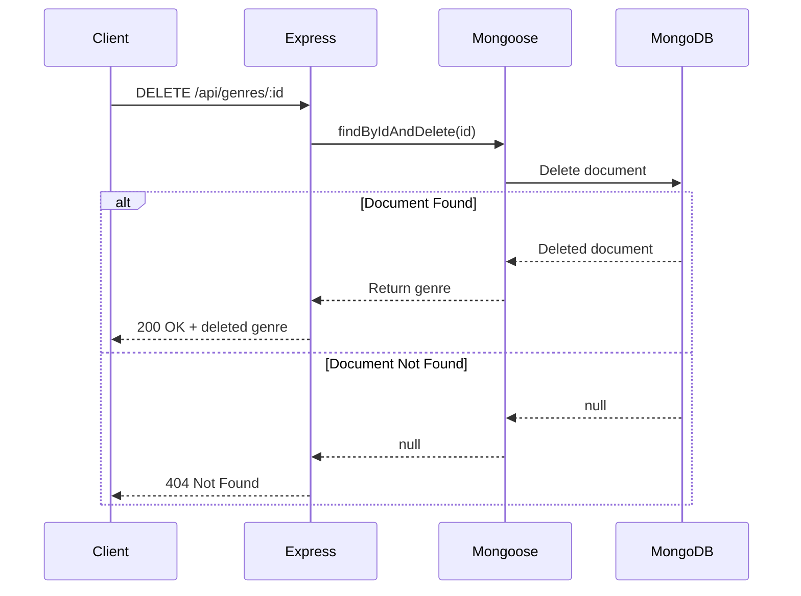

# 🗑️ Refactoring DELETE Endpoint

## Removing Documents from MongoDB

<div style="background: linear-gradient(135deg, #667eea 0%, #764ba2 100%); padding: 2rem; border-radius: 10px; color: white; margin: 1rem 0;">
  <h3>🎯 Goal</h3>
  <p>Convert DELETE endpoint from array removal to MongoDB document deletion</p>
</div>

---

## ❌ DELETE Genre: `/api/genres/:id`

### ❌ Before (Array Splice)

```javascript
router.delete('/:id', (req, res) => {
  const genre = genres.find(c => c.id === parseInt(req.params.id));
  if (!genre) 
    return res.status(404).send('The genre with the given ID was not found.');
  
  const index = genres.indexOf(genre);
  genres.splice(index, 1);
  
  res.send(genre);
});
```

### ✅ After (MongoDB Delete)

```javascript
router.delete('/:id', async (req, res) => {
  const genre = await Genre.findByIdAndDelete(req.params.id);
  
  if (!genre) 
    return res.status(404).send('The genre with the given ID was not found.');
  
  res.send(genre);
});
```

---

## 🔍 Key Changes Explained

### 1. **Async Function**
```javascript
async (req, res) => { /* ... */ }
```

### 2. **Single Delete Operation**
```javascript
const genre = await Genre.findByIdAndDelete(req.params.id);
```

This replaces:
- Finding the genre
- Getting its index
- Removing it with splice

### 3. **Returns Deleted Document**
The deleted document is returned, allowing you to send it back to the client

---

## 🎯 Delete Methods in Mongoose

### findByIdAndDelete() ⭐ (Recommended)

```javascript
const genre = await Genre.findByIdAndDelete(id);
```

**Returns:** The deleted document (or `null` if not found)

### deleteOne()

```javascript
const result = await Genre.deleteOne({ _id: id });
```

**Returns:** 
```javascript
{
  acknowledged: true,
  deletedCount: 1  // 0 if not found
}
```

### deleteMany()

```javascript
const result = await Genre.deleteMany({ isPublished: false });
```

**Returns:** Count of deleted documents

---

## 📊 Comparison

| Method | Use Case | Returns | Best For |
|--------|----------|---------|----------|
| `findByIdAndDelete()` | Delete by ID | Deleted document | RESTful APIs |
| `deleteOne()` | Delete first match | Delete result | Batch operations |
| `deleteMany()` | Delete all matches | Delete count | Cleanup tasks |

---

## 🔄 Flow Diagram



---

## 💡 Example Request/Response

### Request
```http
DELETE /api/genres/60660697a67cea840cebd666
```

### Response (Success)
```json
{
  "_id": "60660697a67cea840cebd666",
  "name": "Science Fiction",
  "__v": 0
}
```

### Response (Not Found)
```
404 Not Found
The genre with the given ID was not found.
```

---

## ⚠️ Deprecated Method

You might see older code using:

```javascript
// ❌ Deprecated
await Genre.findByIdAndRemove(id);
```

**Use instead:**

```javascript
// ✅ Current
await Genre.findByIdAndDelete(id);
```

---

## 🎨 Complete DELETE Endpoint

```javascript
router.delete('/:id', async (req, res) => {
  // Try to delete the genre
  const genre = await Genre.findByIdAndDelete(req.params.id);
  
  // Check if it existed
  if (!genre) {
    return res.status(404).send('The genre with the given ID was not found.');
  }
  
  // Return the deleted genre
  res.send(genre);
});
```

**Clean and Simple!** ✨

---

<div style="background: #dbeafe; border-left: 4px solid #3b82f6; padding: 1rem; margin: 1rem 0;">
  <strong>💡 Pro Tip:</strong> Returning the deleted document is useful for confirmation and undo operations.
</div>

<div style="background: #fef3c7; border-left: 4px solid #f59e0b; padding: 1rem; margin: 1rem 0;">
  <strong>⚠️ Important:</strong> Delete operations are permanent! Consider implementing soft deletes for important data.
</div>

---

[← Previous: Refactoring PUT](07-refactoring-put.md) | [🏠 Home](../README.md) | [Next: Testing the Application →](09-testing.md)
