# 🧪 Testing the Application

## Running and Testing Your MongoDB-Powered API

<div style="background: linear-gradient(135deg, #667eea 0%, #764ba2 100%); padding: 2rem; border-radius: 10px; color: white; margin: 1rem 0;">
  <h3>🎯 Goal</h3>
  <p>Test all CRUD operations with MongoDB persistence</p>
</div>

---

## 🚀 Starting the Application

### 1. Start MongoDB

Ensure MongoDB is running:

```bash
# macOS/Linux
mongod

# Windows
"C:\Program Files\MongoDB\Server\<version>\bin\mongod.exe"
```

### 2. Start Your Application

```bash
nodemon .
```

**Output:**
```
Connected to MongoDB
Server listening on port 3000...
```

---

## 🌐 Testing with Browser

### Test GET All Genres

Navigate to:
```
http://localhost:3000/api/genres
```

**Initial Response** (empty database):
```json
[]
```

---

## 📮 Testing with Postman

### Create a Genre (POST)

**Request:**
- **Method:** `POST`
- **URL:** `http://localhost:3000/api/genres`
- **Body:** Raw → JSON

```json
{
  "name": "Science Fiction"
}
```

**Response:**
```json
{
  "_id": "60660697a67cea840cebd666",
  "name": "Science Fiction",
  "__v": 0
}
```

### Refresh Browser

Navigate again to `http://localhost:3000/api/genres`:

```json
[
  {
    "_id": "60660697a67cea840cebd666",
    "name": "Science Fiction",
    "__v": 0
  }
]
```

✅ **Data is persisted!**

---

## 🔧 Testing with REST Client (VS Code)

### Create `api-calls/genres.http`

```http
### Variables
@hostname = http://localhost
@port = 3000
@host = {{hostname}}:{{port}}
@contentType = application/json
@url = {{host}}/api/genres

### Get all genres
GET {{url}}

### Create a new genre
POST {{url}}
Content-Type: {{contentType}}

{
  "name": "Action"
}

### Get specific genre (replace with actual ID)
GET {{url}}/60660697a67cea840cebd666

### Update a genre
PUT {{url}}/60660697a67cea840cebd666
Content-Type: {{contentType}}

{
  "name": "Sci-Fi"
}

### Delete a genre
DELETE {{url}}/60660697a67cea840cebd666
```

---

## 📋 Test Checklist

### ✅ GET All Genres
- [ ] Empty array when database is empty
- [ ] Returns all genres after creating some
- [ ] Genres are sorted by name

### ✅ GET Single Genre
- [ ] Returns genre when ID exists
- [ ] Returns 404 when ID doesn't exist
- [ ] Returns 404 for invalid ID format

### ✅ POST Create Genre
- [ ] Creates genre with valid data
- [ ] Returns 400 for missing name
- [ ] Returns 400 for name < 5 characters
- [ ] Returns 400 for name > 50 characters
- [ ] Auto-generates `_id`

### ✅ PUT Update Genre
- [ ] Updates genre with valid data
- [ ] Returns updated genre
- [ ] Returns 404 for non-existent ID
- [ ] Returns 400 for invalid data

### ✅ DELETE Genre
- [ ] Deletes existing genre
- [ ] Returns deleted genre
- [ ] Returns 404 for non-existent ID

---

## 🎯 Testing Flow Diagram

```mermaid
graph TB
    A[Start MongoDB] --> B[Start Application]
    B --> C[Test GET /api/genres]
    C --> D[Empty Array?]
    D -->|Yes| E[Test POST]
    E --> F[Create Genre]
    F --> G[Test GET Again]
    G --> H[Genre Exists?]
    H -->|Yes| I[Test PUT]
    I --> J[Update Genre]
    J --> K[Test DELETE]
    K --> L[Delete Genre]
    L --> M[✅ All Tests Pass]
    
    style A fill:#3b82f6,stroke:#1e40af,color:#fff
    style M fill:#10b981,stroke:#059669,color:#fff
```



---

## 🔍 Verification Commands

### Check MongoDB Directly

```javascript
// Open MongoDB Shell
mongosh

// Use your database
use vivesbib

// View all genres
db.genres.find()

// Count genres
db.genres.countDocuments()
```

---

## 🐛 Common Issues & Solutions

### Issue: Can't connect to MongoDB
```
Could not connect to MongoDB...
```

**Solution:** 
- Ensure MongoDB is running
- Check connection string: `mongodb://localhost/vivesbib`

### Issue: Validation error
```
Genre validation failed: name: Path `name` is required.
```

**Solution:** 
- Check request body includes `name`
- Ensure name is 5-50 characters

### Issue: 404 on GET /:id
```
The genre with the given ID was not found.
```

**Solution:**
- Use valid MongoDB ObjectId format
- Copy actual `_id` from created document

---

## 📊 Sample Test Data

```json
[
  { "name": "Action" },
  { "name": "Comedy" },
  { "name": "Drama" },
  { "name": "Horror" },
  { "name": "Romance" },
  { "name": "Science Fiction" },
  { "name": "Thriller" }
]
```

---

<div style="background: #f0fdf4; border-left: 4px solid #10b981; padding: 1rem; margin: 1rem 0;">
  <strong>✅ Success!</strong> If all tests pass, your API is fully integrated with MongoDB!
</div>

<div style="background: #dbeafe; border-left: 4px solid #3b82f6; padding: 1rem; margin: 1rem 0;">
  <strong>💡 Next Step:</strong> Try the lab assignment to apply these concepts to other routes!
</div>

---

[← Previous: Refactoring DELETE](08-refactoring-delete.md) | [🏠 Home](../README.md) | [Next: Lab Assignment →](10-lab.md)
