# 🔬 Lab Assignment

## Practice Data Validation with MongoDB

<div style="background: linear-gradient(135deg, #667eea 0%, #764ba2 100%); padding: 2rem; border-radius: 10px; color: white; margin: 1rem 0;">
  <h3>🎯 Assignment</h3>
  <p>Apply what you've learned to extend the Library API with MongoDB persistence and validation</p>
</div>

---

## 📋 Assignment Details

See **Toledo** for the complete assignment link and instructions.

---

## 🎯 What You'll Practice

### 1. Schema Design
- Create Mongoose schemas with validation
- Define appropriate data types
- Set up constraints (required, min/max, etc.)

### 2. Model Creation
- Convert schemas to models
- Understand model-collection relationship
- Implement proper naming conventions

### 3. CRUD Implementation
- Refactor all endpoints to use MongoDB
- Implement async/await patterns
- Handle errors appropriately

### 4. Validation
- Use Mongoose validators
- Combine with Joi validation
- Create custom validation rules

---

## 💡 Tips for Success

<div style="background: #dbeafe; border-left: 4px solid #3b82f6; padding: 1rem; margin: 1rem 0;">
  <strong>📝 Plan First</strong>
  <ul>
    <li>Sketch your schema before coding</li>
    <li>List all required validations</li>
    <li>Consider field relationships</li>
  </ul>
</div>

<div style="background: #f0fdf4; border-left: 4px solid #10b981; padding: 1rem; margin: 1rem 0;">
  <strong>🧪 Test Thoroughly</strong>
  <ul>
    <li>Test happy paths</li>
    <li>Test validation errors</li>
    <li>Test edge cases</li>
  </ul>
</div>

<div style="background: #fef3c7; border-left: 4px solid #f59e0b; padding: 1rem; margin: 1rem 0;">
  <strong>🔍 Follow Patterns</strong>
  <ul>
    <li>Use the Genres route as a reference</li>
    <li>Keep consistent error messages</li>
    <li>Maintain code structure</li>
  </ul>
</div>

---

## 🛠️ Suggested Workflow

```mermaid
graph TD
    A[📖 Read Assignment] --> B[📝 Design Schema]
    B --> C[💾 Create Model]
    C --> D[🔄 Refactor GET]
    D --> E[➕ Refactor POST]
    E --> F[✏️ Refactor PUT]
    F --> G[🗑️ Refactor DELETE]
    G --> H[🧪 Test All Endpoints]
    H --> I[📚 Document Code]
    I --> J[🚀 Submit]
    
    style A fill:#3b82f6,stroke:#1e40af,color:#fff
    style J fill:#10b981,stroke:#059669,color:#fff
```



---

## 📚 Key Concepts to Apply

### Schema Definition
```javascript
const schema = new mongoose.Schema({
  field: {
    type: Type,
    required: true,
    // Add validators
  }
});
```

### Model Creation
```javascript
const Model = mongoose.model('ModelName', schema);
```

### Async Operations
```javascript
router.get('/', async (req, res) => {
  const items = await Model.find();
  res.send(items);
});
```

### Error Handling
```javascript
if (!item) 
  return res.status(404).send('Not found');
```

---

## ✅ Checklist Before Submission

- [ ] MongoDB connection established
- [ ] All schemas defined with validation
- [ ] All models created correctly
- [ ] GET all endpoint works
- [ ] GET by ID endpoint works
- [ ] POST endpoint creates documents
- [ ] PUT endpoint updates documents
- [ ] DELETE endpoint removes documents
- [ ] Validation works on all endpoints
- [ ] Error handling is consistent
- [ ] Code is clean and commented
- [ ] All endpoints tested
- [ ] REST Client file created (optional)

---

## 🎓 Learning Objectives Review

After completing this lab, you should be able to:

✅ Define schemas with built-in validators  
✅ Create and use Mongoose models  
✅ Implement CRUD operations with MongoDB  
✅ Handle asynchronous database operations  
✅ Validate data at multiple levels  
✅ Test RESTful APIs with persistence  

---

## 🆘 Getting Help

If you're stuck:

1. Review the chapter slides
2. Check the Genres route implementation
3. Review Mongoose documentation
4. Ask questions in the course forum
5. Attend office hours

---

## 🎉 Bonus Challenges

Once you've completed the basic assignment:

### 🌟 Advanced Validation
- Implement custom validators
- Add async validators
- Create conditional required fields

### 🌟 Advanced Queries
- Add filtering to GET endpoints
- Implement pagination
- Add sorting options

### 🌟 Advanced Error Handling
- Create custom error middleware
- Improve error messages
- Add logging

---

<div style="background: linear-gradient(135deg, #10b981 0%, #059669 100%); padding: 2rem; border-radius: 10px; color: white; margin: 1rem 0; text-align: center;">
  <h3>🚀 Good Luck!</h3>
  <p>You've got all the tools you need. Time to build something great!</p>
</div>

---

[← Previous: Testing](09-testing.md) | [🏠 Home](../README.md) | [Next Chapter: Mongoose Modeling →](../09-Mongoose-Modeling/01-introduction.md)
