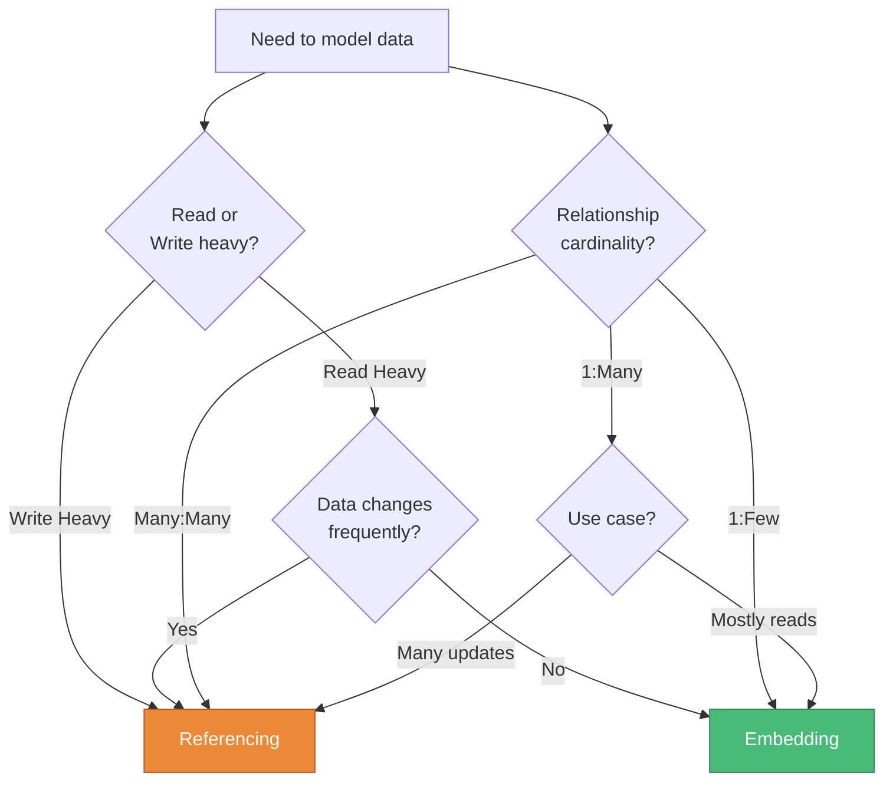

# 🔗 Referencing & Embedding

> **Understanding the two main data modeling approaches**

---

## 📊 The Two Approaches

### 🔗 Referencing (Normalization)

**✅ HIGH Consistency | ❌ LOW Performance**

The author is stored in a **separate collection** and the course only holds the author's `_id`.

```javascript
// Authors collection
{ _id: ObjectId('64a1...'), name: 'Vives', bio: '...', website: '...' }

// Courses collection — stores only the reference
{ _id: ObjectId('64b2...'), name: 'Node.js Course', author: ObjectId('64a1...') }
```

**Characteristics:**
- 📌 Data stored in separate collections
- 🔄 Single source of truth
- 🔍 Requires a second query (via `populate()`) to get the full author
- ✨ Update the author once — every course reflects it automatically

#### Mongoose Schema

```javascript
const mongoose = require('mongoose');

const authorSchema = new mongoose.Schema({
  name: String,
  bio:  String,
});
const Author = mongoose.model('Author', authorSchema);

const courseSchema = new mongoose.Schema({
  name: String,
  author: {
    type: mongoose.Schema.Types.ObjectId,  // stores the _id
    ref:  'Author',                        // tells populate() which model to use
    required: true,
  },
});
const Course = mongoose.model('Course', courseSchema);
```

#### Creating & Reading

```javascript
// --- Create ---
const author = await Author.create({ name: 'Vives', bio: 'Educational institution' });
const course = await Course.create({ name: 'Node.js Course', author: author._id });

// --- Read without populate (only gets the ObjectId) ---
const raw = await Course.findById(course._id);
console.log(raw.author); // ObjectId('64a1...')

// --- Read WITH populate (replaces the id with the full document) ---
const full = await Course.findById(course._id).populate('author');
console.log(full.author.name); // 'Vives'
console.log(full.author.bio);  // 'Educational institution'
```

---

### 📦 Embedding Documents (Denormalization)

**✅ HIGH Performance | ❌ LOW Consistency**

The author's data lives **inside** the course document — no second collection needed.

```javascript
// Courses collection — author is embedded
{
  _id: ObjectId('64b2...'),
  name: 'Node.js Course',
  author: { name: 'Vives', bio: 'Educational institution' }
}
```

**Characteristics:**
- ⚡ Single query retrieves all data — no `populate()` needed
- 💾 Data duplicated across documents
- 🔄 If the author's name changes, every course must be updated individually
- 🚀 Faster read operations

#### Mongoose Schema

```javascript
const mongoose = require('mongoose');

const courseSchema = new mongoose.Schema({
  name: String,
  author: {        // nested object — no ref, no separate collection
    name: String,
    bio:  String,
  },
});
const Course = mongoose.model('Course', courseSchema);
```

#### Creating & Reading

```javascript
// --- Create ---
const course = await Course.create({
  name: 'Node.js Course',
  author: { name: 'Vives', bio: 'Educational institution' },
});

// --- Read (author data is already there — no populate needed) ---
const found = await Course.findById(course._id);
console.log(found.author.name); // 'Vives'

// --- Updating the embedded author (must update every course!) ---
await Course.updateMany(
  { 'author.name': 'Vives' },
  { $set: { 'author.name': 'VIVES Hogeschool' } }
);
```

---

## 🎭 Visual Comparison


```mermaid
graph TB
    subgraph "Referencing (Normalization)"
    A1[Course Collection] -->|author ObjectId| B1[Author Collection]
    end
    
    subgraph "Embedding (Denormalization)"
    A2[Course Collection<br/>contains author data]
    end
    
    style A1 fill:#4299e1,stroke:#2c5282,color:#fff
    style B1 fill:#48bb78,stroke:#2f855a,color:#fff
    style A2 fill:#ed8936,stroke:#c05621,color:#fff
```

---

## 🔄 Trade-Off Analysis

### Referencing Advantages

| ✅ Pros | ❌ Cons |
|---------|---------|
| Data consistency | Multiple queries needed |
| Single source of truth | Slower read operations |
| Easy updates | More complex queries |
| Less storage used | Requires `populate()` or `$lookup` |

### Embedding Advantages

| ✅ Pros | ❌ Cons |
|---------|---------|
| Fast queries | Data duplication |
| Single query reads | Update complexity |
| Better performance | Consistency challenges |
| Simpler code | Larger documents |

---

## 🤔 Decision Matrix


```mermaid
graph TD
    A[Need to model data] --> B{Read or<br/>Write heavy?}
    B -->|Read Heavy| C{Data changes<br/>frequently?}
    B -->|Write Heavy| D[Referencing]
    C -->|Yes| D
    C -->|No| E[Embedding]
    
    A --> F{Relationship<br/>cardinality?}
    F -->|1:Few| E
    F -->|1:Many| G{Use case?}
    F -->|Many:Many| D
    G -->|Mostly reads| E
    G -->|Many updates| D
    
    style E fill:#48bb78,stroke:#2f855a,color:#fff
    style D fill:#ed8936,stroke:#c05621,color:#fff
```

---

## 💡 Example Use Cases

### 🔗 Use Referencing When:

```javascript
// User document
{ _id: ObjectId('u1'), name: 'John' }

// Orders reference the user (can have thousands of orders)
{ _id: ObjectId('o1'), userId: ObjectId('u1'), total: 49.99 }
{ _id: ObjectId('o2'), userId: ObjectId('u1'), total: 19.99 }

// Blog post references its comments (unbounded growth)
{ _id: ObjectId('p1'), title: 'My Post', commentIds: [ObjectId('c1'), ObjectId('c2')] }
```

### 📦 Use Embedding When:

```javascript
// User document with embedded address (limited fields, rarely changes)
{
  _id: ObjectId('u1'),
  name: 'John',
  address: { street: '123 Main St', city: 'Brussels' }
}

// Product document with embedded specs (fixed structure, always needed together)
{
  _id: ObjectId('p1'),
  name: 'Laptop',
  specs: { cpu: 'i7', ram: '16GB', storage: '512GB SSD' }
}
```

---

[← Previous: Introduction](01-intro.md) | [🏠 Home](../README.md) | [Next: Hybrid Approach →](03-hybrid-approach.md)
