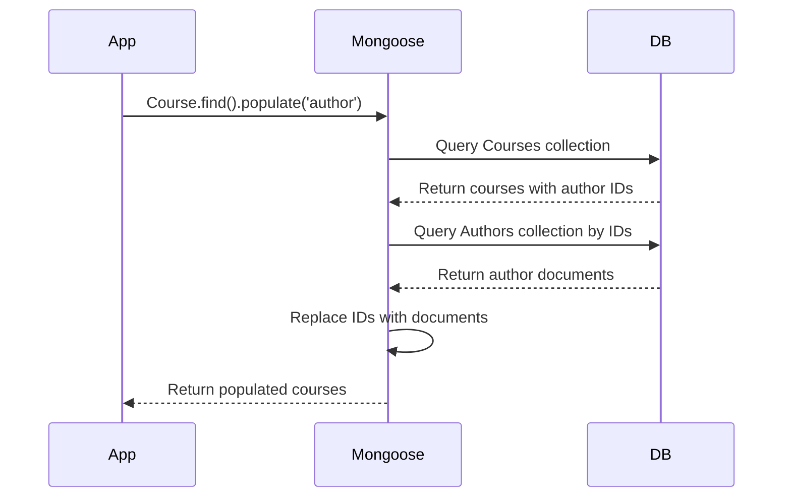

# 🔗 Referencing Documents

> **Implementing references between collections**

---

## 🚀 Getting Started

### Starter Files

📁 **Available on GitHub:**

- `referencing.js` https://github.com/MilanVives/NodeVivesFiles/blob/main/referencing.js
- `embedding.js` https://github.com/MilanVives/NodeVivesFiles/blob/main/embedding.js

---

## 📋 Define Schemas

### Author Schema

```javascript
const Author = mongoose.model(
  "Author",
  new mongoose.Schema({
    name: String,
    bio: String,
    website: String,
  }),
);
```

### Initial Course Schema (Without Reference)

```javascript
const Course = mongoose.model(
  "Course",
  new mongoose.Schema({
    name: String,
  }),
);
```

---

## 🏗️ Create Documents

### Create an Author

```javascript
async function createAuthor(name, bio, website) {
  const author = new Author({
    name,
    bio,
    website,
  });

  const result = await author.save();
  console.log(result);
}

createAuthor("Vives", "My bio", "My Website");
```

**Output:**

```javascript
{
  _id: 60772ac8684c78c4435f4153,
  name: 'Vives',
  bio: 'My bio',
  website: 'My Website',
  __v: 0
}
```

---

### ⚠️ The Problem: No Reference!

```javascript
async function createCourse(name, author) {
  const course = new Course({
    name,
    author, // ❌ This won't work yet!
  });

  const result = await course.save();
  console.log(result);
}

createCourse("Node Course", "60772ac8684c78c4435f4153");
```

**Output:**

```javascript
{
  _id: 60772af0f3915ac45d4064ce,
  name: 'Node Course',
  __v: 0
}
// ❌ No author reference stored!
```

**Why?** The schema doesn't have an author field defined!

---

## ✅ Fix: Add Reference to Schema

### Updated Course Schema

```javascript
const Course = mongoose.model(
  "Course",
  new mongoose.Schema({
    name: String,
    author: {
      type: mongoose.Schema.Types.ObjectId, // 🔑 Reference type
      ref: "Author", // 📌 Target collection
    },
  }),
);
```

### Key Components

| Property | Purpose                        |
| -------- | ------------------------------ |
| `type`   | Define as ObjectId             |
| `ref`    | Specify target collection name |

---

## ✨ Create Course with Reference

```javascript
createCourse("Node Course", "60772ac8684c78c4435f4153");
```

**Output:**

```javascript
{
  _id: 60772d2675c702c574002c58,
  name: 'Node Course',
  author: 60772ac8684c78c4435f4153,  // ✅ Reference stored!
  __v: 0
}
```

---

## 🔍 List Courses (Without Population)

```javascript
async function listCourses() {
  const courses = await Course.find().select("name author");

  console.log(courses);
}

listCourses();
```

**Output:**

```javascript
[
  {
    _id: 60772f4ac904a3c6491bbf46,
    name: 'Node Course',
    author: 60772ac8684c78c4435f4153  // ❌ Only ID, no details
  }
]
```

**Problem:** We only get the author ID, not the name and other properties!

---

## 🎯 Solution: Using populate()

### The populate() Function

The `populate()` function tells Mongoose to **replace the reference ID** with the actual document from the referenced collection.

```javascript
async function listCourses() {
  const courses = await Course.find()
    .populate("author") // ✨ Magic happens here!
    .select("name author");

  console.log(courses);
}
```

**Output:**

```javascript
[
  {
    _id: 60772f4ac904a3c6491bbf46,
    name: 'Node Course',
    author: {
      _id: 60772ac8684c78c4435f4153,
      name: 'Vives',
      bio: 'My bio',
      website: 'My Website',
      __v: 0
    }
  }
]
```

---

## 🎨 Customize populate()

### Select Specific Properties

```javascript
// Populate only the name
.populate('author', 'name')
```

**Output:**

```javascript
{
  name: 'Node Course',
  author: {
    _id: 60772ac8684c78c4435f4153,
    name: 'Vives'
  }
}
```

---

### Exclude \_id

```javascript
// Populate name without _id
.populate('author', 'name -_id')
```

**Output:**

```javascript
{
  name: 'Node Course',
  author: {
    name: 'Vives'  // ✅ No _id
  }
}
```

---

### Multiple Properties

```javascript
// Populate name and bio, exclude _id
.populate('author', 'name bio -_id')
```

**Output:**

```javascript
{
  name: 'Node Course',
  author: {
    name: 'Vives',
    bio: 'My bio'
  }
}
```

---

## 🔗 Chaining populate()

When you have **multiple references**, chain populate calls:

```javascript
const courses = await Course.find()
  .populate("author", "name")
  .populate("category", "name")
  .populate("tags", "name")
  .select("name");
```

---

## 📊 Complete Example

```javascript
const mongoose = require("mongoose");

mongoose
  .connect("mongodb://localhost/playground")
  .then(() => console.log("Connected to MongoDB..."))
  .catch((err) => console.error("Could not connect...", err));

// Schemas
const authorSchema = new mongoose.Schema({
  name: String,
  bio: String,
  website: String,
});

const Author = mongoose.model("Author", authorSchema);

const Course = mongoose.model(
  "Course",
  new mongoose.Schema({
    name: String,
    author: {
      type: mongoose.Schema.Types.ObjectId,
      ref: "Author",
    },
  }),
);

// Functions
async function createAuthor(name, bio, website) {
  const author = new Author({ name, bio, website });
  const result = await author.save();
  console.log(result);
}

async function createCourse(name, author) {
  const course = new Course({ name, author });
  const result = await course.save();
  console.log(result);
}

async function listCourses() {
  const courses = await Course.find()
    .populate("author", "name -_id")
    .select("name author");
  console.log(courses);
}

// Usage — must be sequential so we have the real _id before proceeding
async function main() {
  const author = await Author.create({
    name: "Vives",
    bio: "My bio",
    website: "My Website",
  });
  await createCourse("Node Course", author._id);
  await listCourses();
}

main();
```

---

## 🎯 Behind the Scenes



### What's Actually Happening

`populate()` is **not** a MongoDB feature — it is implemented entirely by the Mongoose library in your application. MongoDB itself has no concept of references; it just stores ObjectIds as plain values. When you call `.populate('author')`, Mongoose runs **two separate queries** under the hood:

**Query 1 — fetch the courses:**

```javascript
db.courses.find({});
// Returns: [{ name: 'Node Course', author: ObjectId('60772ac8...') }]
```

**Query 2 — fetch the matching authors:**

```javascript
db.authors.find({ _id: { $in: [ObjectId("60772ac8...")] } });
// Returns: [{ _id: ObjectId('60772ac8...'), name: 'Vives', ... }]
```

**Step 3 — Mongoose stitches the results together in memory:**  
Each `author` field (which was just an ObjectId) gets replaced with the full author document before the result is returned to your code.

### Why This Matters

| Implication                       | Explanation                                                                                               |
| --------------------------------- | --------------------------------------------------------------------------------------------------------- |
| **Two DB round-trips**            | Every `populate()` call costs an extra query — avoid it when you only need the ID                         |
| **Application-level JOIN**        | MongoDB has no server-side JOIN like SQL; the join happens in your Node.js process                        |
| **No referential integrity**      | If an author is deleted, courses still hold the old ObjectId — `populate()` returns `null` for that field |
| **Selective population pays off** | `.populate('author', 'name -_id')` only transfers the fields you need, reducing data over the wire        |

```javascript
// ✅ Only fetch author when you actually need their details
const courses = await Course.find().populate("author", "name");

// ✅ Skip populate when the ID alone is enough (e.g. for a delete operation)
const course = await Course.findById(id);
await Author.findByIdAndDelete(course.author); // course.author is still the ObjectId
```

---

## 💡 Key Takeaways

| Concept           | Description                     |
| ----------------- | ------------------------------- |
| 🔑 **ObjectId**   | Special type for references     |
| 📌 **ref**        | Points to target collection     |
| 🔍 **populate()** | Replaces ID with document       |
| 🎨 **Selective**  | Choose which fields to populate |
| 🔗 **Chainable**  | Populate multiple references    |

---

[← Previous: Hybrid Approach](03-hybrid-approach.md) | [🏠 Home](../README.md) | [Next: Embedding Documents →](05-embedding-documents.md)
