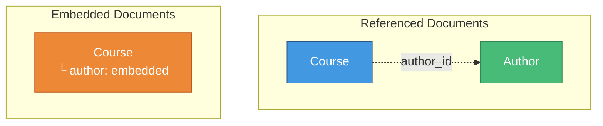

# 📦 Embedding Documents

> **Working with subdocuments in Mongoose**

---

## 🚀 Getting Started

### Starter Files

📁 **Available on GitHub:**

- `embedding.js` https://github.com/MilanVives/NodeVivesFiles/blob/main/embedding.js

---

## 📋 Initial Setup

### Define Author Schema

```javascript
const authorSchema = new mongoose.Schema({
  name: String,
  bio: String,
  website: String,
});

const Author = mongoose.model("Author", authorSchema);
```

### Course Schema (Before Embedding)

```javascript
const Course = mongoose.model(
  "Course",
  new mongoose.Schema({
    name: String,
  }),
);
```

---

## ✨ Add Embedded Document

### Updated Course Schema

```javascript
const Course = mongoose.model(
  "Course",
  new mongoose.Schema({
    name: String,
    author: authorSchema, // 📦 Embed the entire schema
  }),
);
```

### 🔑 Key Difference

| Approach        | Schema Definition                      |
| --------------- | -------------------------------------- |
| **Referencing** | `type: mongoose.Schema.Types.ObjectId` |
| **Embedding**   | `authorSchema` (the schema itself)     |

---

## 🏗️ Create Course with Embedded Author

### Implementation

```javascript
async function createCourse(name, author) {
  const course = new Course({
    name,
    author,
  });

  const result = await course.save();
  console.log(result);
}

// Create course with embedded author
createCourse("Node Course", new Author({ name: "Vives" }));
```

### Output

```javascript
{
  _id: 6077363c35b1d0c8b49ef261,
  name: 'Node Course',
  author: {
    _id: 6077363c35b1d0c8b49ef260,  // ✨ Subdocument has its own ID
    name: 'Vives'
  },
  __v: 0
}
```

---

## 📊 Subdocument Features

### What is a Subdocument?

A **subdocument** is a document embedded within another document. It has most document features:

- ✅ Automatic `_id` generation
- ✅ Validation
- ✅ Middleware (pre/post hooks)
- ✅ Virtual properties
- ❌ **Cannot** be saved independently

---

## 📝 Update Subdocument (Query First)

### The "Query First" Approach

```javascript
async function updateAuthor(courseId) {
  const course = await Course.findById(courseId);
  course.author.name = "M. Dima";
  await course.save(); // ⚠️ Save parent, not subdocument!
  // course.author.save() does NOT exist!
}

updateAuthor("60798f05a3a949f04af32ab6");
```

---

### Result in MongoDB Compass

```javascript
{
  "_id": {"$oid": "60798f05a3a949f04af32ab6"},
  "name": "Node Course",
  "author": {
    "_id": {"$oid": "60798f05a3a949f04af32ab5"},
    "name": "M. Dima"  // ✅ Updated!
  },
  "__v": 0
}
```

---

## ⚡ Update Subdocument (Update First)

### The "Update First" Approach

Update without querying first using `findByIdAndUpdate()`:

```javascript
async function updateAuthor(courseId) {
  // findByIdAndUpdate takes the id directly as first argument (not a filter object)
  const course = await Course.findByIdAndUpdate(courseId, {
    $set: {
      "author.name": "M. Dima", // 📝 Dot notation for nested property
    },
  });
}

updateAuthor("60798f05a3a949f04af32ab6");
```

---

## 🗑️ Remove Subdocument Property

### Using $unset

```javascript
async function removeAuthorProperty(courseId) {
  await Course.findByIdAndUpdate(
    { _id: courseId },
    {
      $unset: {
        author: "", // 🗑️ Remove entire author subdocument
      },
    },
  );
}
```

---

## ✅ Validation on Subdocuments

### Current State

```javascript
const Course = mongoose.model(
  "Course",
  new mongoose.Schema({
    name: String,
    author: authorSchema,
  }),
);
```

### Make Author Required

```javascript
const Course = mongoose.model(
  "Course",
  new mongoose.Schema({
    name: String,
    author: {
      type: authorSchema,
      required: true, // ✅ Author is now required
    },
  }),
);
```

---

### Validation in Author Schema

If you want specific **author properties** to be required:

```javascript
const authorSchema = new mongoose.Schema({
  name: {
    type: String,
    required: true, // ✅ Name is required in author
  },
  bio: String,
  website: String,
});
```

---

## 📊 Complete Example

```javascript
const mongoose = require("mongoose");

mongoose
  .connect("mongodb://localhost/playground")
  .then(() => console.log("Connected to MongoDB..."))
  .catch((err) => console.error("Could not connect...", err));

// Author Schema
const authorSchema = new mongoose.Schema({
  name: {
    type: String,
    required: true,
  },
  bio: String,
  website: String,
});

const Author = mongoose.model("Author", authorSchema);

// Course Schema with Embedded Author
const Course = mongoose.model(
  "Course",
  new mongoose.Schema({
    name: String,
    author: {
      type: authorSchema,
      required: true,
    },
  }),
);

// Create Course
async function createCourse(name, author) {
  const course = new Course({
    name,
    author,
  });

  const result = await course.save();
  console.log(result);
}

// Update Author (Query First)
async function updateAuthor(courseId) {
  const course = await Course.findById(courseId);
  course.author.name = "M. Dima";
  await course.save();
}

// Update Author (Update First)
async function updateAuthorDirect(courseId) {
  await Course.findByIdAndUpdate(courseId, {
    $set: {
      "author.name": "M. Dima",
    },
  });
}

// Usage
createCourse("Node Course", new Author({ name: "Vives" }));
```

---

## 🎯 Visual: Embedded vs Referenced



---

## 💡 Key Takeaways

| Aspect            | Details                            |
| ----------------- | ---------------------------------- |
| 📦 **Schema**     | Use schema directly (not ObjectId) |
| 🆔 **IDs**        | Subdocuments get automatic `_id`   |
| 💾 **Saving**     | Only save parent document          |
| ✅ **Validation** | Works on subdocuments              |
| 🔧 **Updates**    | Use dot notation or query first    |

---

## ⚖️ When to Use Embedding?

✅ **Use embedding when:**

- Subdocument is always accessed with parent
- Subdocument is small and bounded
- Read operations are frequent
- Data rarely changes

❌ **Avoid embedding when:**

- Subdocument can grow unbounded
- Subdocument needs independent access
- Data changes frequently
- You need many-to-many relationships

---

[← Previous: Referencing Documents](04-referencing-documents.md) | [🏠 Home](../README.md) | [Next: Arrays of Subdocuments →](06-arrays-subdocuments.md)
