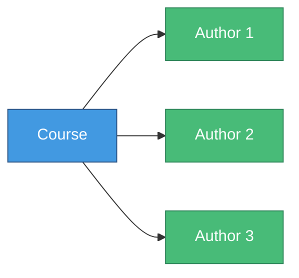
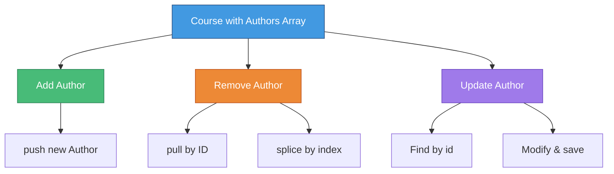

# 📚 Arrays of Subdocuments

> **Managing multiple embedded documents**

---

## 🎯 The Challenge

What if a course has **multiple authors**?


```mermaid
graph LR
    A[Course] --> B[Author 1]
    A --> C[Author 2]
    A --> D[Author 3]
    style A fill:#4299e1,stroke:#2c5282,color:#fff
    style B fill:#48bb78,stroke:#2f855a,color:#fff
    style C fill:#48bb78,stroke:#2f855a,color:#fff
    style D fill:#48bb78,stroke:#2f855a,color:#fff
```

---

## 📋 Schema Definition

### Single Author (Before)

```javascript
const Course = mongoose.model('Course', new mongoose.Schema({
  name: String,
  author: authorSchema  // Single subdocument
}));
```

### Multiple Authors (After)

```javascript
const Course = mongoose.model('Course', new mongoose.Schema({
  name: String,
  authors: [authorSchema]  // 📚 Array of subdocuments
}));
```

---

## 🏗️ Create Course with Multiple Authors

### Implementation

```javascript
async function createCourse(name, authors) {
  const course = new Course({
    name,
    authors
  });
  
  const result = await course.save();
  console.log(result);
}

// Create course with multiple authors
createCourse('Node Course', [
  new Author({ name: 'Vives' }),
  new Author({ name: 'M. Dima' })
]);
```

---

### Output

```javascript
{
  _id: 6079a25f42697ff398cb9de0,
  name: 'Node Course',
  authors: [
    {
      _id: 6079a25f42697ff398cb9dde,
      name: 'Vives'
    },
    {
      _id: 6079a25f42697ff398cb9ddf,
      name: 'M. Dima'
    }
  ],
  __v: 0
}
```

---

## ➕ Add Author to Array

### Using push()

```javascript
async function addAuthor(courseId, author) {
  const course = await Course.findById(courseId);
  course.authors.push(author);  // 📌 Add to array
  await course.save();
}

// Usage
addAuthor(
  '6079a25f42697ff398cb9de0',
  new Author({ name: 'Milan D.' })
);
```

---

### Result

```javascript
{
  _id: 6079a25f42697ff398cb9de0,
  name: 'Node Course',
  authors: [
    { _id: ..., name: 'Vives' },
    { _id: ..., name: 'M. Dima' },
    { _id: ..., name: 'Milan D.' }  // ✅ New author added
  ],
  __v: 0
}
```

---

## ➖ Remove Author from Array

### Implementation

```javascript
async function removeAuthor(courseId, authorId) {
  const course = await Course.findById(courseId);
  
  // Find index of author to remove
  // Use .toString() when comparing ObjectIDs — == can be unreliable
  const index = course.authors.findIndex(
    (obj) => obj._id.toString() === authorId.toString()
  );
  
  // Remove from array
  course.authors.splice(index, 1);
  
  await course.save();
  // ⚠️ Note: In older versions it was author.save()
}

// Usage
removeAuthor(
  '6079a25f42697ff398cb9de0',
  '6079a4a166aa79f40bee78d0'
);
```

---

## 🎨 Alternative: Using pull()

### Mongoose Array Methods

Mongoose provides special array methods:

```javascript
async function removeAuthor(courseId, authorId) {
  const course = await Course.findById(courseId);
  
  // Use Mongoose pull() method
  course.authors.pull(authorId);  // 🎯 More elegant!
  
  await course.save();
}
```

---

## 📝 Update Author in Array

### Find and Update

```javascript
async function updateAuthor(courseId, authorId, newName) {
  const course = await Course.findById(courseId);
  
  // Find the author
  const author = course.authors.id(authorId);  // ✨ Mongoose helper
  
  if (author) {
    author.name = newName;
    await course.save();
  }
}

// Usage
updateAuthor(
  '6079a25f42697ff398cb9de0',
  '6079a25f42697ff398cb9dde',
  'VIVES University'
);
```

---

## 📊 Complete Example

```javascript
const mongoose = require('mongoose');

mongoose.connect('mongodb://localhost/playground')
  .then(() => console.log('Connected to MongoDB...'))
  .catch(err => console.error('Could not connect...', err));

// Author Schema
const authorSchema = new mongoose.Schema({
  name: {
    type: String,
    required: true
  },
  bio: String,
  website: String
});

const Author = mongoose.model('Author', authorSchema);

// Course Schema with Author Array
const Course = mongoose.model('Course', new mongoose.Schema({
  name: String,
  authors: [authorSchema]  // Array of subdocuments
}));

// Create course
async function createCourse(name, authors) {
  const course = new Course({ name, authors });
  const result = await course.save();
  console.log(result);
}

// Add author
async function addAuthor(courseId, author) {
  const course = await Course.findById(courseId);
  course.authors.push(author);
  await course.save();
}

// Remove author
async function removeAuthor(courseId, authorId) {
  const course = await Course.findById(courseId);
  course.authors.pull(authorId);  // or use splice
  await course.save();
}

// Update author
async function updateAuthor(courseId, authorId, newName) {
  const course = await Course.findById(courseId);
  const author = course.authors.id(authorId);
  if (author) {
    author.name = newName;
    await course.save();
  }
}

// Usage
createCourse('Node Course', [
  new Author({ name: 'Vives' }),
  new Author({ name: 'M. Dima' })
]);
```

---

## 🔍 Query Documents with Arrays

### Find Courses by Author Name

```javascript
// Find courses where any author has name 'Vives'
const courses = await Course.find({
  'authors.name': 'Vives'
});
```

### Find Courses with Multiple Authors

```javascript
// Find courses with more than 2 authors
const courses = await Course.find({
  'authors.2': { $exists: true }  // Check if 3rd element exists
});
```

---

## 🎯 Array Operations Summary

| Operation | Method | Code |
|-----------|--------|------|
| **Add** | `push()` | `course.authors.push(author)` |
| **Remove** | `pull()` | `course.authors.pull(authorId)` |
| **Remove** | `splice()` | `course.authors.splice(index, 1)` |
| **Find** | `id()` | `course.authors.id(authorId)` |
| **Update** | Direct | `author.name = 'New Name'` |

---

## 💡 Best Practices

### ✅ Do's

```javascript
// Use Mongoose array methods
course.authors.push(newAuthor);
course.authors.pull(authorId);

// Use id() helper to find subdocuments
const author = course.authors.id(authorId);

// Save parent document
await course.save();
```

### ❌ Don'ts

```javascript
// Don't try to save subdocuments independently
await course.authors[0].save();  // ❌ Won't work

// Don't forget to save parent
course.authors.push(author);  // ❌ Not persisted yet
// Missing: await course.save();

// Don't use array index if order can change
course.authors[0].name = 'New';  // ⚠️ Fragile
```

---

## ⚠️ Important Notes

### Subdocuments Cannot Be Saved Independently

```javascript
// ❌ This throws an error — subdocuments are not standalone documents
await course.authors[0].save();

// ✅ Always save the parent document
course.authors[0].name = 'Updated Name';
await course.save();
```

### Removing: pull() vs splice()

```javascript
// ✅ Preferred — Mongoose tracks the change automatically
course.authors.pull(authorId);

// ✅ Also works — find the index first, then splice
const index = course.authors.findIndex(
  (obj) => obj._id.toString() === authorId.toString()
);
course.authors.splice(index, 1);
```

---

## 🎭 Visual: Array Operations


```mermaid
graph TB
    A[Course with Authors Array] --> B[Add Author]
    A --> C[Remove Author]
    A --> D[Update Author]
    
    B --> E[push new Author]
    C --> F[pull by ID]
    C --> G[splice by index]
    D --> H[Find by id]
    D --> I[Modify & save]
    
    style A fill:#4299e1,stroke:#2c5282,color:#fff
    style B fill:#48bb78,stroke:#2f855a,color:#fff
    style C fill:#ed8936,stroke:#c05621,color:#fff
    style D fill:#9f7aea,stroke:#6b46c1,color:#fff
```

---

[← Previous: Embedding Documents](05-embedding-documents.md) | [🏠 Home](../README.md) | [Next: MongoDB ObjectIDs →](07-objectids.md)
