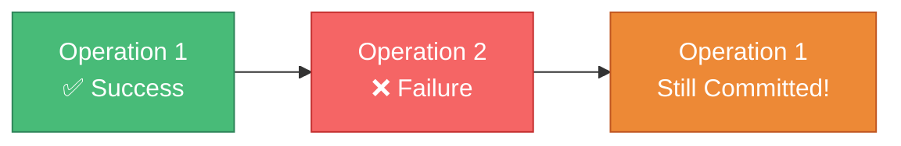
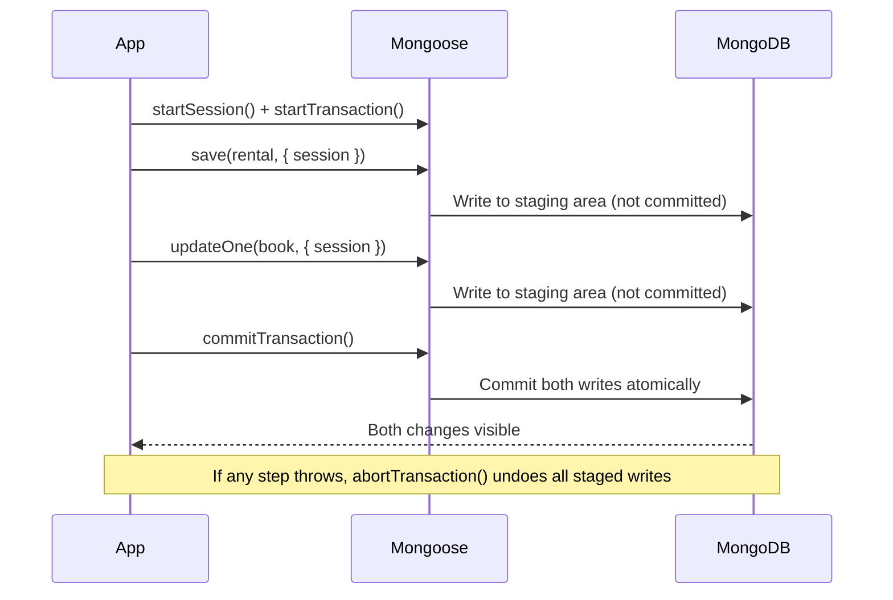

# 💳 Transactions in MongoDB

> **Ensuring data consistency across multiple operations**

---

## ⚠️ The Problem

### No Automatic Rollback Without Transactions

If two operations must succeed together (or both fail), plain sequential `await` calls are not safe.


```mermaid
graph LR
    A[Operation 1<br/>✅ Success] --> B[Operation 2<br/>❌ Failure]
    B --> C[Operation 1<br/>Still Committed!]
    
    style A fill:#48bb78,stroke:#2f855a,color:#fff
    style B fill:#f56565,stroke:#c53030,color:#fff
    style C fill:#ed8936,stroke:#c05621,color:#fff
```

**Problem:** First operation succeeded, second failed. Data is now inconsistent!

---

## 🎯 Real-World Example

### Book Rental Scenario

```javascript
// Step 1: Create rental record
const rental = new Rental({ book: bookId, customer: customerId, dateOut: Date.now() });
await rental.save();         // ✅ Succeeds

// Step 2: Decrease book stock
const book = await Book.findById(bookId);
book.numberInStock--;
await book.save();           // ❌ What if this fails?
```

**Problem:** If step 2 fails, the rental exists but the stock was never decreased!

---

## 💡 The Solution: Native MongoDB Transactions

MongoDB 4.0+ supports **multi-document transactions** using **sessions**. This is the recommended approach for all modern MongoDB deployments.

> **Requirement:** Transactions require a **replica set** (or sharded cluster).  
> - **MongoDB Atlas** always runs as a replica set — no extra setup needed.  
> - **Local development:** use Docker (easiest) or start `mongod` with `--replSet rs0`.

### 🐳 Local Setup with Docker (Recommended)

**Option A — single `docker run` command:**

```bash
docker run -d \
  --name mongodb \
  -p 27017:27017 \
  mongo:latest --replSet rs0
```

Then initialise the replica set once (only needed the very first time):

```bash
docker exec -it mongodb mongosh --eval "rs.initiate()"
```

Restart the container anytime with:

```bash
docker start mongodb
```

---

**Option B — Docker Compose** (better for projects that already have a `docker-compose.yml`):

```yaml
services:
  mongodb:
    image: mongo:latest
    ports:
      - 27017:27017
    command: --replSet rs0
    healthcheck:
      test: echo 'db.runCommand("ping").ok' | mongosh localhost:27017/test --quiet
      interval: 10s
      timeout: 5s
      retries: 5
```

Start it with:

```bash
docker compose up -d
```

Then initialise once:

```bash
docker compose exec mongodb mongosh --eval "rs.initiate()"
```

Your Mongoose connection string stays the same as without a replica set:

```javascript
mongoose.connect('mongodb://localhost:27017/playground');
```

---

**Option C — bare `mongod`** (if you have MongoDB installed locally):

```bash
mongod --replSet rs0
# in a second terminal:
mongosh --eval "rs.initiate()"
```

---

## 🔧 Using Native Transactions

### The Pattern

```javascript
const session = await mongoose.startSession();
session.startTransaction();

try {
  // All operations must receive { session }
  await Operation1({ session });
  await Operation2({ session });

  await session.commitTransaction();   // Persist all changes
} catch (ex) {
  await session.abortTransaction();    // Roll back all changes
  throw ex;
} finally {
  session.endSession();                // Always release the session
}
```

> **Critical:** pass `{ session }` to **every** operation inside the transaction — missing it on one call silently excludes that operation from the transaction scope.

---

## 📋 Complete Example

### Models

```javascript
const mongoose = require('mongoose');

const rentalSchema = new mongoose.Schema({
  customer: { type: mongoose.Schema.Types.ObjectId, ref: 'Customer', required: true },
  book:     { type: mongoose.Schema.Types.ObjectId, ref: 'Book',     required: true },
  dateOut:  { type: Date, required: true, default: Date.now },
  dateReturned: Date,
  rentalFee: Number,
});
const Rental = mongoose.model('Rental', rentalSchema);

const bookSchema = new mongoose.Schema({
  title:         String,
  numberInStock: Number,
});
const Book = mongoose.model('Book', bookSchema);
```

---

### Without Transactions (Problematic)

```javascript
async function createRental(customerId, bookId) {
  // ❌ No transaction — crash between saves = inconsistent data
  const rental = new Rental({ customer: customerId, book: bookId, dateOut: Date.now() });
  await rental.save();

  const book = await Book.findById(bookId);
  book.numberInStock--;
  await book.save();  // If this crashes, the rental still exists

  return rental;
}
```

---

### With Native Transactions (Safe)

```javascript
async function createRental(customerId, bookId) {
  const session = await mongoose.startSession();
  session.startTransaction();

  try {
    // Both operations share the same session
    const rental = new Rental({ customer: customerId, book: bookId, dateOut: Date.now() });
    await rental.save({ session });

    await Book.updateOne(
      { _id: bookId },
      { $inc: { numberInStock: -1 } },
      { session }
    );

    await session.commitTransaction();
    return rental;

  } catch (ex) {
    await session.abortTransaction();   // Roll back both operations
    throw ex;
  } finally {
    session.endSession();
  }
}
```

---

## 🔄 Multiple Operations

### Chain as Many Operations as Needed

```javascript
async function placeOrder(userId, productId, quantity) {
  const session = await mongoose.startSession();
  session.startTransaction();

  try {
    // 1. Create the order
    const order = new Order({ userId, productId, quantity });
    await order.save({ session });

    // 2. Decrease product stock
    await Product.updateOne(
      { _id: productId },
      { $inc: { stock: -quantity } },
      { session }
    );

    // 3. Record in user's order history
    await User.updateOne(
      { _id: userId },
      { $push: { orders: order._id } },
      { session }
    );

    await session.commitTransaction();
    return order;

  } catch (ex) {
    await session.abortTransaction();   // All or nothing!
    throw ex;
  } finally {
    session.endSession();
  }
}
```

---

## 🎯 How It Works


```mermaid
sequenceDiagram
    participant App
    participant Mongoose
    participant MongoDB
    
    App->>Mongoose: startSession() + startTransaction()
    App->>Mongoose: save(rental, { session })
    Mongoose->>MongoDB: Write to staging area (not committed)
    App->>Mongoose: updateOne(book, { session })
    Mongoose->>MongoDB: Write to staging area (not committed)
    App->>Mongoose: commitTransaction()
    Mongoose->>MongoDB: Commit both writes atomically
    MongoDB-->>App: Both changes visible
    
    note over App,MongoDB: If any step throws, abortTransaction() undoes all staged writes
```

---

## 🚨 Error Handling in Express

```javascript
router.post('/', async (req, res) => {
  const session = await mongoose.startSession();
  session.startTransaction();

  try {
    const rental = new Rental({
      customer: req.body.customerId,
      book:     req.body.bookId,
      dateOut:  Date.now(),
    });

    await rental.save({ session });

    await Book.updateOne(
      { _id: rental.book },
      { $inc: { numberInStock: -1 } },
      { session }
    );

    await session.commitTransaction();
    res.send(rental);

  } catch (ex) {
    await session.abortTransaction();
    res.status(500).send('Could not create rental. Please try again.');
  } finally {
    session.endSession();
  }
});
```

---

## 💡 When to Use Transactions

### ✅ Use transactions when:

- Multiple collections must be updated together
- A failure in one step should undo all previous steps
- Financial or inventory operations
- Data consistency is critical

### ❌ Transactions are NOT needed when:

- Only updating a single document (MongoDB is always atomic at the single-document level)
- Inserting independent records that don't need to stay in sync

---

### Examples

```javascript
// ✅ Bank transfer — both updates must succeed together
const session = await mongoose.startSession();
session.startTransaction();
try {
  await Account.updateOne({ _id: fromId }, { $inc: { balance: -amount } }, { session });
  await Account.updateOne({ _id: toId },   { $inc: { balance:  amount } }, { session });
  await session.commitTransaction();
} catch (ex) {
  await session.abortTransaction();
} finally {
  session.endSession();
}

// ✅ User registration — user + profile must both exist or neither
const session = await mongoose.startSession();
session.startTransaction();
try {
  const user    = await User.create([{ name: 'John' }], { session });
  const profile = await Profile.create([{ userId: user[0]._id }], { session });
  await session.commitTransaction();
} catch (ex) {
  await session.abortTransaction();
} finally {
  session.endSession();
}
```

> **Note:** When using `Model.create()` inside a transaction, pass the data as an **array** (e.g., `[{ ... }]`) — this is required for Mongoose to accept the `session` option in `create()`.

---

## ⚡ Performance Considerations

| Aspect | Impact |
|--------|--------|
| **Speed** | Slightly slower than individual operations |
| **Safety** | Much higher data consistency |
| **Complexity** | Low — just wrap in session + try/catch/finally |
| **Reliability** | Automatic rollback on any failure |

**Verdict:** The safety benefits outweigh the minimal performance cost for any multi-document operation!

---

## 🎯 Key Takeaways

| Concept | Detail |
|---------|--------|
| ⚠️ **Problem** | Sequential `await` calls have no automatic rollback |
| 💳 **Solution** | Native MongoDB transactions via `startSession()` |
| 🔄 **All or Nothing** | All operations commit or all roll back |
| 📌 **Pass session** | Every operation inside needs `{ session }` |
| 🔚 **endSession()** | Always in `finally` — releases the session regardless of outcome |
| ✅ **Use Cases** | Orders, transfers, registrations, any multi-step writes |

---

[← Previous: MongoDB ObjectIDs](07-objectids.md) | [🏠 Home](../README.md) | [Next: Recap →](09-recap.md)
