# 💳 Transactions in MongoDB

> **Ensuring data consistency across multiple operations**

---

## ⚠️ The Problem

### No Automatic Rollback in MongoDB

Unlike traditional SQL databases, MongoDB **doesn't automatically roll back** failed transactions.

```mermaid
graph LR
    A[Operation 1<br/>✅ Success] --> B[Operation 2<br/>❌ Failure]
    B --> C[Operation 1<br/>Still Committed!]
    
    style A fill:#48bb78,stroke:#2f855a,color:#fff
    style B fill:#f56565,stroke:#c53030,color:#fff
    style C fill:#ed8936,stroke:#c05621,color:#fff
```



**Problem:** First operation succeeded, second failed. Data is now inconsistent!

---

## 🎯 Real-World Example

### Book Rental Scenario

```javascript
// Step 1: Create rental record
const rental = new Rental({
  book: bookId,
  customer: customerId,
  dateOut: Date.now()
});
await rental.save();  // ✅ Success

// Step 2: Decrease book stock
const book = await Book.findById(bookId);
book.numberInStock--;
await book.save();  // ❌ What if this fails?
```

**Problem:** If step 2 fails, the rental exists but the stock wasn't decreased!

---

## 💡 The Solution: Fawn

**Fawn** is a package that provides **transaction-like behavior** for MongoDB.

### Installation

```bash
npm install fawn
```

### Documentation

📚 [https://www.npmjs.com/package/fawn](https://www.npmjs.com/package/fawn)

---

## 🔧 Using Fawn

### Initialize Fawn

```javascript
const Fawn = require('fawn');
const mongoose = require('mongoose');

// Initialize Fawn with mongoose
Fawn.init(mongoose);
```

---

### Create a Transaction Task

```javascript
const Fawn = require('fawn');

try {
  new Fawn.Task()
    .save('rentals', rental)                    // Step 1: Save rental
    .update('books', { _id: book._id }, {       // Step 2: Update book
      $inc: { numberInStock: -1 }
    })
    .run();                                     // Execute transaction
    
  res.send(rental);
} catch(ex) {
  res.status(500).send('Something failed.');
}
```

---

## 🎯 How It Works

```mermaid
sequenceDiagram
    participant App
    participant Fawn
    participant MongoDB
    
    App->>Fawn: Create Task
    App->>Fawn: Add save operation
    App->>Fawn: Add update operation
    App->>Fawn: Run task
    
    Fawn->>MongoDB: Execute save
    alt Save successful
        Fawn->>MongoDB: Execute update
        alt Update successful
            Fawn-->>App: All operations succeeded
        else Update failed
            Fawn->>MongoDB: Rollback save
            Fawn-->>App: Transaction failed (rolled back)
        end
    else Save failed
        Fawn-->>App: Transaction failed
    end
    
    style Fawn fill:#4299e1,stroke:#2c5282,color:#fff
    style MongoDB fill:#48bb78,stroke:#2f855a,color:#fff
```

---

## 📋 Complete Example

### Models

```javascript
const mongoose = require('mongoose');

const rentalSchema = new mongoose.Schema({
  customer: {
    type: mongoose.Schema.Types.ObjectId,
    ref: 'Customer',
    required: true
  },
  book: {
    type: mongoose.Schema.Types.ObjectId,
    ref: 'Book',
    required: true
  },
  dateOut: {
    type: Date,
    required: true,
    default: Date.now
  },
  dateReturned: Date,
  rentalFee: Number
});

const Rental = mongoose.model('Rental', rentalSchema);

const bookSchema = new mongoose.Schema({
  title: String,
  numberInStock: Number
});

const Book = mongoose.model('Book', bookSchema);
```

---

### Without Fawn (Problematic)

```javascript
async function createRental(customerId, bookId) {
  // ❌ No transaction protection
  const rental = new Rental({
    customer: customerId,
    book: bookId,
    dateOut: Date.now()
  });
  
  await rental.save();  // What if next operation fails?
  
  const book = await Book.findById(bookId);
  book.numberInStock--;
  await book.save();  // Crash here = inconsistent data!
  
  return rental;
}
```

---

### With Fawn (Protected)

```javascript
const Fawn = require('fawn');
Fawn.init(mongoose);

async function createRental(customerId, bookId) {
  const rental = new Rental({
    customer: customerId,
    book: bookId,
    dateOut: Date.now()
  });
  
  try {
    // ✅ Transaction-protected
    await new Fawn.Task()
      .save('rentals', rental)
      .update('books', { _id: bookId }, {
        $inc: { numberInStock: -1 }
      })
      .run();
    
    return rental;
  } catch(ex) {
    console.error('Transaction failed:', ex);
    throw new Error('Could not create rental');
  }
}
```

---

## 🔄 Multiple Operations

### Chain Multiple Updates

```javascript
try {
  await new Fawn.Task()
    // Create rental
    .save('rentals', rental)
    
    // Decrease book stock
    .update('books', { _id: book._id }, {
      $inc: { numberInStock: -1 }
    })
    
    // Increase customer rental count
    .update('customers', { _id: customer._id }, {
      $inc: { totalRentals: 1 }
    })
    
    // Add to rental history
    .update('customers', { _id: customer._id }, {
      $push: { rentalHistory: rental._id }
    })
    
    .run();  // All or nothing!
    
} catch(ex) {
  console.error('Transaction failed:', ex);
}
```

---

## 🎭 Operations Supported

### Available Operations

| Operation | Purpose | Example |
|-----------|---------|---------|
| **save** | Insert document | `.save('collection', doc)` |
| **update** | Update document | `.update('collection', query, update)` |
| **remove** | Delete document | `.remove('collection', query)` |

---

### Save Operation

```javascript
new Fawn.Task()
  .save('users', {
    name: 'John Doe',
    email: 'john@example.com'
  })
  .run();
```

---

### Update Operation

```javascript
new Fawn.Task()
  .update('users', 
    { email: 'john@example.com' },  // Query
    { $set: { name: 'John Smith' } } // Update
  )
  .run();
```

---

### Remove Operation

```javascript
new Fawn.Task()
  .remove('users', {
    email: 'john@example.com'
  })
  .run();
```

---

## 🚨 Error Handling

### Proper Error Handling

```javascript
async function createRental(req, res) {
  const rental = new Rental({
    customer: req.body.customerId,
    book: req.body.bookId,
    dateOut: Date.now()
  });
  
  try {
    await new Fawn.Task()
      .save('rentals', rental)
      .update('books', { _id: rental.book }, {
        $inc: { numberInStock: -1 }
      })
      .run();
    
    res.send(rental);
  } catch(ex) {
    console.error('Rental creation failed:', ex);
    res.status(500).send('Could not create rental. Please try again.');
  }
}
```

---

## ⚡ Performance Considerations

### Impact

| Aspect | Impact |
|--------|--------|
| **Speed** | Slightly slower than individual operations |
| **Safety** | Much higher data consistency |
| **Complexity** | Moderate learning curve |
| **Reliability** | Automatic rollback on failure |

**Verdict:** The safety benefits outweigh the minimal performance cost!

---

## 🆚 Fawn vs Native Transactions

### MongoDB 4.0+ Native Transactions

MongoDB 4.0+ supports **native transactions** (replica sets required):

```javascript
const session = await mongoose.startSession();
session.startTransaction();

try {
  await rental.save({ session });
  await Book.updateOne(
    { _id: bookId },
    { $inc: { numberInStock: -1 } },
    { session }
  );
  
  await session.commitTransaction();
} catch(ex) {
  await session.abortTransaction();
  throw ex;
} finally {
  session.endSession();
}
```

---

### Comparison

| Feature | Fawn | Native Transactions |
|---------|------|-------------------|
| **MongoDB Version** | Any | 4.0+ |
| **Replica Set** | Not required | Required |
| **API** | Simple | More complex |
| **Performance** | Good | Better |
| **Learning Curve** | Easy | Moderate |

---

## 💡 When to Use Transactions

### ✅ Use transactions when:

- Multiple collections need to be updated together
- Data consistency is critical
- Failure in one operation should undo others
- Financial or inventory operations

---

### Examples:

```javascript
// ✅ E-commerce order
new Fawn.Task()
  .save('orders', order)
  .update('products', { _id: productId }, { $inc: { stock: -1 } })
  .update('users', { _id: userId }, { $push: { orders: orderId } })
  .run();

// ✅ Bank transfer
new Fawn.Task()
  .update('accounts', { _id: fromAccount }, { $inc: { balance: -amount } })
  .update('accounts', { _id: toAccount }, { $inc: { balance: amount } })
  .save('transactions', transaction)
  .run();

// ✅ User registration
new Fawn.Task()
  .save('users', user)
  .save('profiles', profile)
  .save('settings', defaultSettings)
  .run();
```

---

## 🎯 Key Takeaways

| Concept | Detail |
|---------|--------|
| ⚠️ **Problem** | No automatic rollback in MongoDB |
| 💳 **Solution** | Use Fawn for transactions |
| 🔄 **All or Nothing** | All operations succeed or all roll back |
| 📦 **Package** | `npm install fawn` |
| 🔧 **Simple API** | Chain operations with `.save()`, `.update()`, `.remove()` |
| ✅ **Use Cases** | Orders, transfers, multi-step operations |

---

[← Previous: MongoDB ObjectIDs](07-objectids.md) | [🏠 Home](../README.md) | [Next: Lab & Assignment →](09-lab.md)
