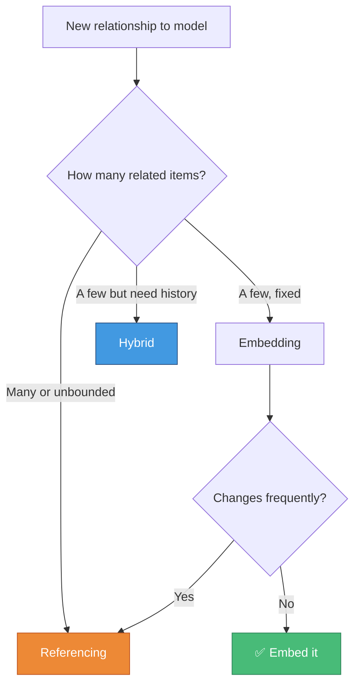

# 📋 Chapter Recap

> **Everything you need to remember from Chapter 9**

---

## 🗂️ The Three Modeling Approaches

| Approach | How | When |
|----------|-----|------|
| **Referencing** | Store `ObjectId` + `ref`, use `populate()` | Data changes often, shared across documents, large/unbounded |
| **Embedding** | Nest schema directly inside parent | Data always read together, small/bounded, rarely changes |
| **Hybrid** | Store `_id` reference + a few snapshot fields | Need fast reads for a subset of fields, historical accuracy |

---

## 🤔 Decision Flowchart



---

## 🔗 Referencing — Quick Reference

```javascript
// Schema
const courseSchema = new mongoose.Schema({
  name: String,
  author: { type: mongoose.Schema.Types.ObjectId, ref: 'Author' }
});

// Create
const author = await Author.create({ name: 'Vives' });
const course = await Course.create({ name: 'Node.js', author: author._id });

// Read — without populate (only gets the ObjectId)
const raw = await Course.findById(id);
console.log(raw.author);        // ObjectId('...')

// Read — with populate (replaces id with full document)
const full = await Course.findById(id).populate('author');
console.log(full.author.name);  // 'Vives'

// Selective populate (only fetch what you need)
await Course.find().populate('author', 'name -_id');
```

---

## 📦 Embedding — Quick Reference

```javascript
// Schema
const courseSchema = new mongoose.Schema({
  name: String,
  author: authorSchema          // embed the whole schema
});

// Create
const course = await Course.create({
  name: 'Node.js',
  author: { name: 'Vives', bio: '...' }
});

// Update — query first
const course = await Course.findById(id);
course.author.name = 'Updated';
await course.save();            // always save the PARENT

// Update — update first (no fetch)
await Course.findByIdAndUpdate(id, {
  $set: { 'author.name': 'Updated' }  // dot notation for nested fields
});
```

---

## 📚 Arrays of Subdocuments — Quick Reference

```javascript
// Schema
const courseSchema = new mongoose.Schema({
  name: String,
  authors: [authorSchema]       // array of embedded subdocuments
});

// Add
const course = await Course.findById(id);
course.authors.push({ name: 'New Author' });
await course.save();

// Find in array
const author = course.authors.id(authorId);  // Mongoose helper

// Update in array
author.name = 'Updated';
await course.save();

// Remove
course.authors.pull(authorId);
await course.save();

// Query by embedded field
await Course.find({ 'authors.name': 'Vives' });
```

---

## 🎭 Hybrid — Quick Reference

```javascript
// Schema
const courseSchema = new mongoose.Schema({
  name: String,
  author: {
    _id:  { type: mongoose.Schema.Types.ObjectId, ref: 'Author' },
    name: String    // snapshot
  }
});

// Create — store both reference and snapshot
await Course.create({
  name: 'Node.js',
  author: { _id: author._id, name: author.name }
});

// Fast read — snapshot already there, no populate needed
const course = await Course.findById(id);
console.log(course.author.name);   // from snapshot

// Full read — populate when you need all fields
const course = await Course.findById(id).populate('author._id');
console.log(course.author._id.bio);
```

---

## 🆔 ObjectIDs — Quick Reference

```javascript
// Generate
const id = new mongoose.Types.ObjectId();

// Validate (e.g. from req.params)
mongoose.Types.ObjectId.isValid(id);     // true
mongoose.Types.ObjectId.isValid('abc');  // false

// Extract creation timestamp
id.getTimestamp();   // Date object

// Compare
id1.equals(id2);
```

---

## 💳 Transactions — Quick Reference

```javascript
const session = await mongoose.startSession();
session.startTransaction();

try {
  await Doc1.save({ session });                         // pass session to every op
  await Model.updateOne(query, update, { session });

  await session.commitTransaction();
} catch (ex) {
  await session.abortTransaction();
  throw ex;
} finally {
  session.endSession();                                 // always in finally
}
```

> Requires a replica set. Easiest local setup:
> ```bash
> docker run -d --name mongodb -p 27017:27017 mongo:latest --replSet rs0
> docker exec -it mongodb mongosh --eval "rs.initiate()"
> ```

---

## ⚠️ Common Mistakes

| Mistake | Fix |
|---------|-----|
| `course.author.save()` | `course.save()` — always save the parent |
| `findByIdAndUpdate({ _id: id }, ...)` | `findByIdAndUpdate(id, ...)` — first arg is the id directly |
| `obj._id == otherId` | `obj._id.toString() === otherId.toString()` — compare as strings |
| Forgetting `{ session }` on one operation | Every operation in a transaction needs `{ session }` |
| `populate()` without selecting the field | `.select('name author')` — field must be in select list |
| `style` in a `sequenceDiagram` | `style` only works in `graph`/`flowchart` diagrams |

---

[← Previous: Transactions](08-transactions.md) | [🏠 Home](../README.md) | [Next: Lab →](10-lab.md)
