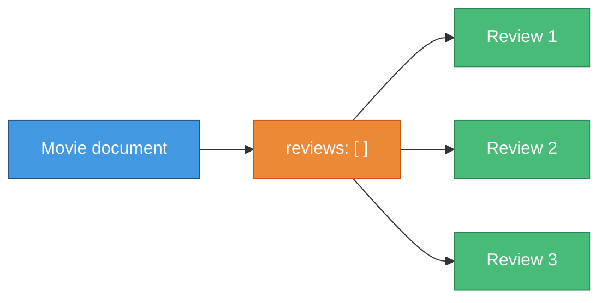

# 🧪 Lab — Movie Review Database

> **Practice embedding with a real-world scenario**

---

## 🎯 Scenario

You are building a **movie review database**. Each movie document contains its reviews **embedded** as an array of subdocuments — a natural fit because reviews are always read together with the movie, are bounded per movie, and never need to exist independently.



---

## 📋 Given Schema

Start with this — **do not change the schemas**, only implement the functions below.

```javascript
const mongoose = require('mongoose');

mongoose.connect('mongodb://localhost/movies')
  .then(() => console.log('Connected...'))
  .catch(err => console.error(err));

const reviewSchema = new mongoose.Schema({
  reviewer: { type: String, required: true },
  rating:   { type: Number, min: 1, max: 5, required: true },
  comment:  String,
  date:     { type: Date, default: Date.now }
});

const movieSchema = new mongoose.Schema({
  title:   { type: String, required: true },
  genre:   String,
  year:    Number,
  reviews: [reviewSchema]
});

const Movie = mongoose.model('Movie', movieSchema);
```

---

## 🏗️ Tasks

### Task 1 — Create a Movie with an Embedded Review

Implement `createMovie()` to create a movie document that already contains **one review** at creation time.

```javascript
async function createMovie(title, genre, year, firstReview) {
  // TODO: create and save a movie with the firstReview already embedded
}

// Expected usage:
createMovie('Inception', 'Sci-Fi', 2010, {
  reviewer: 'Milan',
  rating: 5,
  comment: 'Mind-blowing!'
});
```

**Expected output:**
```javascript
{
  _id: ObjectId('...'),
  title: 'Inception',
  genre: 'Sci-Fi',
  year: 2010,
  reviews: [
    { _id: ObjectId('...'), reviewer: 'Milan', rating: 5, comment: 'Mind-blowing!', date: ... }
  ]
}
```

---

### Task 2 — Add a Review to an Existing Movie

Implement `addReview()` to push a new review onto an existing movie's `reviews` array.

```javascript
async function addReview(movieId, review) {
  // TODO: find the movie, push the review, save
}

// Expected usage:
addReview('MOVIE_ID', {
  reviewer: 'Lien',
  rating: 4,
  comment: 'Great visuals'
});
```

**Tip:** Use `push()` on the array, then save the parent document.

---

### Task 3 — Update a Specific Review

Implement `updateReview()` to change the comment and rating of a specific review by its `_id`.

```javascript
async function updateReview(movieId, reviewId, newRating, newComment) {
  // TODO: find the movie, find the review with .id(), update fields, save
}

// Expected usage:
updateReview('MOVIE_ID', 'REVIEW_ID', 3, 'Good but overrated');
```

**Tip:** Use `movie.reviews.id(reviewId)` to locate the subdocument.

---

### Task 4 — Remove a Review

Implement `removeReview()` to delete a specific review from a movie.

```javascript
async function removeReview(movieId, reviewId) {
  // TODO: find the movie, pull the review, save
}

// Expected usage:
removeReview('MOVIE_ID', 'REVIEW_ID');
```

**Tip:** Use `movie.reviews.pull(reviewId)` — no need to find the index manually.

---

### Task 5 — Find Top-Rated Movies

Implement `getTopRated()` to return all movies that have **at least one review with rating 5**.

```javascript
async function getTopRated() {
  // TODO: query using dot notation on the embedded reviews array
}
```

**Expected output:**
```javascript
[
  { title: 'Inception', genre: 'Sci-Fi', year: 2010, reviews: [...] },
  // ...
]
```

**Tip:** Use dot notation: `{ 'reviews.rating': 5 }`.

---

### Task 6 — Calculate Average Rating

Implement `getAverageRating()` to compute the average rating for a given movie **in JavaScript** (after fetching the document — no aggregation needed).

```javascript
async function getAverageRating(movieId) {
  // TODO: fetch the movie, compute average from reviews array
  // Return 0 if there are no reviews
}

// Expected usage:
const avg = await getAverageRating('MOVIE_ID');
console.log(`Average rating: ${avg.toFixed(1)}`);
// Average rating: 4.5
```

---

## ✅ Checklist

- [ ] Task 1: Movie created with initial embedded review
- [ ] Task 2: Review added with `push()` + parent save
- [ ] Task 3: Review updated with `id()` helper + parent save
- [ ] Task 4: Review removed with `pull()` + parent save
- [ ] Task 5: Dot notation query on embedded array field
- [ ] Task 6: Average calculated from the embedded array in JS

---

## 💡 Hints

| If you're stuck on... | Check... |
|-----------------------|----------|
| Task 1 | `new Movie({ ..., reviews: [firstReview] })` |
| Task 2 | `movie.reviews.push(review)` then `movie.save()` |
| Task 3 | `movie.reviews.id(reviewId)` returns the subdocument |
| Task 4 | `movie.reviews.pull(reviewId)` then `movie.save()` |
| Task 5 | `Movie.find({ 'reviews.rating': 5 })` |
| Task 6 | `array.reduce()` to sum ratings, divide by `array.length` |

---

## 🚀 Bonus Challenges

1. **Validation**: Add a `maxlength: 280` validator to `review.comment` and test that it rejects long comments
2. **Sort**: In `getTopRated()`, sort results by the highest single review rating descending
3. **Aggregation**: Rewrite `getAverageRating()` using MongoDB's `$avg` aggregation operator instead of computing it in JavaScript
4. **Limit reviews**: Add a pre-save hook on `movieSchema` that throws an error if a movie already has 10 or more reviews

---

## 📖 Resources

- [Mongoose Subdocuments](https://mongoosejs.com/docs/subdocs.html)
- [Mongoose Array Methods](https://mongoosejs.com/docs/api/documentarray.html)
- [MongoDB dot notation queries](https://docs.mongodb.com/manual/core/document/#dot-notation)

---

[← Previous: Recap](09-recap.md) | [🏠 Home](../README.md) | [Next Chapter: Github Classroom Lab →](./11-classroom-lab.md)