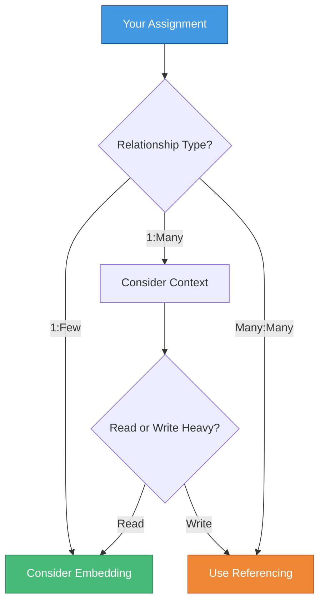

# 🧪 Classroom Assignment

> **Practice what you've learned**

---

## 📚 Code Examples

All code examples from this chapter are available:

### 📁 Files Available

https://github.com/MilanVives/NodeVivesFiles

- `referencing.js` - Working with referenced documents
- `embedding.js` - Working with embedded documents
- `objectids.js` - Understanding and using ObjectIDs

---

## 🎯 Assignment

### 📝 Task

Complete the code in the application following the comments provided.

### 🔗 Access

Assignment link available on **Toledo**

---

## 💡 Key Concepts to Apply

### 1️⃣ Referencing vs Embedding



---

### 2️⃣ Working with References

Remember to:

- ✅ Define `type: mongoose.Schema.Types.ObjectId`
- ✅ Specify `ref: 'CollectionName'`
- ✅ Use `populate()` to fetch referenced data
- ✅ Use selective population to optimize queries

```javascript
// Example structure
const schema = new mongoose.Schema({
  field: {
    type: mongoose.Schema.Types.ObjectId,
    ref: "OtherModel",
    required: true,
  },
});

// Querying with population
const data = await Model.find().populate("field", "name -_id");
```

---

### 3️⃣ Working with Embedded Documents

Remember to:

- ✅ Embed the schema directly
- ✅ Save only the parent document
- ✅ Use dot notation for updates
- ✅ Add validation where needed

```javascript
// Example structure
const subSchema = new mongoose.Schema({
  name: String,
  value: Number,
});

const mainSchema = new mongoose.Schema({
  embedded: {
    type: subSchema,
    required: true,
  },
});

// Updating embedded documents
await Model.findByIdAndUpdate(id, {
  $set: { "embedded.name": "New Name" },
});
```

---

### 4️⃣ Arrays of Subdocuments

Remember to:

- ✅ Use array syntax `[schema]`
- ✅ Use `push()` to add items
- ✅ Use `pull()` or `splice()` to remove
- ✅ Use `id()` helper to find items

```javascript
// Example structure
const schema = new mongoose.Schema({
  items: [itemSchema],
});

// Operations
doc.items.push(newItem);
doc.items.pull(itemId);
const item = doc.items.id(itemId);
await doc.save();
```

---

### 5️⃣ Using Transactions

Remember to:

- ✅ Start a session with `mongoose.startSession()`
- ✅ Call `session.startTransaction()` before any operations
- ✅ Pass `{ session }` to **every** operation inside the transaction
- ✅ Use `commitTransaction()` on success, `abortTransaction()` on failure
- ✅ Always call `session.endSession()` in a `finally` block

```javascript
const session = await mongoose.startSession();
session.startTransaction();

try {
  await doc1.save({ session });
  await Model2.updateOne(query, update, { session });

  await session.commitTransaction();
} catch (ex) {
  await session.abortTransaction();
  throw ex;
} finally {
  session.endSession();
}
```

---

## ✅ Checklist Before Submitting

### Code Quality

- [ ] All required fields are properly validated
- [ ] Appropriate data modeling approach chosen (reference vs embed)
- [ ] Native MongoDB transactions used where data consistency is critical (session passed to every operation)
- [ ] Error handling implemented
- [ ] Code follows the comments/instructions

---

### Functionality

- [ ] Create operations work correctly
- [ ] Read operations retrieve expected data
- [ ] Update operations modify data properly
- [ ] Delete operations work as expected
- [ ] Relationships between models work correctly

---

### Best Practices

- [ ] ObjectIDs validated before use
- [ ] Selective population used where beneficial
- [ ] Subdocuments saved via parent document
- [ ] Array operations use proper methods (push, pull, id)
- [ ] No hardcoded values (use environment variables if needed)

---

## 🎓 Learning Objectives Review

By completing this assignment, you should be able to:

| Objective           | Skills                                |
| ------------------- | ------------------------------------- |
| 🔗 **Referencing**  | Create and query referenced documents |
| 📦 **Embedding**    | Work with subdocuments effectively    |
| 🎭 **Hybrid**       | Combine approaches when beneficial    |
| 🆔 **ObjectIDs**    | Generate, validate, and use ObjectIDs |
| 💳 **Transactions** | Ensure data consistency               |
| 📚 **Arrays**       | Manage arrays of subdocuments         |

---

## 💭 Common Pitfalls to Avoid

### ❌ Don't:

```javascript
// Don't save subdocuments independently
await course.author.save(); // Won't work!

// Don't forget to populate when needed
const courses = await Course.find(); // Only IDs
console.log(courses[0].author.name); // undefined

// Don't use wrong reference type
author: String; // Wrong!
author: mongoose.Schema.Types.ObjectId; // Correct!

// Don't forget error handling
await doc.save(); // What if it fails?
```

---

### ✅ Do:

```javascript
// Save parent document
await course.save();  // Saves subdocuments too

// Use populate when you need related data
const courses = await Course
  .find()
  .populate('author');
console.log(courses[0].author.name);  // Works!

// Use correct types
author: {
  type: mongoose.Schema.Types.ObjectId,
  ref: 'Author'
}

// Handle errors properly
try {
  await doc.save();
} catch(ex) {
  console.error('Save failed:', ex);
}
```

---

## 🚀 Going Further

### Optional Challenges

If you want to extend your learning:

1. **Hybrid Approach**: Implement a hybrid model that stores both reference and snapshot data
2. **Complex Queries**: Write queries that populate multiple levels deep
3. **Performance**: Compare query performance between referenced and embedded approaches
4. **Validation**: Add custom validators to subdocuments
5. **Middleware**: Implement pre/post hooks on embedded documents

---

## 📖 Resources

### Official Documentation

- [Mongoose Documentation](https://mongoosejs.com/docs/)
- [MongoDB Manual](https://docs.mongodb.com/manual/)

### Key Sections to Review

- [Mongoose Schemas](https://mongoosejs.com/docs/guide.html)
- [Subdocuments](https://mongoosejs.com/docs/subdocs.html)
- [Population](https://mongoosejs.com/docs/populate.html)
- [Transactions](https://mongoosejs.com/docs/transactions.html)

---

## 🎯 Success Criteria

Your assignment will be evaluated on:

| Criteria           | Weight |
| ------------------ | ------ |
| **Correctness**    | 40%    |
| **Code Quality**   | 30%    |
| **Best Practices** | 20%    |
| **Error Handling** | 10%    |

---

## 💬 Need Help?

If you get stuck:

1. 📚 Review the chapter materials
2. 🔍 Check the example files (referencing.js, embedding.js, objectids.js)
3. 📖 Consult the Mongoose documentation
4. 💭 Think about the data relationships in your model
5. 🎓 Ask questions during class or office hours

---

## 🎉 Final Tips

Remember:

> **"Choose the right tool for the job"**
>
> - Use **referencing** for flexibility and data that changes frequently
> - Use **embedding** for performance and data that's always accessed together
> - Use **hybrid** when you need the best of both worlds
> - Use **transactions** when consistency is critical

Good luck! 🚀

---

[← Previous: Transactions](08-transactions.md) | [🏠 Home](../README.md) | [Next Chapter: Authentication & Authorization →](../10-Auth-And-Auth/01-intro.md)
