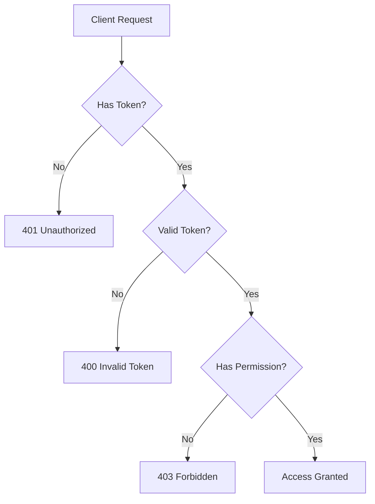

# Chapter 10: Authorization & Authentication

## Introduction

> **Authentication** vs **Authorization**
>
> **Authentication**: Making the identity of a subject known — e.g., by entering a password.
>
> **Authorization**: Granting a subject (person or process) rights to access an object (file, system).
>
> In short: **authentication** = logging in, identifying the user. **authorization** = accessing resources based on that identity.

---

### Starter Code

We start from the **VivesBib** application built in previous chapters.

Starter repository: [https://github.com/VIVES-Zuid/2425-node-les10-les10-starter](https://github.com/VIVES-Zuid/2425-node-les10-les10-starter)

Clone it and run `npm install` before starting.

---

### Objective

- **Goal:** only logged-in users get rights to modify data → C(R)U(D)
- **Additional security:** only **admin users** can delete data → (CRU)D

| | CREATE | READ | UPDATE | DELETE |
|---|---|---|---|---|
| **Visitor** | ❌ | ✅ | ❌ | ❌ |
| **Logged-in** | ✅ | ✅ | ✅ | ❌ |
| **Admin** | ✅ | ✅ | ✅ | ✅ |

---

### Two New Endpoints

We need two new endpoints:

- **Register:** `POST /api/users` → `{ name, email, password }` (email must be unique)
- **Login:** `POST /api/auth` → `{ email, password }` → returns a JWT

---

### Authentication Steps (overview)

1. Create a **User model**
2. Create a **user endpoint/route** for registration
3. Create an **auth endpoint/route** for login
4. **Hash passwords** with bcrypt
5. Return a **JSON Web Token** on login
6. Save the **PrivateKey** in an environment variable
7. Send the **JWT in headers** with each request

---

### Topics Covered

- User model + registration route
- Password hashing with bcrypt
- Login route + JWT generation
- Environment variables with the `config` package
- Information Expert Principle — `generateAuthToken` on the User model
- Auth middleware (`middleware/auth.js`)
- Protecting routes
- Getting the current user (`/me`)
- User logout
- Role-based authorization (`isAdmin`)
- Admin middleware (`middleware/admin.js`)

---

### Key Concepts

---

[🏠 Home](../README.md) | [Next: User Model & Registration →](02-user-model.md)
