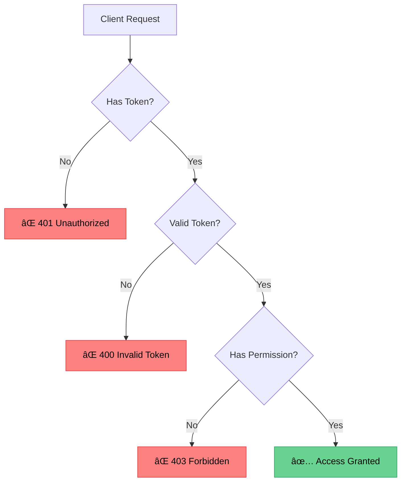

# 🔠Chapter 10: Authorization & Authentication

## Introduction to Auth

> **Authentication** vs **Authorization**
> 
> 🔑 **Authentication**: Who are you?
> 
> 🚪 **Authorization**: What can you do?

---

### 📋 Topics Covered

- **Authentication with JWT** ğŸ«
- **Protecting Routes** 🛡ï¸
- **Getting Current User** 👤
- **Role-Based Authorization** 👑
- **Admin Middleware** âš¡

---

### 🯠Learning Objectives

By the end of this chapter, you will be able to:

- ✅ Implement JWT authentication
- ✅ Protect API routes with middleware
- ✅ Retrieve authenticated user information
- ✅ Implement role-based access control
- ✅ Create admin-only endpoints

---

### 🔑 Key Concepts

```mermaid
graph TB
    A[Client Request] --> B{Has Token?}
    B -->|No| C[⌠401 Unauthorized]
    B -->|Yes| D{Valid Token?}
    D -->|No| E[⌠400 Invalid Token]
    D -->|Yes| F{Has Permission?}
    F -->|No| G[⌠403 Forbidden]
    F -->|Yes| H[✅ Access Granted]
    style H fill:#68d391,stroke:#38a169,color:#000
    style C fill:#fc8181,stroke:#e53e3e,color:#000
    style E fill:#fc8181,stroke:#e53e3e,color:#000
    style G fill:#fc8181,stroke:#e53e3e,color:#000
```

---

### 📦 Prerequisites

Make sure you have completed:
- ✅ Chapter 9 - Mongoose Modeling
- ✅ Understanding of Express middleware
- ✅ JWT basics from previous chapters

---

[🠠Home](../README.md) | [Next: Auth Middleware →](02-auth-middleware.md)
