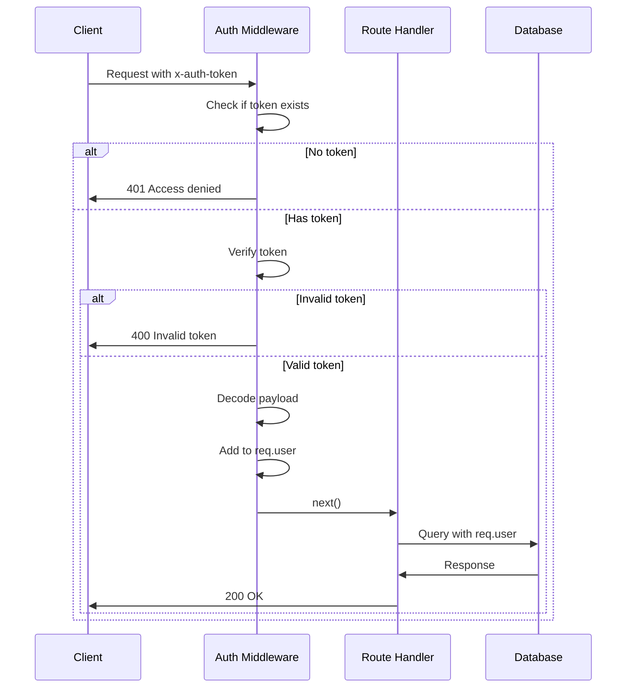

# Auth Middleware

## Protecting Routes with Authentication

We want certain endpoints to be accessible only by **authenticated users** (e.g., the POST route in `/routes/genres`).

We could add the token check inside each route:

```javascript
router.post('/', async (req, res) => {
  const token = req.header('x-auth-token');
  // if no token: res.send(401)...
});
```

But copying this logic into every route is repetitive. Instead we **extract it into a middleware function**.

---

### Creating Auth Middleware

Create `middleware/auth.js`:

```javascript
const jwt = require('jsonwebtoken');
const config = require('config');

module.exports = function (req, res, next) {
  const token = req.header('x-auth-token');
  if (!token) return res.status(401).send('Access denied. No token provided.');

  try {
    const decoded = jwt.verify(token, config.get('jwtPrivateKey'));
    req.user = decoded;
    next();
  } catch (ex) {
    res.status(400).send('Invalid token.');
  }
}
```

---

### How It Works



---

### Key Points

- **Token in Header**: reads from the `x-auth-token` request header
- **Verification**: uses the JWT secret to check the token's signature
- **Decoded Payload**: the decoded data (containing `_id`) is attached to `req.user`
- **next()**: passes control to the route handler if the token is valid

---

### HTTP Status Codes

| Status | Meaning | When Used |
|--------|---------|-----------|
| **401** | Unauthorized | No token provided |
| **400** | Bad Request | Invalid/malformed token |
| **403** | Forbidden | Valid token, insufficient permissions |
| **200** | OK | Success |

---

[← Previous: Login & JWT](03-login-and-jwt.md) | [🏠 Home](../README.md) | [Next: Protecting Routes →](05-protecting-routes.md)
