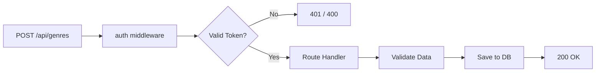

# Protecting Routes

## Applying Auth Middleware to Endpoints

Our routes have three arguments: the path, an optional middleware, and the route handler. We apply the auth middleware selectively — **not all routes need protection**.

In `routes/genres.js`, import the middleware and add it to the POST route:

```javascript
const auth = require('../middleware/auth');

router.post('/', auth, async (req, res) => {
  const { error } = validate(req.body);
  if (error) return res.status(400).send(error.details[0].message);

  let genre = new Genre({ name: req.body.name });
  genre = await genre.save();
  res.send(genre);
});
```

Every route that passes through `auth` will go through the middleware function first.

---

### Testing with REST Client

Create or update `api_calls/api_calls_genres.http`:

```http
@base_URL=http://localhost:3000/api/genres

### POST without token (401)
POST {{base_URL}}
Content-Type: application/json

{
    "name": "Action"
}

###

### POST with invalid token (400)
POST {{base_URL}}
Content-Type: application/json
x-auth-token: invalid_token_here

{
    "name": "Action"
}

###

### POST with valid token (200)
POST {{base_URL}}
Content-Type: application/json
x-auth-token: eyJhbGciOiJIUzI1NiIsInR5cCI6IkpXVCJ9...

{
    "name": "genre2"
}
```

---

### Middleware Flow



---

[← Previous: Auth Middleware](04-auth-middleware.md) | [🏠 Home](../README.md) | [Next: Getting Current User →](06-current-user.md)
