# 🚪 User Logout

## Handling User Logout with JWT

Understanding how to properly log users out when using JWT authentication.

---

### 🤔 The JWT Logout Challenge

Unlike session-based authentication, **JWT tokens are stateless**:

- 🚫 Tokens are **not stored** on the server
- ✅ Tokens exist **only on the client** side
- 🔑 Tokens remain **valid until expiration**

---

### 💡 Logout Strategy

```mermaid
graph TB
    A[User wants to logout] --> B[Client-side action]
    B --> C[Delete token from storage]
    C --> D[Remove from localStorage]
    C --> E[Remove from sessionStorage]
    C --> F[Remove from memory]
    D --> G[User logged out ✓]
    E --> G
    F --> G
    style G fill:#68d391,stroke:#38a169,color:#000
    style B fill:#90cdf4,stroke:#3182ce,color:#000
```



---

### 🎯 Client-Side Logout

**Browser (JavaScript):**
```javascript
// Remove token from localStorage
localStorage.removeItem('authToken');

// Remove token from sessionStorage
sessionStorage.removeItem('authToken');

// Clear from application state
authToken = null;

// Redirect to login page
window.location.href = '/login';
```

**React Example:**
```javascript
const logout = () => {
  localStorage.removeItem('token');
  setUser(null);
  navigate('/login');
};
```

---

### ⚠️ Important Security Considerations

#### 🚫 Bad Practice: Storing Tokens in Database

```javascript
// ❌ DON'T DO THIS
const token = jwt.sign({_id: user._id}, jwtKey);
await TokenBlacklist.create({ token }); // Bad!
```

**Why it's bad:**
- 💾 Defeats the purpose of stateless JWT
- 🐌 Adds database overhead
- 🔐 Security risk if database is compromised

---

#### ✅ Best Practices

1. **Short Token Expiration** ⏰
   ```javascript
   const token = jwt.sign(
     { _id: this._id }, 
     jwtKey, 
     { expiresIn: '1h' } // Token expires in 1 hour
   );
   ```

2. **HTTPS Only** 🔒
   ```javascript
   // Always send tokens over HTTPS only
   res.header('x-auth-token', token);
   // In production: force HTTPS
   ```

3. **Refresh Tokens** 🔄
   - Use short-lived access tokens (15min - 1hr)
   - Use long-lived refresh tokens (7-30 days)
   - Refresh tokens can be stored & revoked

---

### 🏗️ Token Storage Options

```mermaid
graph TB
    A[Token Storage] --> B[localStorage]
    A --> C[sessionStorage]
    A --> D[httpOnly Cookie]
    A --> E[Memory Only]
    
    B --> B1[✅ Persists across sessions]
    B --> B2[❌ Vulnerable to XSS]
    
    C --> C1[✅ Cleared on tab close]
    C --> C2[❌ Vulnerable to XSS]
    
    D --> D1[✅ Not accessible to JS]
    D --> D2[✅ Secure against XSS]
    D --> D3[⚠️ Needs CSRF protection]
    
    E --> E1[✅ Most secure]
    E --> E2[❌ Lost on page refresh]
    
    style D fill:#68d391,stroke:#38a169,color:#000
    style B2 fill:#fc8181,stroke:#e53e3e,color:#000
    style C2 fill:#fc8181,stroke:#e53e3e,color:#000
```



---

### 🔐 Enhanced Security Measures

#### 1. HTTPS Enforcement
```javascript
// middleware/https.js
module.exports = (req, res, next) => {
  if (process.env.NODE_ENV === 'production' && !req.secure) {
    return res.redirect(301, `https://${req.headers.host}${req.url}`);
  }
  next();
};
```

#### 2. Secure Headers
```javascript
const helmet = require('helmet');
app.use(helmet());
```

#### 3. Token Blacklist (Optional)
Only if absolutely necessary:
```javascript
// For critical operations only
const blacklist = new Set();

const checkBlacklist = (req, res, next) => {
  const token = req.header('x-auth-token');
  if (blacklist.has(token)) {
    return res.status(401).send('Token has been revoked');
  }
  next();
};
```

---

### 📊 Logout Flow Comparison

| Aspect | Session-Based | JWT-Based |
|--------|---------------|-----------|
| Server Storage | ✅ Yes | ❌ No |
| Logout Action | Delete session on server | Delete token on client |
| Immediate Effect | ✅ Instant | ⚠️ Until expiration |
| Scalability | ❌ Harder | ✅ Easier |

---

### 💡 Key Takeaways

- 🎯 **Logout = Delete token client-side**
- ⏰ **Use short token expiration**
- 🔒 **Always use HTTPS in production**
- 🚫 **Avoid storing tokens in database**
- 🔐 **Encrypt tokens if you must store them**
- 🔄 **Consider refresh token pattern**

---

### 🧪 Testing Logout Flow

```http
### 1. Login
POST {{base_URL}}/api/auth
Content-Type: application/json

{
  "email": "user@example.com",
  "password": "password123"
}

### 2. Use token for requests
GET {{base_URL}}/api/users/me
x-auth-token: {{token}}

### 3. Logout (client-side)
# Remove token from storage
# Token is now invalid from client perspective

### 4. Try to access protected route (should fail)
GET {{base_URL}}/api/users/me
# No x-auth-token header
```

---

[← Previous: Getting Current User](04-current-user.md) | [🏠 Home](../README.md) | [Next: Role-Based Authorization →](06-role-based-auth.md)
