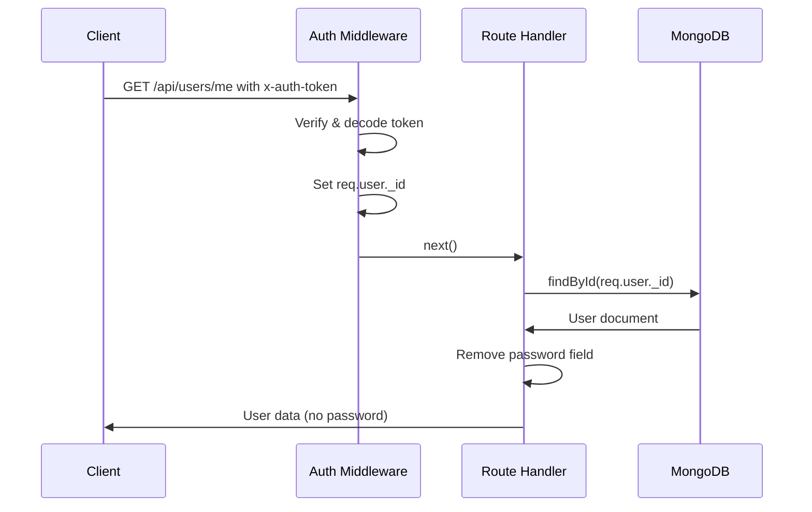

# Getting the Current User

## The /me Endpoint

We want a way to get the currently logged-in user's data. A route like `GET /api/users/:id` is **not safe** — any user could change the `:id` and access someone else's data.

The correct approach uses the token: after the auth middleware decodes it, `req.user._id` holds the ID from the signed token — it cannot be tampered with.

In `routes/users.js`:

```javascript
const auth = require('../middleware/auth');

router.get('/me', auth, async (req, res) => {
  const user = await User.findById(req.user._id).select('-password');
  res.send(user);
});
```

- `req.user._id` comes from the **verified token** (set by auth middleware), not from user input
- `.select('-password')` excludes the password field from the response

---

### How It Works



---

### Testing with REST Client

```http
@base_URL=http://localhost:3000/api/users

### No token (401)
GET {{base_URL}}/me

###

### Invalid token (400)
GET {{base_URL}}/me
x-auth-token: 1234

###

### Valid token (200)
GET {{base_URL}}/me
x-auth-token: eyJhbGciOiJIUzI1NiIsInR5cCI6IkpXVCJ9...
```

Expected response with a valid token:
```json
{
  "_id": "609429731a37803084ef0adf",
  "name": "Vives",
  "email": "milan12@vives.be",
  "__v": 0
}
```

---

[← Previous: Protecting Routes](05-protecting-routes.md) | [🏠 Home](../README.md) | [Next: User Logout →](07-user-logout.md)
