# 🛡️ Applying Admin Middleware

## Protecting Admin-Only Routes

Let's apply the admin middleware to protect the DELETE route for genres.

---

### 📝 Updating the DELETE Route

In `routes/genres.js`:

```javascript
const auth = require('../middleware/auth');
const admin = require('../middleware/admin');

// Delete route - requires authentication AND admin role
router.delete('/:id', [auth, admin], async (req, res) => {
  const genre = await Genre.findByIdAndRemove(req.params.id);
  
  if (!genre) 
    return res.status(404).send('The genre with the given ID was not found.');
  
  res.send(genre);
});
```

---

### 🎨 Middleware Chain

```mermaid
graph LR
    A[DELETE /api/genres/:id] --> B[auth]
    B --> C{Valid Token?}
    C -->|No| D[❌ 401/400]
    C -->|Yes| E[admin]
    E --> F{isAdmin?}
    F -->|No| G[❌ 403]
    F -->|Yes| H[Route Handler]
    H --> I[Delete Genre]
    I --> J[✅ 200 OK]
    
    style J fill:#68d391,stroke:#38a169,color:#000
    style D fill:#fc8181,stroke:#e53e3e,color:#000
    style G fill:#fc8181,stroke:#e53e3e,color:#000
    style B fill:#90cdf4,stroke:#3182ce,color:#000
    style E fill:#fbd38d,stroke:#d69e2e,color:#000
```



---

### 🧪 Testing in Postman

#### Setup: Find a Valid Genre ID

1. Open **MongoDB Compass**
2. Navigate to your database → genres collection
3. Copy a genre ID: `6094366aab3fa733183d8f38`

---

#### ❌ Test 1: No Token

**Request:**
```http
DELETE http://localhost:3000/api/genres/6094366aab3fa733183d8f38
```

**Response:** `401 Unauthorized`
```
Access denied. No token provided.
```

---

#### ❌ Test 2: Invalid Token

**Request:**
```http
DELETE http://localhost:3000/api/genres/6094366aab3fa733183d8f38
x-auth-token: invalid_token_here
```

**Response:** `400 Bad Request`
```
Invalid token.
```

---

#### ❌ Test 3: Valid Token, Not Admin

**Request:**
```http
DELETE http://localhost:3000/api/genres/6094366aab3fa733183d8f38
x-auth-token: eyJhbGciOiJIUzI1NiIsInR5cCI6IkpXVCJ9...
```
*(Token with `isAdmin: false`)*

**Response:** `403 Forbidden`
```
Access Denied
```

---

#### ✅ Test 4: Valid Token, Is Admin

**Request:**
```http
DELETE http://localhost:3000/api/genres/6094366aab3fa733183d8f38
x-auth-token: eyJhbGciOiJIUzI1NiIsInR5cCI6IkpXVCJ9...
```
*(Token with `isAdmin: true`)*

**Response:** `200 OK`
```json
{
  "_id": "6094366aab3fa733183d8f38",
  "name": "sci-fi",
  "__v": 0
}
```

---

### 🧾 REST Client Examples

```http
### Test 1: No Token (❌ 401)
DELETE {{base_URL}}/api/genres/6094366aab3fa733183d8f38

### Test 2: Invalid Token (❌ 400)
DELETE {{base_URL}}/api/genres/6094366aab3fa733183d8f38
x-auth-token: invalid_token

### Test 3: Regular User Token (❌ 403)
DELETE {{base_URL}}/api/genres/6094366aab3fa733183d8f38
x-auth-token: {{regular_user_token}}

### Test 4: Admin User Token (✅ 200)
DELETE {{base_URL}}/api/genres/6094366aab3fa733183d8f38
x-auth-token: {{admin_user_token}}
```

---

### 📊 Complete Test Matrix

| Test Case | Token | isAdmin | Status | Response |
|-----------|-------|---------|--------|----------|
| 1 | None | - | 🔴 401 | Access denied. No token provided. |
| 2 | Invalid | - | 🔴 400 | Invalid token. |
| 3 | Valid | false | 🔴 403 | Access Denied |
| 4 | Valid | true | 🟢 200 | Genre deleted successfully |

---

### 🎯 Authorization Levels

```mermaid
graph TB
    A[API Endpoints] --> B[Public Routes]
    A --> C[Authenticated Routes]
    A --> D[Admin Routes]
    
    B --> B1[✅ Anyone can access]
    B --> B2[GET /api/genres]
    
    C --> C1[🔑 Requires valid token]
    C --> C2[POST /api/genres]
    C --> C3[GET /api/users/me]
    
    D --> D1[👑 Requires admin token]
    D --> D2[DELETE /api/genres/:id]
    D --> D3[DELETE /api/users/:id]
    
    style B1 fill:#68d391,stroke:#38a169,color:#000
    style C1 fill:#90cdf4,stroke:#3182ce,color:#000
    style D1 fill:#fbd38d,stroke:#d69e2e,color:#000
```



---

### 🔐 Security Layers

1. **Authentication** (auth middleware)
   - ✅ Verifies identity
   - ✅ Token must be valid
   - ❌ 401 if no/invalid token

2. **Authorization** (admin middleware)
   - ✅ Verifies permissions
   - ✅ User must be admin
   - ❌ 403 if not admin

3. **Validation** (route handler)
   - ✅ Verifies resource exists
   - ❌ 404 if not found

---

### 💡 Best Practices

- ✅ **Layer security**: Multiple checks for sensitive operations
- ✅ **Descriptive errors**: Different status codes for different failures
- ✅ **Audit logging**: Log all admin actions
- ✅ **Principle of least privilege**: Only admins can delete
- ✅ **Test all scenarios**: Test success and all failure cases

---

### 🎓 Key Takeaways

1. **Middleware Array**: `[auth, admin]` applies both checks
2. **Order Matters**: auth must come before admin
3. **Clear Status Codes**: 401, 400, 403, 404, 200 each mean something
4. **Token-Based**: No database query needed for authorization
5. **Reusable**: Apply to any route that needs admin access

---

[← Previous: Admin Middleware](07-admin-middleware.md) | [🏠 Home](../README.md) | [Next: Summary →](09-summary.md)
