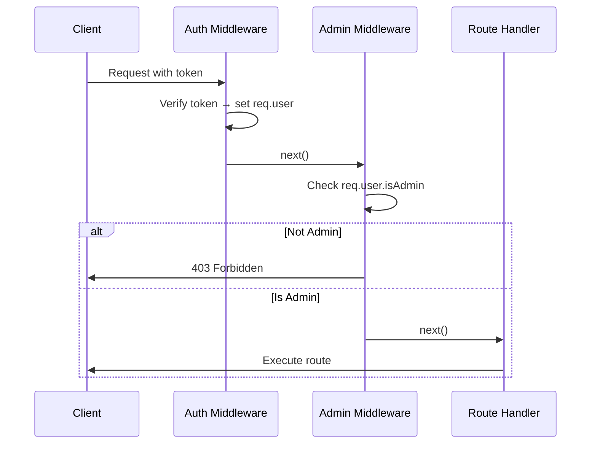

# Admin Middleware

## Creating the Admin Authorization Middleware

Create `middleware/admin.js`:

```javascript
// 400 Bad Request
// 401 Unauthorized - not authenticated
// 403 Forbidden    - authenticated but no permission

module.exports = function (req, res, next) {
  if (!req.user.isAdmin) return res.status(403).send('Access Denied');
  next();
}
```

The auth middleware (`middleware/auth.js`) sets `req.user` from the decoded token. Because `isAdmin` is now in the payload, `req.user.isAdmin` is available here without any DB query.

---

### Key Concept: Middleware Order

The admin middleware **must come after** the auth middleware, because it depends on `req.user` being set.

```javascript
const auth = require('../middleware/auth');
const admin = require('../middleware/admin');

// Correct order: [auth, admin]
router.delete('/:id', [auth, admin], async (req, res) => {
  // ...
});
```

If you put `admin` before `auth`, `req.user` will be `undefined` and the middleware will crash.

---

### Authorization Flow



---

### HTTP Status Codes

| Status | Name | Meaning |
|--------|------|---------|
| **400** | Bad Request | Invalid token |
| **401** | Unauthorized | No token provided |
| **403** | Forbidden | Valid token, insufficient role |
| **200** | OK | Success |

---

[← Previous: Role-Based Authorization](08-role-based-auth.md) | [🏠 Home](../README.md) | [Next: Applying Admin Middleware →](10-applying-admin.md)
