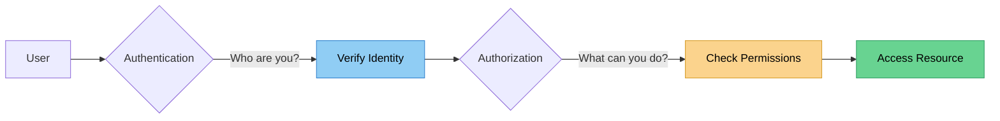
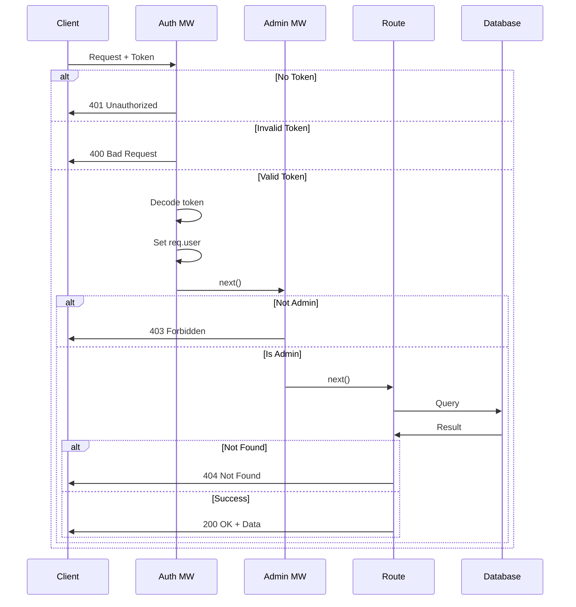

# 📚 Chapter 10 Summary

## Authorization & Authentication - Key Concepts

Congratulations! You've mastered authentication and authorization in Node.js! 🎉

---

### 🎯 What You've Learned

#### 1. Authentication vs Authorization



- **Authentication** 🔑: Verifying WHO the user is (via JWT token)
- **Authorization** 🚪: Verifying WHAT the user can do (via roles)

---

### 🔧 Key Components Implemented

#### 1. **Auth Middleware** (`middleware/auth.js`)
```javascript
// Verifies JWT token and sets req.user
module.exports = function (req, res, next) {
  const token = req.header('x-auth-token');
  if (!token) return res.status(401).send('Access denied.');
  
  try {
    const decoded = jwt.verify(token, config.get('jwtPrivateKey'));
    req.user = decoded;
    next();
  } catch (ex) {
    res.status(400).send('Invalid token.');
  }
}
```

---

#### 2. **Admin Middleware** (`middleware/admin.js`)
```javascript
// Checks if user has admin role
module.exports = function (req, res, next) {
  if (!req.user.isAdmin) return res.status(403).send('Access Denied');
  next();
}
```

---

#### 3. **Protected Routes**
```javascript
// Requires authentication
router.post('/', auth, async (req, res) => {
  // Only authenticated users can create
});

// Requires authentication AND admin role
router.delete('/:id', [auth, admin], async (req, res) => {
  // Only admins can delete
});
```

---

### 📊 HTTP Status Codes

| Code | Status | Meaning | When to Use |
|------|--------|---------|-------------|
| 🟢 200 | OK | Success | Request successful |
| 🔴 400 | Bad Request | Invalid data | Invalid token or bad input |
| 🔴 401 | Unauthorized | Not authenticated | No token or expired token |
| 🔴 403 | Forbidden | No permission | Valid user but insufficient privileges |
| 🔴 404 | Not Found | Resource missing | Resource doesn't exist |

---

### 🎨 Complete Authorization Flow



---

### 🔐 Security Best Practices Covered

✅ **Token-Based Authentication**
- Stateless JWT tokens
- Signed with secret key
- Contains user ID and role

✅ **Secure Logout**
- Client-side token removal
- Short token expiration
- HTTPS only in production

✅ **Role-Based Access Control**
- `isAdmin` property in user model
- Admin role included in JWT
- Separate admin middleware

✅ **Proper Error Handling**
- Descriptive error messages
- Appropriate status codes
- No sensitive data in errors

✅ **Password Security**
- Never send passwords in responses
- Use `.select('-password')`
- Bcrypt hashing (from previous chapters)

---

### 💡 Key Concepts

#### 1. Middleware Composition
```javascript
// Single middleware
router.get('/me', auth, handler);

// Multiple middleware (array)
router.delete('/:id', [auth, admin], handler);
```

#### 2. Token Payload
```javascript
const token = jwt.sign(
  { 
    _id: user._id,
    isAdmin: user.isAdmin 
  }, 
  jwtPrivateKey
);
```

#### 3. Accessing Current User
```javascript
// req.user is set by auth middleware
const userId = req.user._id;
const isAdmin = req.user.isAdmin;
```

---

### 🧪 Testing Checklist

For each protected route, test:

- ✅ No token (401)
- ✅ Invalid token (400)
- ✅ Valid token, not admin (403 for admin routes)
- ✅ Valid token, is admin (200)
- ✅ Valid request, resource not found (404)

---

### 📁 File Structure

```
project/
├── middleware/
│   ├── auth.js          # Authentication middleware
│   └── admin.js         # Authorization middleware
├── models/
│   └── user.js          # User model with isAdmin
├── routes/
│   ├── auth.js          # Login endpoint
│   ├── users.js         # User routes (/me endpoint)
│   └── genres.js        # Protected CRUD operations
└── config/
    └── default.json     # JWT secret configuration
```

---

### 🚀 Next Steps

Now that you've mastered authentication and authorization, you can:

1. **Add more roles**: Implement multiple role levels
2. **Refresh tokens**: Add long-lived refresh tokens
3. **OAuth integration**: Add social login (Google, GitHub)
4. **Two-factor authentication**: Add 2FA for extra security
5. **Audit logging**: Log all admin actions
6. **Rate limiting**: Prevent brute force attacks

---

### 📖 Resources

- [JWT.io](https://jwt.io/) - JWT debugger and docs
- [Bcrypt](https://www.npmjs.com/package/bcrypt) - Password hashing
- [Helmet.js](https://helmetjs.github.io/) - Security headers
- [OWASP Top 10](https://owasp.org/www-project-top-ten/) - Security best practices

---

### 🎓 Quiz Yourself

1. What's the difference between authentication and authorization?
2. Why do we use middleware arrays like `[auth, admin]`?
3. What status code for: no token, invalid token, not admin?
4. Why don't we store JWT tokens in the database?
5. How does the `/me` endpoint prevent users from accessing other users' data?

---

## 🎉 Congratulations!

You've completed **Chapter 10: Authorization & Authentication**!

You now know how to:
- ✅ Implement JWT authentication
- ✅ Protect routes with middleware
- ✅ Implement role-based authorization
- ✅ Secure user data and operations
- ✅ Handle logout properly with JWT

Keep building secure applications! 🔒🚀

---

[← Previous: Applying Admin Middleware](08-applying-admin.md) | [🏠 Home](../README.md)
