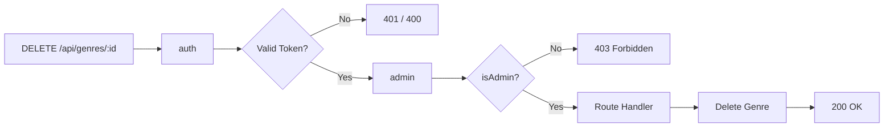
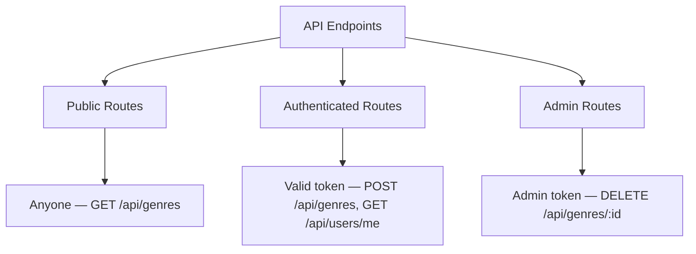

# Applying Admin Middleware

## Protecting the DELETE Route

In `routes/genres.js`, import the admin middleware and apply both middlewares to the DELETE route:

```javascript
const auth = require('../middleware/auth');
const admin = require('../middleware/admin');

router.delete('/:id', [auth, admin], async (req, res) => {
  const genre = await Genre.findByIdAndRemove(req.params.id);

  if (!genre)
    return res.status(404).send('The genre with the given ID was not found.');

  res.send(genre);
});
```

---

### Middleware Chain



---

### Testing with REST Client

First find a valid genre ID in MongoDB Compass, then:

```http
@base_URL=http://localhost:3000/api/genres
@objId=6094366aab3fa733183d8f38

### No token (401)
DELETE {{base_URL}}/{{objId}}

###

### Invalid token (400)
DELETE {{base_URL}}/{{objId}}
x-auth-token: faultyToken..

###

### Valid token, not admin (403)
DELETE {{base_URL}}/{{objId}}
x-auth-token: eyJhbGci...   # token with isAdmin: false

###

### Admin token (200)
DELETE {{base_URL}}/{{objId}}
x-auth-token: eyJhbGci...   # token with isAdmin: true
```

---

### Test Matrix

| Test | Token | isAdmin | Status | Response |
|------|-------|---------|--------|----------|
| 1 | None | — | 401 | Access denied. No token provided. |
| 2 | Invalid | — | 400 | Invalid token. |
| 3 | Valid | false | 403 | Access Denied |
| 4 | Valid | true | 200 | Deleted genre object |

---

### Authorization Levels Summary



---

[← Previous: Admin Middleware](09-admin-middleware.md) | [🏠 Home](../README.md) | [Next: Summary →](11-summary.md)
