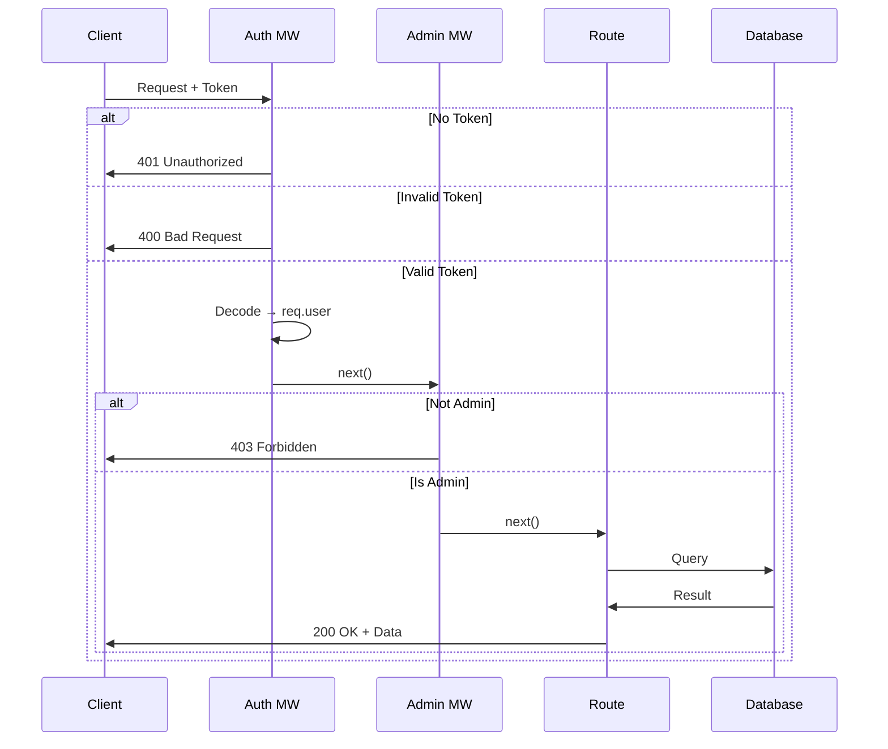

# Chapter 10 Summary

## Authorization & Authentication — Key Concepts

---

### What You've Built

Starting from the VivesBib starter, you incrementally added:

1. **User model** (`models/user.js`) with name, email, hashed password, isAdmin
2. **Register route** (`routes/users.js`) with lodash + bcrypt
3. **Login route** (`routes/auth.js`) returning a JWT
4. **Environment variables** via the `config` package
5. **generateAuthToken** method on the User model (Information Expert Principle)
6. **Auth middleware** (`middleware/auth.js`) — verifies the JWT
7. **Protected routes** — POST/PUT/DELETE require a valid token
8. **/me endpoint** — returns the current user from the token
9. **Admin middleware** (`middleware/admin.js`) — checks `isAdmin` role
10. **DELETE protection** — requires both auth + admin

---

### Key Components

#### models/user.js
```javascript
userSchema.methods.generateAuthToken = function() {
  return jwt.sign(
    { _id: this._id, isAdmin: this.isAdmin },
    config.get('jwtPrivateKey')
  );
};
```

#### middleware/auth.js
```javascript
module.exports = function (req, res, next) {
  const token = req.header('x-auth-token');
  if (!token) return res.status(401).send('Access denied.');
  try {
    req.user = jwt.verify(token, config.get('jwtPrivateKey'));
    next();
  } catch (ex) {
    res.status(400).send('Invalid token.');
  }
}
```

#### middleware/admin.js
```javascript
module.exports = function (req, res, next) {
  if (!req.user.isAdmin) return res.status(403).send('Access Denied');
  next();
}
```

---

### File Structure

```
project/
├── config/
│   ├── default.json                      # { "jwtPrivateKey": "" }
│   └── custom-environment-variables.json # { "jwtPrivateKey": "vivesbib_jwtPrivateKey" }
├── middleware/
│   ├── auth.js    # authentication — verifies JWT, sets req.user
│   └── admin.js   # authorization  — checks req.user.isAdmin
├── models/
│   └── user.js    # User schema + generateAuthToken method
├── routes/
│   ├── auth.js    # POST /api/auth — login, returns JWT
│   ├── users.js   # POST /api/users — register; GET /api/users/me
│   └── genres.js  # protected CRUD
└── index.js       # startup check for jwtPrivateKey
```

---

### HTTP Status Codes

| Code | Meaning | Used When |
|------|---------|-----------|
| 200 | OK | Success |
| 400 | Bad Request | Invalid token or bad input |
| 401 | Unauthorized | No token provided |
| 403 | Forbidden | Valid user, insufficient role |
| 404 | Not Found | Resource not found |

---

### Complete Authorization Flow



---

### Testing Checklist

For every protected route, test:

- [ ] No token → 401
- [ ] Invalid token → 400
- [ ] Valid token, not admin (for admin routes) → 403
- [ ] Valid token, is admin → 200
- [ ] Valid request, resource not found → 404

---

### Quiz

1. What is the difference between authentication and authorization?
2. Why does `generateAuthToken` belong on the User model and not in a route file?
3. What HTTP status codes correspond to: no token, invalid token, not admin?
4. Why should you not store JWT tokens in the database?
5. How does the `/me` endpoint prevent users from accessing other users' data?

---

[← Previous: Applying Admin Middleware](10-applying-admin.md) | [🏠 Home](../README.md)
