# 🚨 Error Handling in Node.js

> **Chapter 11: Introduction to Error Handling**

---

## 📋 Overview

Error handling is a **critical aspect** of building robust Node.js applications. Proper error handling ensures:

- 🛡️ **Application stability**
- 🔍 **Better debugging experience**
- 👥 **Improved user experience**
- 🔒 **Security** (no sensitive data leaks)

---

## 🎯 Learning Objectives

By the end of this chapter, you will understand:

1. ✅ Different types of errors in Node.js
2. ✅ Synchronous vs asynchronous error handling
3. ✅ Try-catch blocks and when to use them
4. ✅ Error-first callbacks pattern
5. ✅ Promise error handling
6. ✅ Async/await error handling
7. ✅ Express.js error middleware
8. ✅ Best practices for production

---

## 🔴 Why Error Handling Matters

```mermaid
graph TD
    A[❌ Poor Error Handling] --> B[App Crashes]
    A --> C[Security Vulnerabilities]
    A --> D[Poor User Experience]
    A --> E[Hard to Debug]
    
    F[✅ Good Error Handling] --> G[Graceful Degradation]
    F --> H[Secure Applications]
    F --> I[Better UX]
    F --> J[Easy Debugging]
    
    style A fill:#ff6b6b,stroke:#c92a2a,color:#fff
    style F fill:#51cf66,stroke:#2f9e44,color:#fff
```



---

## 📊 Types of Errors

| Error Type | Description | Example |
|------------|-------------|---------|
| **Syntax Errors** | Code parsing errors | Missing parenthesis |
| **Runtime Errors** | Errors during execution | `undefined.method()` |
| **Logical Errors** | Wrong logic/algorithm | Incorrect calculation |
| **Operational Errors** | Expected failures | Network timeout, DB connection fail |
| **Programmer Errors** | Bugs in code | Passing wrong type to function |

---

## 💡 Key Concepts

### Operational vs Programmer Errors

**🔧 Operational Errors** (Expected & Recoverable)
- Network failures
- Database unavailable
- Invalid user input
- File not found

**🐛 Programmer Errors** (Bugs - Should NOT be caught)
- Calling undefined function
- Passing wrong types
- Logic errors
- Forgetting to handle promises

---

## 🎨 The Error Object

```javascript
const error = new Error('Something went wrong!');

console.log(error.name);      // 'Error'
console.log(error.message);   // 'Something went wrong!'
console.log(error.stack);     // Stack trace
```

### Built-in Error Types

```javascript
// ReferenceError - variable doesn't exist
console.log(nonExistentVar);

// TypeError - wrong type
null.method();

// RangeError - value out of range
new Array(-1);

// SyntaxError - invalid syntax
eval('foo bar');
```

---

## 🚀 What's Next?

In the following slides, we'll dive deep into:
- Handling synchronous errors
- Handling asynchronous errors
- Express.js error middleware
- Best practices and patterns

---

[🏠 Home](../README.md) | [➡️ Next: Synchronous Error Handling](./02-synchronous-errors.md)
