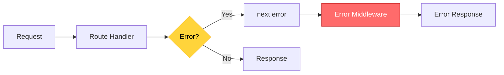

# 🚂 Express Error Handling

> **Chapter 11: Error Middleware in Express.js**

---

## 📋 Express Error Middleware

Express provides a special middleware for handling errors with **4 parameters**:

```javascript
app.use((err, req, res, next) => {
  console.error(err.stack);
  res.status(500).send('Something broke!');
});
```

**Important:** Must have **4 parameters** for Express to recognize it as error middleware!

---

## 🔄 How It Works



---

## 🎯 Basic Error Middleware Setup

```javascript
const express = require('express');
const app = express();

// Regular routes
app.get('/users/:id', async (req, res, next) => {
  try {
    const user = await User.findById(req.params.id);
    if (!user) {
      const error = new Error('User not found');
      error.statusCode = 404;
      throw error;
    }
    res.json(user);
  } catch (error) {
    next(error); // Pass to error middleware
  }
});

// Error middleware (must be LAST!)
app.use((err, req, res, next) => {
  const statusCode = err.statusCode || 500;
  res.status(statusCode).json({
    error: {
      message: err.message,
      status: statusCode
    }
  });
});

app.listen(3000);
```

---

## 🎨 Custom Error Classes

```javascript
// Base error class
class AppError extends Error {
  constructor(message, statusCode) {
    super(message);
    this.statusCode = statusCode;
    this.isOperational = true;
    
    Error.captureStackTrace(this, this.constructor);
  }
}

// Specific error types
class NotFoundError extends AppError {
  constructor(message = 'Resource not found') {
    super(message, 404);
    this.name = 'NotFoundError';
  }
}

class ValidationError extends AppError {
  constructor(message = 'Validation failed') {
    super(message, 400);
    this.name = 'ValidationError';
  }
}

class UnauthorizedError extends AppError {
  constructor(message = 'Unauthorized access') {
    super(message, 401);
    this.name = 'UnauthorizedError';
  }
}

class ForbiddenError extends AppError {
  constructor(message = 'Forbidden') {
    super(message, 403);
    this.name = 'ForbiddenError';
  }
}
```

---

## 🛠️ Comprehensive Error Middleware

```javascript
const errorHandler = (err, req, res, next) => {
  // Log error details
  console.error({
    message: err.message,
    stack: err.stack,
    url: req.originalUrl,
    method: req.method,
    timestamp: new Date().toISOString()
  });
  
  // Default error values
  let statusCode = err.statusCode || 500;
  let message = err.message || 'Internal Server Error';
  
  // Mongoose validation error
  if (err.name === 'ValidationError') {
    statusCode = 400;
    message = Object.values(err.errors).map(e => e.message).join(', ');
  }
  
  // Mongoose duplicate key error
  if (err.code === 11000) {
    statusCode = 400;
    message = 'Duplicate field value entered';
  }
  
  // Mongoose cast error (invalid ObjectId)
  if (err.name === 'CastError') {
    statusCode = 400;
    message = 'Invalid ID format';
  }
  
  // JWT errors
  if (err.name === 'JsonWebTokenError') {
    statusCode = 401;
    message = 'Invalid token';
  }
  
  if (err.name === 'TokenExpiredError') {
    statusCode = 401;
    message = 'Token expired';
  }
  
  // Send error response
  res.status(statusCode).json({
    success: false,
    error: {
      message,
      ...(process.env.NODE_ENV === 'development' && { stack: err.stack })
    }
  });
};

module.exports = errorHandler;
```

---

## 🔍 Environment-Specific Error Responses

```javascript
const errorHandler = (err, req, res, next) => {
  const statusCode = err.statusCode || 500;
  
  if (process.env.NODE_ENV === 'development') {
    // Detailed error for development
    res.status(statusCode).json({
      success: false,
      error: {
        message: err.message,
        statusCode,
        stack: err.stack,
        error: err
      }
    });
  } else {
    // Generic error for production
    if (err.isOperational) {
      // Operational, trusted error: send message to client
      res.status(statusCode).json({
        success: false,
        error: {
          message: err.message
        }
      });
    } else {
      // Programming or unknown error: don't leak details
      console.error('ERROR 💥', err);
      res.status(500).json({
        success: false,
        error: {
          message: 'Something went wrong'
        }
      });
    }
  }
};
```

---

## 🎯 Async Handler Wrapper

```javascript
// Wrapper to catch async errors
const asyncHandler = (fn) => {
  return (req, res, next) => {
    Promise.resolve(fn(req, res, next)).catch(next);
  };
};

// Or with async/await
const asyncHandler = (fn) => {
  return async (req, res, next) => {
    try {
      await fn(req, res, next);
    } catch (error) {
      next(error);
    }
  };
};

// Usage
app.get('/users/:id', asyncHandler(async (req, res) => {
  const user = await User.findById(req.params.id);
  
  if (!user) {
    throw new NotFoundError('User not found');
  }
  
  res.json(user);
}));
```

---

## 🔄 Multiple Error Middlewares

```javascript
// 404 handler (if no route matched)
app.use((req, res, next) => {
  const error = new NotFoundError(`Route ${req.originalUrl} not found`);
  next(error);
});

// Validation error handler
app.use((err, req, res, next) => {
  if (err.name === 'ValidationError') {
    return res.status(400).json({
      success: false,
      error: {
        message: 'Validation failed',
        details: err.errors
      }
    });
  }
  next(err); // Pass to next error handler
});

// General error handler
app.use((err, req, res, next) => {
  const statusCode = err.statusCode || 500;
  res.status(statusCode).json({
    success: false,
    error: {
      message: err.message
    }
  });
});
```

---

## 📊 Complete Example

```javascript
const express = require('express');
const app = express();

// Custom error classes
class AppError extends Error {
  constructor(message, statusCode) {
    super(message);
    this.statusCode = statusCode;
    this.isOperational = true;
  }
}

class NotFoundError extends AppError {
  constructor(message) {
    super(message, 404);
  }
}

// Async handler
const asyncHandler = fn => (req, res, next) => {
  Promise.resolve(fn(req, res, next)).catch(next);
};

// Middleware
app.use(express.json());

// Routes
app.get('/users/:id', asyncHandler(async (req, res) => {
  const user = await getUserById(req.params.id);
  
  if (!user) {
    throw new NotFoundError('User not found');
  }
  
  res.json(user);
}));

app.post('/users', asyncHandler(async (req, res) => {
  // Validate input
  if (!req.body.email) {
    throw new AppError('Email is required', 400);
  }
  
  const user = await createUser(req.body);
  res.status(201).json(user);
}));

// 404 handler
app.use((req, res, next) => {
  next(new NotFoundError(`Route ${req.originalUrl} not found`));
});

// Error handler
app.use((err, req, res, next) => {
  console.error({
    message: err.message,
    stack: err.stack,
    url: req.originalUrl,
    method: req.method
  });
  
  const statusCode = err.statusCode || 500;
  const message = err.isOperational 
    ? err.message 
    : 'Internal Server Error';
  
  res.status(statusCode).json({
    success: false,
    error: { message }
  });
});

app.listen(3000);
```

---

## 🎨 Error Response Format Standards

```javascript
// Success response
{
  "success": true,
  "data": { ... }
}

// Error response
{
  "success": false,
  "error": {
    "message": "User not found",
    "statusCode": 404,
    "timestamp": "2024-01-15T10:30:00.000Z",
    "path": "/api/users/123"
  }
}

// Validation error response
{
  "success": false,
  "error": {
    "message": "Validation failed",
    "statusCode": 400,
    "details": {
      "email": "Email is required",
      "age": "Age must be a positive number"
    }
  }
}
```

---

## 💡 Best Practices

### ✅ DO's

```javascript
// ✅ Use custom error classes
throw new NotFoundError('User not found');

// ✅ Pass errors to next()
next(error);

// ✅ Define error middleware LAST
app.use(errorHandler);

// ✅ Use async wrappers
app.get('/route', asyncHandler(async (req, res) => { ... }));

// ✅ Log errors properly
logger.error('Error details', { error, context });
```

### ❌ DON'Ts

```javascript
// ❌ Don't forget the 4th parameter
app.use((err, req, res) => { ... }); // Won't work!

// ❌ Don't send HTML in API errors
res.status(500).send('<h1>Error</h1>');

// ❌ Don't expose stack traces in production
res.json({ error: err.stack }); // Security risk!

// ❌ Don't forget to call next() in async routes
try {
  await something();
} catch (err) {
  // Forgot next(err) - request hangs!
}
```

---

## 🧪 Lab Exercise

Build an Express API with:
1. Custom error classes hierarchy
2. Async handler wrapper
3. Comprehensive error middleware
4. 404 handler
5. Environment-specific responses
6. Proper error logging

---

[⬅️ Previous: Async Errors](./03-async-errors.md) | [🏠 Home](../README.md) | [➡️ Next: Best Practices](./05-best-practices.md)
