# 🎭 Mocking and Spies

## Chapter 12: Isolating Code Under Test

---

## 🎯 What is Mocking?

**Mocking** replaces real dependencies with controlled test doubles.

### Why Mock?

- ⚡ **Speed** - No real API calls or DB queries
- 🎯 **Isolation** - Test one thing at a time
- 🔄 **Repeatability** - Same results every time
- 🛡️ **Safety** - No side effects (emails, payments, etc.)
- 🧪 **Edge Cases** - Test errors and rare scenarios

---

## 🎭 Types of Test Doubles

```mermaid
graph TB
    A[Test Doubles] --> B[Dummy<br/>📦 Placeholder]
    A --> C[Stub<br/>🔧 Predefined Response]
    A --> D[Mock<br/>🎯 Verify Behavior]
    A --> E[Spy<br/>👀 Track Calls]
    A --> F[Fake<br/>⚙️ Simplified Implementation]
    
    style A fill:#4299e1,stroke:#2b6cb0,color:#fff
    style C fill:#9f7aea,stroke:#6b46c1,color:#fff
    style D fill:#38a169,stroke:#2f855a,color:#fff
```



---

## 🔧 Basic Mock Functions

### Creating a Mock

```javascript
import { test, mock } from 'node:test';
import assert from 'node:assert';

test('basic mock function', () => {
  const mockFn = mock.fn();
  
  // Call the mock
  mockFn('hello', 123);
  mockFn('world');
  
  // Verify calls
  assert.strictEqual(mockFn.mock.calls.length, 2);
  assert.deepStrictEqual(mockFn.mock.calls[0].arguments, ['hello', 123]);
  assert.deepStrictEqual(mockFn.mock.calls[1].arguments, ['world']);
});
```

### Mock with Return Value

```javascript
test('mock with return value', () => {
  const mockFn = mock.fn(() => 'mocked result');
  
  const result = mockFn('test');
  
  assert.strictEqual(result, 'mocked result');
  assert.strictEqual(mockFn.mock.calls.length, 1);
});
```

---

## 👀 Spying on Functions

### Method Spy

```javascript
test('spy on object method', () => {
  const user = {
    name: 'Alice',
    greet(greeting) {
      return `${greeting}, ${this.name}!`;
    }
  };
  
  // Spy on the method
  mock.method(user, 'greet');
  
  // Call it
  const result = user.greet('Hello');
  
  // Verify
  assert.strictEqual(result, 'Hello, Alice!');
  assert.strictEqual(user.greet.mock.calls.length, 1);
  assert.deepStrictEqual(user.greet.mock.calls[0].arguments, ['Hello']);
});
```

---

## 🌐 Mocking External Dependencies

### Example: User Service

```javascript
// userService.js
import { getUser as apiGetUser } from './api.js';

export async function getUserName(id) {
  const user = await apiGetUser(id);
  return user.name;
}
```

### Testing with Mock

```javascript
import { test, mock } from 'node:test';
import assert from 'node:assert';

test('getUserName returns user name', async (t) => {
  // Mock the API module
  const apiModule = await import('./api.js');
  
  t.mock.method(apiModule, 'getUser', async () => ({
    id: 1,
    name: 'Alice',
    email: 'alice@example.com'
  }));
  
  // Import after mocking
  const { getUserName } = await import('./userService.js');
  
  const name = await getUserName(1);
  
  assert.strictEqual(name, 'Alice');
});
```

---

## 📊 Mock Call Information

### Tracking Calls

```javascript
test('track mock calls', () => {
  const mockFn = mock.fn((x, y) => x + y);
  
  mockFn(2, 3);
  mockFn(5, 7);
  mockFn(1, 1);
  
  // Number of calls
  assert.strictEqual(mockFn.mock.calls.length, 3);
  
  // First call arguments
  assert.deepStrictEqual(
    mockFn.mock.calls[0].arguments,
    [2, 3]
  );
  
  // First call result
  assert.strictEqual(mockFn.mock.calls[0].result, 5);
  
  // All results
  const results = mockFn.mock.calls.map(call => call.result);
  assert.deepStrictEqual(results, [5, 12, 2]);
});
```

---

## 🔄 Different Return Values

### Return Different Values Per Call

```javascript
test('different return values', () => {
  let callCount = 0;
  const mockFn = mock.fn(() => {
    callCount++;
    if (callCount === 1) return 'first';
    if (callCount === 2) return 'second';
    return 'default';
  });
  
  assert.strictEqual(mockFn(), 'first');
  assert.strictEqual(mockFn(), 'second');
  assert.strictEqual(mockFn(), 'default');
});
```

### Mock Implementation

```javascript
test('mock implementation', () => {
  const userDb = {
    users: [
      { id: 1, name: 'Alice' },
      { id: 2, name: 'Bob' }
    ],
    findById: null
  };
  
  // Mock the method
  userDb.findById = mock.fn((id) => {
    return userDb.users.find(u => u.id === id);
  });
  
  const user = userDb.findById(1);
  assert.strictEqual(user.name, 'Alice');
  
  assert.strictEqual(userDb.findById.mock.calls.length, 1);
});
```

---

## 🌐 Mocking HTTP Requests

### Mock fetch

```javascript
test('mock fetch API', async (t) => {
  // Mock global fetch
  global.fetch = mock.fn(async (url) => ({
    ok: true,
    json: async () => ({
      userId: 1,
      id: 1,
      title: 'Test Todo',
      completed: false
    })
  }));
  
  const response = await fetch('https://api.example.com/todos/1');
  const data = await response.json();
  
  assert.strictEqual(data.title, 'Test Todo');
  assert.strictEqual(fetch.mock.calls.length, 1);
});
```

---

## 💾 Mocking Database

### Mock Database Connection

```javascript
test('mock database operations', async () => {
  const mockDb = {
    query: mock.fn(async (sql, params) => {
      if (sql.includes('SELECT')) {
        return {
          rows: [{ id: params[0], name: 'Alice' }]
        };
      }
      if (sql.includes('INSERT')) {
        return { insertId: 1 };
      }
    })
  };
  
  // Use mock db
  const result = await mockDb.query(
    'SELECT * FROM users WHERE id = ?',
    [1]
  );
  
  assert.strictEqual(result.rows[0].name, 'Alice');
  assert.strictEqual(mockDb.query.mock.calls.length, 1);
});
```

---

## 📁 Mocking File System

```javascript
import { test, mock } from 'node:test';

test('mock fs operations', async (t) => {
  const fsModule = await import('node:fs/promises');
  
  t.mock.method(fsModule, 'readFile', async () => {
    return JSON.stringify({ name: 'Alice', age: 30 });
  });
  
  const content = await fsModule.readFile('user.json', 'utf-8');
  const data = JSON.parse(content);
  
  assert.strictEqual(data.name, 'Alice');
});
```

---

## 🎯 Mocking Modules

### Complete Module Mock

```javascript
// emailService.js
export function sendEmail(to, subject, body) {
  // Real implementation would send email
  console.log(`Sending email to ${to}`);
  return { success: true, messageId: '12345' };
}
```

```javascript
// userService.test.js
test('sends welcome email', async (t) => {
  const emailModule = await import('./emailService.js');
  
  // Mock the sendEmail function
  t.mock.method(emailModule, 'sendEmail', () => ({
    success: true,
    messageId: 'mock-id'
  }));
  
  // Import service after mocking
  const { registerUser } = await import('./userService.js');
  
  await registerUser({ email: 'test@example.com', name: 'Alice' });
  
  assert.strictEqual(emailModule.sendEmail.mock.calls.length, 1);
  assert.strictEqual(
    emailModule.sendEmail.mock.calls[0].arguments[0],
    'test@example.com'
  );
});
```

---

## ⏰ Mocking Timers

### Mock setTimeout/setInterval

```javascript
test('mock timers', async (t) => {
  t.mock.timers.enable({ apis: ['setTimeout'] });
  
  let called = false;
  
  setTimeout(() => {
    called = true;
  }, 1000);
  
  // Fast-forward time
  t.mock.timers.tick(1000);
  
  assert.strictEqual(called, true);
});
```

---

## 🎯 Resetting Mocks

### Reset Between Tests

```javascript
import { test, mock, afterEach } from 'node:test';

let mockFn;

afterEach(() => {
  mock.restoreAll();
});

test('first test', () => {
  mockFn = mock.fn();
  mockFn('test');
  assert.strictEqual(mockFn.mock.calls.length, 1);
});

test('second test - clean slate', () => {
  mockFn = mock.fn();
  mockFn('test');
  // Starts fresh - still 1 call
  assert.strictEqual(mockFn.mock.calls.length, 1);
});
```

---

## 💡 Best Practices

### ✅ DO

- **Mock external dependencies** - APIs, DBs, file system
- **Keep mocks simple** - Just enough for the test
- **Reset mocks** - Clean state between tests
- **Verify interactions** - Check calls and arguments
- **Mock at boundaries** - Not internal implementation

### ❌ DON'T

- **Over-mock** - Mock everything unnecessarily
- **Mock internal functions** - Test behavior, not implementation
- **Share mocks** - Each test should have its own
- **Forget to verify** - Use the mock data

---

## 📋 Mock Patterns Cheat Sheet

```javascript
// Create mock function
const mockFn = mock.fn();

// Mock with return value
const mockFn = mock.fn(() => 'result');

// Spy on method
mock.method(object, 'methodName');

// Check calls
mockFn.mock.calls.length
mockFn.mock.calls[0].arguments
mockFn.mock.calls[0].result

// Reset all mocks
mock.restoreAll();
```

---

[← Previous: Async Testing](./04-async-testing.md) | [🏠 Home](../README.md) | [Next: Code Coverage →](./06-coverage.md)
