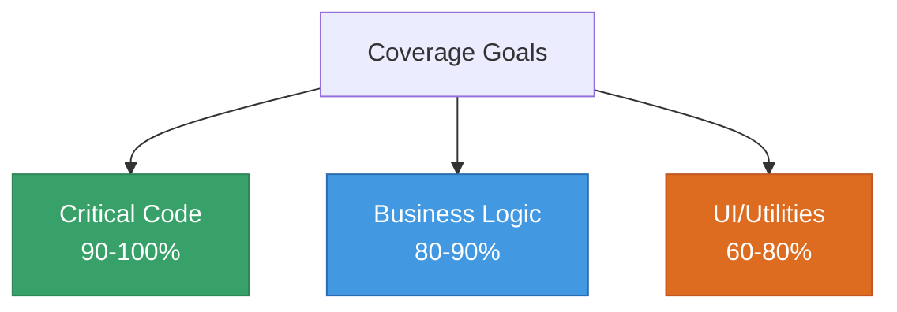

# 📊 Code Coverage

## Chapter 12: Measuring Test Effectiveness

---

## 🎯 What is Code Coverage?

**Code coverage** measures how much of your code is executed during tests.

### Coverage Metrics

- **Line Coverage** - % of lines executed
- **Branch Coverage** - % of if/else branches taken
- **Function Coverage** - % of functions called
- **Statement Coverage** - % of statements executed

```mermaid
graph LR
    A[Your Tests] --> B[Code Coverage Tool]
    B --> C[Coverage Report]
    C --> D[📈 Metrics]
    C --> E[🔴 Uncovered Lines]
    
    style A fill:#4299e1,stroke:#2b6cb0,color:#fff
    style C fill:#9f7aea,stroke:#6b46c1,color:#fff
    style D fill:#38a169,stroke:#2f855a,color:#fff
```



---

## 🚀 Running Coverage with Node.js

### Basic Coverage Command

```bash
node --test --experimental-test-coverage
```

### Output to File

```bash
node --test --experimental-test-coverage > coverage.txt
```

### With Test Pattern

```bash
node --test --experimental-test-coverage --test-name-pattern="User"
```

---

## 📊 Reading Coverage Reports

### Example Output

```
----------------------------------------
| File             | Line % | Branch % | 
----------------------------------------
| src/math.js      | 100.00 | 100.00  |
| src/user.js      |  85.71 |  75.00  |
| src/api.js       |  60.00 |  50.00  |
----------------------------------------
| All files        |  81.90 |  75.00  |
----------------------------------------
```

### What the Numbers Mean

- **100%** - 🎯 Excellent! All code tested
- **80-99%** - ✅ Good coverage
- **60-79%** - ⚠️ Needs improvement
- **< 60%** - 🔴 Poor coverage

---

## 🎯 Coverage Goals

### Industry Standards



### Realistic Targets

- **Start**: 60% coverage
- **Good**: 80% coverage
- **Excellent**: 90%+ coverage
- **Don't aim for 100%** - Diminishing returns

---

## 📝 Example: Improving Coverage

### Initial Code (Low Coverage)

```javascript
// calculator.js
export function calculate(operation, a, b) {
  if (operation === 'add') {
    return a + b;
  } else if (operation === 'subtract') {
    return a - b;
  } else if (operation === 'multiply') {
    return a * b;
  } else if (operation === 'divide') {
    if (b === 0) {
      throw new Error('Division by zero');
    }
    return a / b;
  } else {
    throw new Error('Unknown operation');
  }
}
```

---

## 🧪 Initial Tests (50% Coverage)

```javascript
// calculator.test.js
import { test } from 'node:test';
import assert from 'node:assert';
import { calculate } from './calculator.js';

test('adds two numbers', () => {
  assert.strictEqual(calculate('add', 2, 3), 5);
});

test('subtracts two numbers', () => {
  assert.strictEqual(calculate('subtract', 5, 3), 2);
});
```

**Coverage**: Only `add` and `subtract` branches tested (50%)

---

## ✅ Improved Tests (100% Coverage)

```javascript
import { test, describe } from 'node:test';
import assert from 'node:assert';
import { calculate } from './calculator.js';

describe('Calculator', () => {
  test('adds two numbers', () => {
    assert.strictEqual(calculate('add', 2, 3), 5);
  });
  
  test('subtracts two numbers', () => {
    assert.strictEqual(calculate('subtract', 5, 3), 2);
  });
  
  test('multiplies two numbers', () => {
    assert.strictEqual(calculate('multiply', 4, 5), 20);
  });
  
  test('divides two numbers', () => {
    assert.strictEqual(calculate('divide', 10, 2), 5);
  });
  
  test('throws error on division by zero', () => {
    assert.throws(
      () => calculate('divide', 10, 0),
      { message: 'Division by zero' }
    );
  });
  
  test('throws error on unknown operation', () => {
    assert.throws(
      () => calculate('unknown', 1, 2),
      { message: 'Unknown operation' }
    );
  });
});
```

**Coverage**: All branches tested (100%) ✅

---

## 🔍 Finding Uncovered Code

### Manual Review

1. Run coverage report
2. Look for files with low coverage
3. Check which lines aren't covered
4. Write tests for those lines

### Using Coverage Tools

```bash
# Generate detailed HTML report (with c8)
npm install --save-dev c8
npx c8 node --test

# Open coverage/index.html in browser
```

---

## 📈 Coverage in package.json

```json
{
  "scripts": {
    "test": "node --test",
    "test:coverage": "node --test --experimental-test-coverage",
    "test:watch": "node --test --watch"
  }
}
```

### Running Coverage

```bash
npm run test:coverage
```

---

## 🎯 Branch Coverage Example

### Code with Branches

```javascript
export function getUserStatus(user) {
  if (!user) {
    return 'no-user';
  }
  
  if (user.active) {
    if (user.premium) {
      return 'premium-active';
    }
    return 'active';
  }
  
  return 'inactive';
}
```

### Tests for All Branches

```javascript
describe('getUserStatus', () => {
  test('returns no-user for null', () => {
    assert.strictEqual(getUserStatus(null), 'no-user');
  });
  
  test('returns premium-active for premium user', () => {
    assert.strictEqual(
      getUserStatus({ active: true, premium: true }),
      'premium-active'
    );
  });
  
  test('returns active for active user', () => {
    assert.strictEqual(
      getUserStatus({ active: true, premium: false }),
      'active'
    );
  });
  
  test('returns inactive for inactive user', () => {
    assert.strictEqual(
      getUserStatus({ active: false }),
      'inactive'
    );
  });
});
```

**Branch Coverage**: 100% - All paths tested ✅

---

## ⚠️ Common Coverage Mistakes

### Mistake 1: Chasing 100%

```javascript
// Don't write tests just for coverage
test('logs message', () => {
  // Testing console.log is usually not valuable
  logger.log('test');
});
```

### Mistake 2: Not Testing Error Cases

```javascript
// Missing error case reduces branch coverage
function divide(a, b) {
  if (b === 0) throw new Error('Division by zero');
  return a / b;
}

// ❌ Only tests happy path
test('divides numbers', () => {
  assert.strictEqual(divide(10, 2), 5);
});

// ✅ Tests both paths
test('divides numbers', () => {
  assert.strictEqual(divide(10, 2), 5);
});
test('throws on division by zero', () => {
  assert.throws(() => divide(10, 0));
});
```

---

## 💡 Coverage Best Practices

### ✅ DO

- **Focus on business logic** - Prioritize important code
- **Test error paths** - Don't skip error handling
- **Use coverage as a guide** - Not an absolute goal
- **Review uncovered code** - Understand why it's not tested
- **Track coverage over time** - Monitor trends

### ❌ DON'T

- **Aim for 100% blindly** - Quality > quantity
- **Test trivial code** - Getters/setters rarely need tests
- **Ignore branches** - Test all code paths
- **Write tests just for metrics** - Test valuable behavior
- **Skip integration tests** - Unit tests alone aren't enough

---

## 📊 Coverage Reports in CI/CD

### GitHub Actions Example

```yaml
name: Tests with Coverage

on: [push, pull_request]

jobs:
  test:
    runs-on: ubuntu-latest
    steps:
      - uses: actions/checkout@v3
      - uses: actions/setup-node@v3
        with:
          node-version: '20'
      - run: npm install
      - run: npm run test:coverage
```

---

## 🎯 Coverage Thresholds

### Setting Minimum Coverage

```json
{
  "scripts": {
    "test:coverage": "c8 --check-coverage --lines 80 --branches 75 node --test"
  }
}
```

This fails if coverage drops below:
- 80% line coverage
- 75% branch coverage

---

## 📋 Coverage Checklist

Before pushing code:

- [ ] Run coverage report
- [ ] Coverage > 80% for new code
- [ ] All critical paths tested
- [ ] Error cases covered
- [ ] No obvious gaps in coverage

---

## 🎓 Key Takeaways

1. **Coverage ≠ Quality** - High coverage doesn't guarantee good tests
2. **Focus on branches** - Test all code paths
3. **Use as a tool** - Coverage guides, doesn't dictate
4. **Practical goals** - 80-90% is usually sufficient
5. **Business logic first** - Prioritize important code

---

[← Previous: Mocking](./05-mocking.md) | [🏠 Home](../README.md) | [Next: Best Practices →](./07-best-practices.md)
