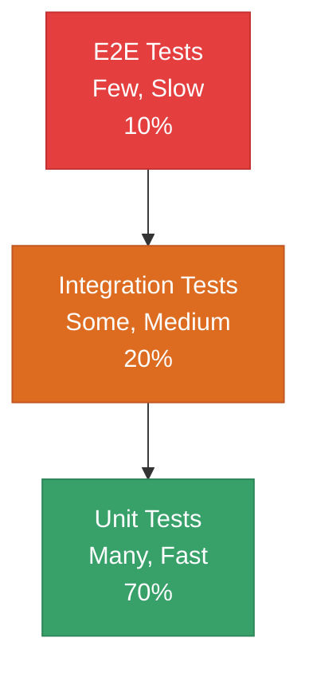

# 🏆 Testing Best Practices

## Chapter 12: Professional Testing Patterns

---

## 🎯 The FIRST Principles

Good tests are **FIRST**:

- **F**ast - Run quickly
- **I**ndependent - No dependencies between tests
- **R**epeatable - Same results every time
- **S**elf-validating - Pass or fail clearly
- **T**imely - Written with (or before) the code

---

## ⚡ Keep Tests Fast

### ✅ DO - Mock External Dependencies

```javascript
// Good - Fast test with mock
test('fetches user data', async (t) => {
  const api = {
    getUser: mock.fn(async () => ({ name: 'Alice' }))
  };
  
  const result = await getUserProfile(1, api);
  assert.strictEqual(result.name, 'Alice');
});
```

### ❌ DON'T - Hit Real APIs

```javascript
// Bad - Slow test with real API
test('fetches user data', async () => {
  const result = await fetch('https://api.example.com/users/1');
  const data = await result.json();
  assert.ok(data);
});
```

---

## 🔗 Keep Tests Independent

### ✅ DO - Fresh State Per Test

```javascript
describe('User tests', () => {
  let user;
  
  beforeEach(() => {
    // Fresh state for each test
    user = { name: 'Alice', age: 30 };
  });
  
  test('updates name', () => {
    user.name = 'Bob';
    assert.strictEqual(user.name, 'Bob');
  });
  
  test('updates age', () => {
    user.age = 31;
    assert.strictEqual(user.age, 31);
  });
});
```

### ❌ DON'T - Share State

```javascript
// Bad - Tests depend on each other
let user = { name: 'Alice', age: 30 };

test('updates name', () => {
  user.name = 'Bob'; // Affects next test!
  assert.strictEqual(user.name, 'Bob');
});

test('expects original name', () => {
  assert.strictEqual(user.name, 'Alice'); // Fails!
});
```

---

## 📝 Write Clear Test Names

### ✅ DO - Descriptive Names

```javascript
// Good - Clear what's being tested
test('returns 400 when email is missing', () => {});
test('sends welcome email after registration', () => {});
test('throws error when dividing by zero', () => {});
test('filters products by price range', () => {});
```

### ❌ DON'T - Vague Names

```javascript
// Bad - Unclear purpose
test('test1', () => {});
test('it works', () => {});
test('user test', () => {});
test('checks something', () => {});
```

---

## 🎯 One Assertion Concept Per Test

### ✅ DO - Focused Tests

```javascript
// Good - Tests one concept
test('adds two positive numbers', () => {
  assert.strictEqual(add(2, 3), 5);
});

test('adds two negative numbers', () => {
  assert.strictEqual(add(-2, -3), -5);
});

test('adds positive and negative number', () => {
  assert.strictEqual(add(5, -3), 2);
});
```

### ⚠️ ACCEPTABLE - Related Assertions

```javascript
// OK - Multiple assertions about same concept
test('creates user with correct properties', () => {
  const user = createUser({ name: 'Alice', email: 'alice@example.com' });
  
  assert.strictEqual(user.name, 'Alice');
  assert.strictEqual(user.email, 'alice@example.com');
  assert.ok(user.id);
  assert.ok(user.createdAt instanceof Date);
});
```

---

## 🔄 AAA Pattern: Arrange, Act, Assert

### ✅ DO - Clear Structure

```javascript
test('updates user name', () => {
  // Arrange - Set up test data
  const user = { id: 1, name: 'Alice' };
  const newName = 'Bob';
  
  // Act - Execute the behavior
  user.name = newName;
  
  // Assert - Verify the result
  assert.strictEqual(user.name, 'Bob');
});
```

### Use Comments for Complex Tests

```javascript
test('processes order with discount', () => {
  // Arrange
  const cart = {
    items: [
      { price: 100, quantity: 2 },
      { price: 50, quantity: 1 }
    ]
  };
  const discount = 0.1; // 10% discount
  
  // Act
  const total = calculateTotal(cart, discount);
  
  // Assert
  assert.strictEqual(total, 225); // (200 + 50) * 0.9
});
```

---

## 🧪 Test Behavior, Not Implementation

### ✅ DO - Test Public API

```javascript
// Good - Tests what the function does
test('sorts users by name', () => {
  const users = [
    { name: 'Charlie' },
    { name: 'Alice' },
    { name: 'Bob' }
  ];
  
  const sorted = sortUsersByName(users);
  
  assert.strictEqual(sorted[0].name, 'Alice');
  assert.strictEqual(sorted[1].name, 'Bob');
  assert.strictEqual(sorted[2].name, 'Charlie');
});
```

### ❌ DON'T - Test Internal Details

```javascript
// Bad - Tests how it's implemented
test('uses Array.sort', () => {
  const sortSpy = mock.method(Array.prototype, 'sort');
  sortUsersByName([{ name: 'Alice' }]);
  assert.strictEqual(sortSpy.mock.calls.length, 1);
});
```

---

## 🎯 Test Edge Cases

### Important Edge Cases

```javascript
describe('divide function', () => {
  test('divides positive numbers', () => {
    assert.strictEqual(divide(10, 2), 5);
  });
  
  test('divides negative numbers', () => {
    assert.strictEqual(divide(-10, -2), 5);
  });
  
  test('throws on division by zero', () => {
    assert.throws(() => divide(10, 0));
  });
  
  test('handles decimal results', () => {
    assert.strictEqual(divide(10, 3), 3.3333333333333335);
  });
  
  test('handles very large numbers', () => {
    assert.strictEqual(divide(1e15, 1e10), 100000);
  });
});
```

---

## 📊 Common Edge Cases Checklist

- [ ] **Empty inputs** - Empty arrays, strings, objects
- [ ] **Null/undefined** - Missing values
- [ ] **Zero** - Boundary value
- [ ] **Negative numbers** - When applicable
- [ ] **Very large numbers** - Test limits
- [ ] **Very small numbers** - Near zero
- [ ] **Special characters** - In strings
- [ ] **Duplicates** - Repeated values
- [ ] **Single item** - Minimum valid input
- [ ] **Maximum values** - Upper bounds

---

## 🔧 Use Test Helpers

### Create Reusable Factories

```javascript
// test-helpers.js
export function createTestUser(overrides = {}) {
  return {
    id: 1,
    name: 'Test User',
    email: 'test@example.com',
    active: true,
    ...overrides
  };
}

export function createTestOrder(overrides = {}) {
  return {
    id: 1,
    userId: 1,
    total: 100,
    status: 'pending',
    ...overrides
  };
}
```

### Use in Tests

```javascript
import { createTestUser, createTestOrder } from './test-helpers.js';

test('processes order for active user', () => {
  const user = createTestUser({ active: true });
  const order = createTestOrder({ userId: user.id });
  
  const result = processOrder(order, user);
  
  assert.ok(result.success);
});
```

---

## 🎨 Organize Tests Logically

### ✅ Good Structure

```javascript
describe('UserService', () => {
  describe('createUser', () => {
    test('creates user with valid data', () => {});
    test('throws error when email is invalid', () => {});
    test('throws error when email already exists', () => {});
  });
  
  describe('updateUser', () => {
    test('updates user name', () => {});
    test('throws error when user not found', () => {});
    test('does not update immutable fields', () => {});
  });
  
  describe('deleteUser', () => {
    test('deletes user by id', () => {});
    test('throws error when user not found', () => {});
  });
});
```

---

## 🚨 Test Error Cases

### ✅ DO - Test Failure Paths

```javascript
describe('Error handling', () => {
  test('throws error with invalid email', () => {
    assert.throws(
      () => createUser({ email: 'invalid' }),
      { message: 'Invalid email format' }
    );
  });
  
  test('throws error when user not found', async () => {
    await assert.rejects(
      () => getUser(99999),
      { message: 'User not found' }
    );
  });
  
  test('handles network errors gracefully', async () => {
    const api = {
      fetch: mock.fn(async () => {
        throw new Error('Network error');
      })
    };
    
    await assert.rejects(
      () => fetchData(api),
      { message: 'Network error' }
    );
  });
});
```

---

## 📁 Test File Organization

### Option 1: Co-located Tests

```
src/
├── user.js
├── user.test.js
├── order.js
└── order.test.js
```

### Option 2: Separate Test Directory

```
src/
├── user.js
└── order.js
test/
├── user.test.js
└── order.test.js
```

### Option 3: Test Subdirectories

```
src/
├── user/
│   ├── user.js
│   └── __tests__/
│       └── user.test.js
└── order/
    ├── order.js
    └── __tests__/
        └── order.test.js
```

---

## 🔍 What NOT to Test

### ❌ Don't Test

- **Third-party libraries** - Trust they work
- **Node.js built-ins** - Already tested
- **Framework code** - Express, etc.
- **Trivial getters/setters** - No logic
- **Configuration files** - JSON, etc.

### ✅ DO Test

- **Your business logic** - Core functionality
- **Edge cases** - Boundary conditions
- **Error handling** - Failure scenarios
- **Integration points** - How pieces connect
- **Public APIs** - External interfaces

---

## 🎯 Test Pyramid Strategy



- **70% Unit Tests** - Fast, isolated
- **20% Integration Tests** - Components together
- **10% E2E Tests** - Full application flow

---

## 💡 Quick Best Practices Summary

| ✅ DO | ❌ DON'T |
|-------|----------|
| Write descriptive test names | Use vague names like "test1" |
| Keep tests independent | Share state between tests |
| Test one concept per test | Test multiple unrelated things |
| Mock external dependencies | Hit real APIs/databases |
| Test edge cases | Only test happy path |
| Use AAA pattern | Write unclear test structure |
| Test behavior | Test implementation details |
| Keep tests fast | Write slow integration tests for everything |

---

## 📚 Recommended Resources

- [Node.js Testing Best Practices](https://github.com/goldbergyoni/nodejs-testing-best-practices)
- [Clean Code by Robert Martin](https://www.goodreads.com/book/show/3735293-clean-code)
- [Test-Driven Development by Kent Beck](https://www.goodreads.com/book/show/387190.Test_Driven_Development)

---

[← Previous: Code Coverage](./06-coverage.md) | [🏠 Home](../README.md) | [Next: Lab Exercise →](./08-lab.md)
