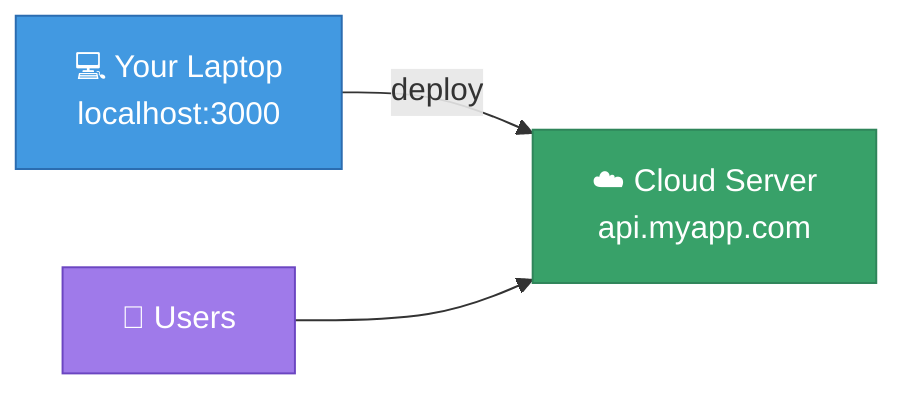
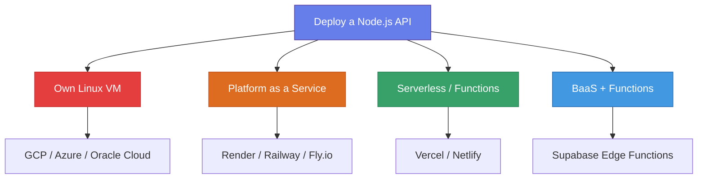

# 🚀 Deploying Node.js APIs

## Chapter 13: Introduction to Deployment

---

## 🌍 What is Deployment?

> Deployment means making your application available to users on the internet.

Your dev machine runs the API locally — deployment moves it somewhere **always on** and **publicly reachable**.

---

## 🗺️ Deployment Options Overview

---

## 📊 Comparison Table

| Option | Control | Cost | Complexity | Best For |
|--------|---------|------|------------|----------|
| **Linux VM** | ⭐⭐⭐ Full | 💰 Free tier / cheap | 🔴 High | Production, learning DevOps |
| **Render** | ⭐⭐ Medium | 💚 Free tier | 🟢 Low | Quick deploys, students |
| **Railway** | ⭐⭐ Medium | 💛 $5 credit | 🟢 Low | Full-stack projects |
| **Fly.io** | ⭐⭐ Medium | 💚 Free tier | 🟡 Medium | Docker-based apps |
| **Supabase** | ⭐ Low | 💚 Free tier | 🟡 Medium | Postgres + small functions |
| **Vercel** | ⭐ Low | 💚 Free tier | 🟢 Low | Serverless / Next.js |

---

## 🆓 Best Free Tiers (2025)

| Provider | Free Offer | Limits |
|----------|-----------|--------|
| **Oracle Cloud** | 2 VMs forever (always free) | ARM-based, 1 GB RAM |
| **Render** | Web services | Spins down after 15 min inactivity |
| **Fly.io** | 3 shared VMs | 256 MB RAM each |
| **Supabase** | PostgreSQL + Edge Functions | 500 MB DB, 500K function calls |
| **Vercel** | Serverless functions | 100 GB bandwidth |
| **Koyeb** | 1 service | 512 MB RAM |

---

## 🎯 What We'll Cover

1. **Preparing for Production** — env vars, NODE_ENV, security
2. **Linux VM** — own server on GCP / Azure / Oracle Cloud
3. **PM2 & Nginx** — keeping the server alive, reverse proxy
4. **Render & Railway** — easiest cloud deploys
5. **Supabase** — free Postgres + serverless functions
6. **Other Options** — Fly.io, Koyeb, Vercel

---

## 📚 Resources

- [Render.com](https://render.com)
- [Railway.app](https://railway.app)
- [Fly.io](https://fly.io)
- [Supabase.com](https://supabase.com)
- [Oracle Cloud Free Tier](https://www.oracle.com/cloud/free/)

---

[🏠 Home](../README.md) | [Next: Preparing for Production →](./02-production-prep.md)
