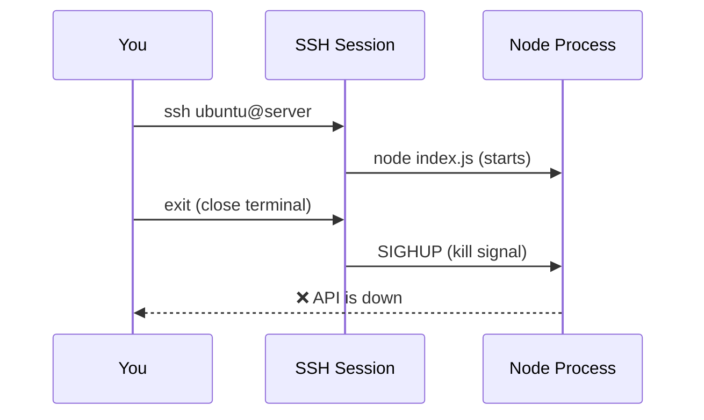
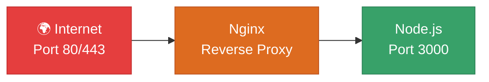
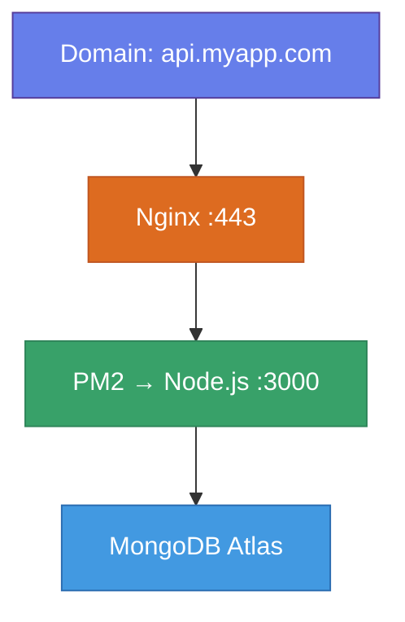

# ⚙️ PM2 & Nginx

## Chapter 13: Keeping Your Server Alive

---

## 😱 The SSH Termination Problem

When you close your SSH session, the terminal process dies — and takes your Node.js server with it.



---

## 🩹 Quick Fix: `nohup` (Not Recommended)

```bash
# Redirect output, run in background, ignore hangup
nohup node index.js > output.log 2>&1 &

# Check if it's running
ps aux | grep node

# Kill it
kill <PID>
```

> Works, but no auto-restart on crash. Use PM2 instead.

---

## 🖥️ Quick Fix: `screen` / `tmux`

```bash
# Start a detached screen session
screen -S myapi

# Inside screen: run your app
npm start

# Detach from screen (app keeps running!)
# Press: Ctrl+A then D

# Reattach later
screen -r myapi
```

```bash
# tmux alternative
tmux new -s myapi
npm start
# Detach: Ctrl+B then D
tmux attach -t myapi
```

> Good for quick debugging, but PM2 is better for production.

---

## 🚀 PM2: The Production Process Manager

PM2 keeps Node.js apps running forever, restarts on crash, and survives reboots.

```bash
# Install PM2 globally
npm install -g pm2

# Start your app
pm2 start index.js --name "my-api"

# View running apps
pm2 list

# View logs
pm2 logs my-api

# Restart / Stop / Delete
pm2 restart my-api
pm2 stop my-api
pm2 delete my-api
```

---

## 🔄 PM2: Auto-Restart on Reboot

```bash
# Generate startup script (run this once)
pm2 startup

# It prints a command — copy and run it, e.g.:
sudo env PATH=$PATH:/home/ubuntu/.nvm/versions/node/v20.0.0/bin \
  pm2 startup systemd -u ubuntu --hp /home/ubuntu

# Save current process list
pm2 save
```

> Now PM2 restarts your app automatically after a VM reboot.

---

## 📊 PM2 Monitoring

```bash
# Real-time dashboard
pm2 monit

# Process details
pm2 show my-api

# Reload without downtime (zero-downtime restart)
pm2 reload my-api
```

---

## 🌐 Nginx: Reverse Proxy



Benefits:
- Serve on port 80/443 (no `sudo` for Node.js)
- SSL termination
- Load balancing
- Serve static files efficiently

---

## 📦 Install & Configure Nginx

```bash
sudo apt update
sudo apt install nginx -y

# Edit config
sudo nano /etc/nginx/sites-available/my-api
```

```nginx
server {
    listen 80;
    server_name your-domain.com;   # or your IP

    location / {
        proxy_pass http://localhost:3000;
        proxy_http_version 1.1;
        proxy_set_header Upgrade $http_upgrade;
        proxy_set_header Connection 'upgrade';
        proxy_set_header Host $host;
        proxy_set_header X-Real-IP $remote_addr;
        proxy_cache_bypass $http_upgrade;
    }
}
```

---

## ✅ Enable the Nginx Site

```bash
# Enable site
sudo ln -s /etc/nginx/sites-available/my-api \
           /etc/nginx/sites-enabled/

# Test config
sudo nginx -t

# Reload Nginx
sudo systemctl reload nginx

# Enable Nginx on boot
sudo systemctl enable nginx
```

Now your API is reachable on port 80!

---

## 🔒 Free HTTPS with Let's Encrypt

```bash
# Install Certbot
sudo apt install certbot python3-certbot-nginx -y

# Get certificate (replace with your domain)
sudo certbot --nginx -d api.yourdomain.com

# Auto-renewal (already set up by certbot)
sudo certbot renew --dry-run
```

> **Note**: You need a domain name pointing to your VM's IP for SSL to work.

---

## 🏗️ Full Stack on One VM



---

## 📋 VM Deployment Summary

```bash
# 1. Install and start
git clone <repo> && cd <repo>
npm install
pm2 start index.js --name my-api

# 2. Survive reboots
pm2 startup && pm2 save

# 3. Nginx reverse proxy (port 80)
sudo systemctl enable nginx

# 4. Optional: SSL
sudo certbot --nginx -d yourdomain.com
```

---

[← Linux VM](./03-linux-vm.md) | [🏠 Home](../README.md) | [Next: Render & Railway →](./05-render-railway.md)
