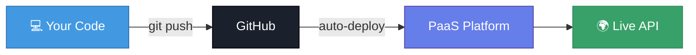

# ☁️ Render & Railway

## Chapter 13: Easy Cloud Deployments

---

## 🎯 Platform as a Service (PaaS)

> PaaS platforms handle servers, OS updates, and networking for you. You just push code.



Zero server management. Deploy in minutes.

---

## 🟣 Render

**render.com** — the simplest free Node.js hosting

### Free Tier
- ✅ Web services (Node.js, Python, etc.)
- ✅ 750 hours/month
- ✅ Auto-deploy from GitHub
- ⚠️ Spins down after **15 min inactivity** (cold start ~30s)
- ❌ No persistent disk on free tier

---

## 🚀 Deploy to Render — Step by Step

1. Push your project to **GitHub**
2. Sign up at [render.com](https://render.com) with GitHub
3. **New → Web Service**
4. Connect your GitHub repo
5. Configure:

| Setting | Value |
|---------|-------|
| **Environment** | Node |
| **Build Command** | `npm install` |
| **Start Command** | `npm start` |
| **Region** | Frankfurt (closest to BE) |

6. Add **Environment Variables** (scroll down)
7. Click **Create Web Service**

---

## 🔧 Render: Environment Variables

```
MONGODB_URI    = mongodb+srv://...
JWT_SECRET     = your_secret
NODE_ENV       = production
```

> Add these in Render's dashboard under **Environment**.

---

## 📋 Render: What Render Detects Automatically

```json
{
  "scripts": {
    "start": "node index.js"
  }
}
```

Render reads `package.json` and runs `npm start`. Make sure this script exists!

---

## 🟡 Railway

**railway.app** — more powerful, great for full projects

### Pricing
- ✅ $5 free credit on signup (no card needed)
- ✅ Hobby plan: $5/month after credit
- ✅ **No sleep** on paid tiers
- ✅ Built-in databases (MongoDB, Postgres, Redis)

---

## 🚀 Deploy to Railway — Step by Step

```bash
# Option A: GitHub deploy (easiest)
# 1. Go to railway.app → New Project
# 2. Deploy from GitHub repo
# 3. Railway detects Node.js automatically

# Option B: Railway CLI
npm install -g @railway/cli
railway login
railway init
railway up
```

---

## ⚙️ Railway: Environment Variables

```bash
# Via CLI
railway variables set MONGODB_URI=mongodb+srv://...
railway variables set JWT_SECRET=secret
railway variables set NODE_ENV=production

# Or via dashboard → Variables tab
```

---

## 🗄️ Railway: Add a Database

Railway can provision a **MongoDB** or **PostgreSQL** database next to your app:

1. In your project: **New → Database → MongoDB**
2. Railway creates it and injects `MONGODB_URL` automatically
3. No separate Atlas account needed

---

## 🔄 Auto-Deploy on Every Push

Both Render and Railway watch your GitHub branch and redeploy automatically on every push:

```bash
git add .
git commit -m "fix: update endpoint"
git push origin main
# → Deploy starts automatically in ~60 seconds
```

---

## ⚖️ Render vs Railway

| Feature | Render | Railway |
|---------|--------|---------|
| Free tier | ✅ Forever (with sleep) | ✅ $5 credit |
| Sleep on inactivity | ⚠️ Yes (free) | ❌ No |
| Built-in DB | ❌ (link Atlas) | ✅ Yes |
| Custom domains | ✅ | ✅ |
| Ease of use | ⭐⭐⭐ Easiest | ⭐⭐⭐ Easy |

> 💡 **For student projects**: Start with Render (truly free). Upgrade to Railway when you need a DB or no sleep.

---

[← PM2 & Nginx](./04-pm2-nginx.md) | [🏠 Home](../README.md) | [Next: Supabase →](./06-supabase.md)
