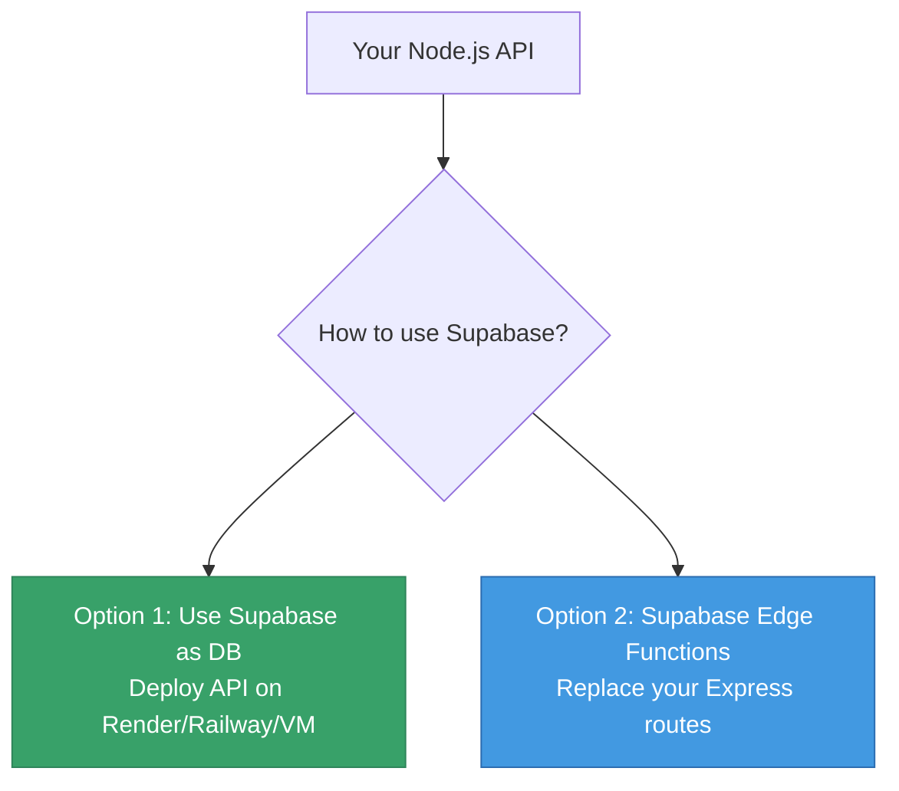
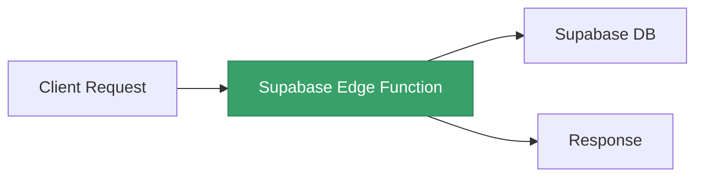

# 🟢 Supabase

## Chapter 13: Free Database + Serverless Functions

---

## 🤔 What is Supabase?

Supabase is an **open-source Firebase alternative** — it bundles:

- 🗄️ **PostgreSQL** database (free tier: 500 MB)
- 🔑 **Auth** — user management out of the box
- 📦 **Storage** — file uploads
- ⚡ **Edge Functions** — serverless JS/TS functions
- 🔴 **Realtime** — live database subscriptions

> **Key insight**: Supabase uses **PostgreSQL**, not MongoDB. A different database paradigm from this course.

---

## 🏗️ Two Ways to Use Supabase with Node.js



---

## 🗄️ Option 1: Supabase as a Free PostgreSQL DB

Use Supabase's PostgreSQL as your database, host your Node.js API anywhere:

```javascript
// npm install @supabase/supabase-js
import { createClient } from '@supabase/supabase-js';

const supabase = createClient(
  process.env.SUPABASE_URL,
  process.env.SUPABASE_ANON_KEY
);

// Fetch all users
const { data, error } = await supabase
  .from('users')
  .select('*');

// Insert a row
const { data, error } = await supabase
  .from('products')
  .insert({ name: 'Laptop', price: 999 });
```

---

## 🚀 Set Up a Supabase Project

1. Sign up at [supabase.com](https://supabase.com)
2. **New Project** → choose a region
3. Wait ~2 minutes for DB provisioning
4. Go to **Settings → API** and copy:
   - `Project URL`
   - `anon/public` key

```bash
# Add to your .env
SUPABASE_URL=https://xxxxx.supabase.co
SUPABASE_ANON_KEY=eyJhbGciOiJIUzI1NiIs...
```

---

## 🏗️ Create Tables in Supabase

```sql
-- In Supabase SQL Editor
CREATE TABLE products (
  id uuid DEFAULT gen_random_uuid() PRIMARY KEY,
  name text NOT NULL,
  price numeric NOT NULL,
  created_at timestamptz DEFAULT now()
);

-- Enable Row Level Security
ALTER TABLE products ENABLE ROW LEVEL SECURITY;

-- Allow public reads
CREATE POLICY "Public read" ON products
  FOR SELECT USING (true);
```

---

## ⚡ Option 2: Supabase Edge Functions

Edge Functions run **server-side code** at the edge — similar to Express routes, but serverless:



> Edge Functions use **Deno** runtime, but support Node.js-compatible imports.

---

## 📝 Create an Edge Function

```bash
# Install Supabase CLI
npm install -g supabase

# Login and link project
supabase login
supabase init
supabase link --project-ref your-project-ref

# Create a new function
supabase functions new get-products
```

This creates `supabase/functions/get-products/index.ts`.

---

## ✍️ Write the Function

```typescript
// supabase/functions/get-products/index.ts
import { createClient } from 'https://esm.sh/@supabase/supabase-js@2';

Deno.serve(async (req) => {
  const supabase = createClient(
    Deno.env.get('SUPABASE_URL')!,
    Deno.env.get('SUPABASE_SERVICE_ROLE_KEY')!
  );

  const { data, error } = await supabase
    .from('products')
    .select('*');

  if (error) return new Response(JSON.stringify({ error }), { status: 500 });

  return new Response(JSON.stringify(data), {
    headers: { 'Content-Type': 'application/json' }
  });
});
```

---

## 🚀 Deploy & Call the Function

```bash
# Deploy to Supabase
supabase functions deploy get-products

# Test it
curl https://xxxxx.supabase.co/functions/v1/get-products \
  -H "Authorization: Bearer <SUPABASE_ANON_KEY>"
```

Each function is available at:
```
https://<project-ref>.supabase.co/functions/v1/<function-name>
```

---

## 🆓 Supabase Free Tier Limits

| Resource | Free Limit |
|----------|-----------|
| Database | 500 MB storage |
| Edge Functions | 500,000 invocations/month |
| Bandwidth | 5 GB/month |
| Projects | 2 active projects |
| Auth users | Unlimited |

> Projects pause after **1 week of inactivity** on the free tier — wake them up in the dashboard.

---

## 🆚 Supabase vs MongoDB Atlas (for this course)

| | Supabase | MongoDB Atlas |
|--|---------|--------------|
| Database | PostgreSQL (SQL) | MongoDB (NoSQL) |
| Free tier | ✅ 500 MB | ✅ 512 MB |
| Mongoose compatible | ❌ | ✅ |
| Supabase JS client | ✅ | ❌ |
| Best with | REST APIs, auth | This course's codebase |

---

[← Render & Railway](./05-render-railway.md) | [🏠 Home](../README.md) | [Next: Other Options →](./07-other-options.md)
