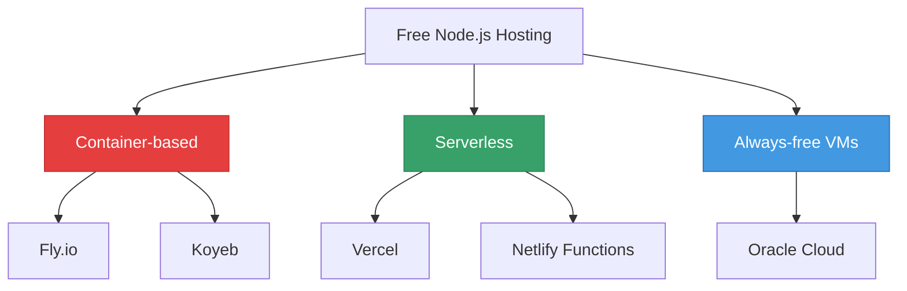
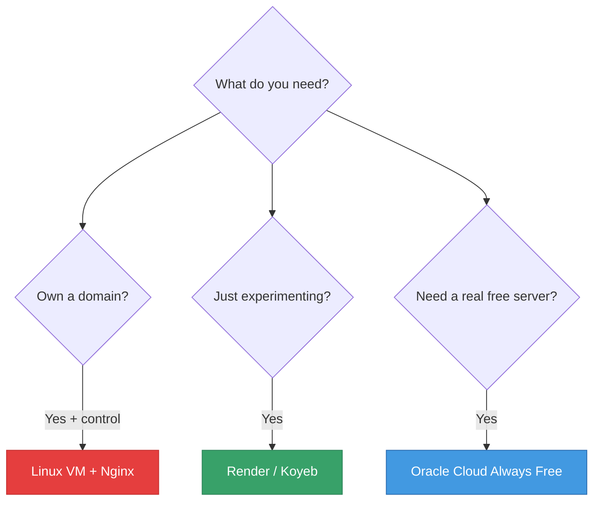

# 🌐 Other Deployment Options

## Chapter 13: Fly.io, Koyeb, Vercel & More

---

## 🎯 The Landscape



---

## 🪂 Fly.io

**fly.io** — Docker-based hosting, generous free tier

### Free Tier
- ✅ 3 shared VMs (256 MB RAM each)
- ✅ **No sleep** on free tier
- ✅ Global edge deployment
- ✅ Built-in Postgres / Redis
- ✅ Custom domains + free SSL

### Deploy

```bash
# Install Fly CLI
curl -L https://fly.io/install.sh | sh

# Login
fly auth login

# Launch (inside your project folder)
fly launch

# Deploy updates
fly deploy
```

---

## 🐋 Fly.io: Dockerfile (Auto-detected)

```dockerfile
# Dockerfile (Fly generates this for you)
FROM node:20-alpine
WORKDIR /app
COPY package*.json ./
RUN npm ci --only=production
COPY . .
EXPOSE 3000
CMD ["npm", "start"]
```

> If no Dockerfile exists, `fly launch` generates one automatically.

---

## ⚙️ Fly.io: Environment Variables

```bash
# Set secrets
fly secrets set MONGODB_URI="mongodb+srv://..."
fly secrets set JWT_SECRET="your_secret"
fly secrets set NODE_ENV="production"

# List secrets
fly secrets list
```

---

## 🟡 Koyeb

**koyeb.com** — simple container hosting, always-on free tier

### Free Tier
- ✅ 1 service **always on** (no sleep!)
- ✅ 512 MB RAM, 0.1 vCPU
- ✅ Deploy from GitHub
- ✅ Free `.koyeb.app` domain + SSL

### Deploy

1. Sign up at [koyeb.com](https://koyeb.com)
2. **Create Service → GitHub**
3. Select repo and branch
4. Set build command: `npm install`
5. Set start command: `npm start`
6. Add environment variables
7. Deploy!

---

## ⚡ Vercel

**vercel.com** — serverless, great for APIs

### How it works

Vercel wraps your Express app as **serverless functions** — each request spins up a function instance.

```javascript
// api/index.js — Vercel entry point
import app from '../src/app.js';

export default app;
```

```json
// vercel.json
{
  "version": 2,
  "builds": [{ "src": "api/index.js", "use": "@vercel/node" }],
  "routes": [{ "src": "/(.*)", "dest": "api/index.js" }]
}
```

---

## ⚡ Vercel: Free Tier

- ✅ Unlimited deployments
- ✅ 100 GB bandwidth/month
- ✅ Automatic HTTPS
- ⚠️ **Serverless** — no persistent connections (bad for WebSockets)
- ⚠️ Max function duration: 10 seconds (hobby)
- ⚠️ No persistent file storage

> Best for stateless REST APIs. Don't use for WebSockets or long-running tasks.

---

## 🌐 Netlify Functions

Similar to Vercel, but functions are written differently:

```javascript
// netlify/functions/products.js
export const handler = async (event, context) => {
  // event.httpMethod, event.body, etc.
  return {
    statusCode: 200,
    body: JSON.stringify({ products: [] })
  };
};
```

> Netlify is better suited for static sites + small backend functions, not full Express apps.

---

## 🎮 Glitch

**glitch.com** — beginner-friendly, browser-based IDE

- ✅ Free, no setup
- ✅ Edit and run in browser
- ✅ Instant preview
- ⚠️ Sleeps after 5 min inactivity
- ⚠️ Very limited resources

> Great for **demos and prototypes**, not for real projects.

---

## 📊 Full Comparison

| Platform | Sleep | RAM | DB included | Complexity |
|----------|-------|-----|-------------|------------|
| **Oracle Cloud VM** | ❌ | 1 GB | ❌ | 🔴 High |
| **Render** | ⚠️ Free | 512 MB | ❌ | 🟢 Low |
| **Railway** | ❌ Paid | 512 MB | ✅ | 🟢 Low |
| **Fly.io** | ❌ | 256 MB | ✅ | 🟡 Medium |
| **Koyeb** | ❌ | 512 MB | ❌ | 🟢 Low |
| **Vercel** | ❌ | 1 GB | ❌ | 🟡 Medium |
| **Supabase** | ⚠️ 1 week | — | ✅ Postgres | 🟡 Medium |

---

## 💡 Which Should You Pick?



---

[← Supabase](./06-supabase.md) | [🏠 Home](../README.md) | [Next: Lab →](./08-lab.md)
