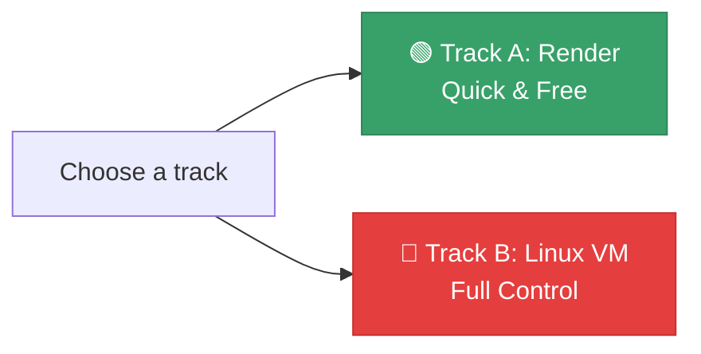

# 🧪 Lab: Deploy Your API

## Chapter 13: Hands-On Deployment

---

## 🎯 Lab Overview

In this lab you will deploy the Node.js API you built throughout this course to a live public URL.

**Choose one of two tracks:**



---

## ✅ Prerequisites

Before starting, make sure your project has:

- [ ] `npm start` script in `package.json`
- [ ] All secrets in `.env` (not hardcoded)
- [ ] `.env` in `.gitignore`
- [ ] MongoDB Atlas cluster set up (free tier)
- [ ] Code pushed to GitHub

---

## 🟢 Track A: Deploy to Render

### Step 1: Prepare your repo

```json
// package.json
{
  "scripts": {
    "start": "node index.js"
  },
  "engines": {
    "node": ">=20.0.0"
  }
}
```

### Step 2: Push to GitHub

```bash
git add .
git commit -m "chore: prepare for deployment"
git push origin main
```

---

### Step 3: Deploy on Render

1. Go to [render.com](https://render.com) → sign up with GitHub
2. **New → Web Service**
3. Connect your repository
4. Set:
   - Build Command: `npm install`
   - Start Command: `npm start`
5. Add environment variables (from your `.env`)
6. Click **Create Web Service**
7. Wait ~2 minutes for the first deploy

---

### Step 4: Test your live API

```bash
# Replace with your Render URL
BASE_URL=https://your-api.onrender.com

# Health check
curl $BASE_URL/health

# Test an endpoint
curl $BASE_URL/api/products

# Test authentication
curl -X POST $BASE_URL/api/auth/register \
  -H "Content-Type: application/json" \
  -d '{"name":"Test","email":"test@test.com","password":"Test1234"}'
```

---

## 🔴 Track B: Deploy to a Linux VM

### Step 1: Create Oracle Cloud VM

1. Sign up at [cloud.oracle.com](https://cloud.oracle.com)
2. Create an Ubuntu 22.04 VM (Always Free tier)
3. Download your SSH key

### Step 2: Set up the server

```bash
# SSH in
ssh ubuntu@<VM_IP>

# Install Node.js via nvm
curl -o- https://raw.githubusercontent.com/nvm-sh/nvm/v0.39.7/install.sh | bash
source ~/.bashrc
nvm install --lts

# Install PM2
npm install -g pm2
```

---

### Step 3: Deploy your code

```bash
# Clone from GitHub
git clone https://github.com/your-username/your-api.git
cd your-api
npm install

# Create .env
nano .env
# (paste your environment variables)

# Start with PM2
pm2 start index.js --name my-api
pm2 save
pm2 startup  # follow the printed instructions
```

---

### Step 4: Configure firewall and test

```bash
# Open port 3000
sudo ufw allow 3000
sudo ufw enable

# Test from your laptop
curl http://<VM_IP>:3000/health
```

---

### Step 5 (Bonus): Set up Nginx

```bash
sudo apt install nginx -y
sudo nano /etc/nginx/sites-available/my-api
```

```nginx
server {
    listen 80;
    location / {
        proxy_pass http://localhost:3000;
        proxy_set_header Host $host;
        proxy_set_header X-Real-IP $remote_addr;
    }
}
```

```bash
sudo ln -s /etc/nginx/sites-available/my-api \
           /etc/nginx/sites-enabled/
sudo nginx -t && sudo systemctl reload nginx
```

---

## 🏆 Bonus Challenges

- [ ] **Domain**: Point a free domain from [freenom.com](https://www.freenom.com) or [duckdns.org](https://www.duckdns.org) to your server
- [ ] **HTTPS**: Set up Let's Encrypt with `certbot` on your VM
- [ ] **CI/CD**: Configure GitHub Actions to auto-deploy to Render on push
- [ ] **Monitoring**: Set up PM2 with `pm2 monit` and add a `/health` endpoint
- [ ] **Supabase**: Migrate one endpoint to use Supabase PostgreSQL instead of MongoDB

---

## 📊 Deliverables

Submit the following:

1. ✅ **Live API URL** — accessible from the internet
2. ✅ **Screenshot** of your health check response (`/health`)
3. ✅ **Screenshot** of at least one authenticated request working
4. ✅ **Brief explanation** (max 5 lines) of which platform you chose and why

---

## 💡 Tips

- If Render shows **"Build failed"** → check the logs, usually a missing env var
- If your VM API is unreachable → check the firewall rules (Oracle VCN security list)
- If PM2 shows **"errored"** → run `pm2 logs` to see the error
- Free tiers of Render **sleep after 15 min** — add a health ping service like [uptimerobot.com](https://uptimerobot.com) to keep it awake

---

[← Other Options](./07-other-options.md) | [🏠 Home](../README.md)
