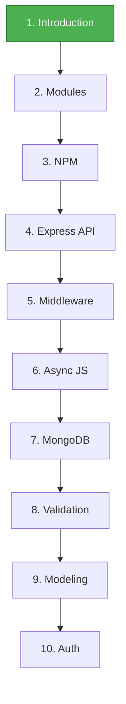

# 🎓 Node.js Course

<div style="background: linear-gradient(135deg, #667eea 0%, #764ba2 100%); padding: 40px; border-radius: 15px; color: white; text-align: center;">

## Full-Stack JavaScript Development with Node.js

**VIVES University of Applied Sciences**

Dirk Hostens & Milan Dima

</div>

---

## 📚 Course Overview

Welcome to the **Node.js Course**! This comprehensive course will take you from Node.js basics to building full-stack applications with MongoDB, Express, and authentication.

---

## 🗂️ Course Chapters

<div style="display: grid; grid-template-columns: repeat(2, 1fr); gap: 20px; margin: 20px 0;">

### 📘 [Chapter 1: Introduction and Installation](./01-Intro/README.md)

<div style="background-color: #e3f2fd; padding: 20px; border-radius: 10px;">

**Topics:**
- What is Node.js?
- Node.js Architecture
- Installation & Setup
- First Application

**Slides:**
- [01 - Course Introduction](./01-Intro/01-course-introduction.md)
- [02 - What is Node.js](./01-Intro/02-what-is-nodejs.md)
- [03 - Node.js Architecture](./01-Intro/03-nodejs-architecture.md)
- [04 - Installation & Setup](./01-Intro/04-installation-setup.md)
- [05 - First Application](./01-Intro/05-first-application.md)

</div>

---

### 📗 [Chapter 2: Node Module System](./02-Node-Module-System/README.md)

<div style="background-color: #f3e5f5; padding: 20px; border-radius: 10px;">

**Topics:**
- Global Objects
- Module System Basics
- Creating Custom Modules
- Built-in Modules
- Events & EventEmitter
- HTTP Module

**Slides:**
- [01 - Global Objects](./02-Node-Module-System/01-global-objects.md)
- [02 - Module System Basics](./02-Node-Module-System/02-module-system.md)
- [03 - Creating Custom Modules](./02-Node-Module-System/03-creating-modules.md)
- [04 - Built-in Modules](./02-Node-Module-System/04-builtin-modules.md)
- [05 - Events & EventEmitter](./02-Node-Module-System/05-events.md)
- [06 - HTTP Module](./02-Node-Module-System/06-http-module.md)

</div>

---

### 📙 [Chapter 3: Node Package Manager (NPM)](./03-Node-NPM/README.md)

<div style="background-color: #fff3e0; padding: 20px; border-radius: 10px;">

**Topics:**
- What is npm?
- package.json Configuration
- Installing & Using Packages
- Semantic Versioning
- Managing Dependencies
- Publishing Packages

**Slides:**
- [01 - What is NPM?](./03-Node-NPM/01-what-is-npm.md)
- [02 - package.json](./03-Node-NPM/02-package-json.md)
- [03 - Installing Packages](./03-Node-NPM/03-installing-packages.md)
- [04 - Semantic Versioning](./03-Node-NPM/04-semantic-versioning.md)
- [05 - Managing Dependencies](./03-Node-NPM/05-managing-dependencies.md)
- [06 - Publishing Packages](./03-Node-NPM/06-publishing-packages.md)

</div>

---

### 📕 [Chapter 4: Building APIs with Express](./04-Express-API/README.md)

<div style="background-color: #e8f5e9; padding: 20px; border-radius: 10px;">

**Topics:**
- RESTful API Principles
- Express.js Framework
- GET, POST, PUT, DELETE Requests
- Route Parameters & Validation
- Using Postman & nodemon

**Slides:**
- [01 - REST & Express](./04-Express-API/01-rest-and-express.md)
- [02 - GET Requests](./04-Express-API/02-get-requests.md)
- [03 - POST Requests](./04-Express-API/03-post-requests.md)
- [04 - PUT & DELETE Requests](./04-Express-API/04-put-delete-requests.md)
- [05 - Tools & Best Practices](./04-Express-API/05-tools-best-practices.md)

</div>

---

### 📔 [Chapter 5: Middleware Functions](./05-Middleware/README.md)

<div style="background-color: #fce4ec; padding: 20px; border-radius: 10px;">

**Topics:**
- Middleware Concepts & Pipeline
- Built-in Middleware
- Third-party Middleware (helmet, morgan)
- Environments & Configuration
- Templating & Project Structure

**Slides:**
- [01 - Middleware Basics](./05-Middleware/01-middleware-basics.md)
- [02 - Built-in Middleware](./05-Middleware/02-builtin-middleware.md)
- [03 - Third-party Middleware](./05-Middleware/03-third-party-middleware.md)
- [04 - Environments & Config](./05-Middleware/04-environments-config.md)
- [05 - Templating & Structure](./05-Middleware/05-templating-structure.md)

</div>

---

### 📓 [Chapter 6: Asynchronous JavaScript](./06-Async-JS/README.md)

<div style="background-color: #e1f5fe; padding: 20px; border-radius: 10px;">

**Topics:**
- Synchronous vs Asynchronous
- Callbacks & Callback Hell
- Promises
- Async/Await
- Parallel Execution

**Slides:**
- [01 - Sync vs Async](./06-Async-JS/01-sync-vs-async.md)
- [02 - Callbacks](./06-Async-JS/02-callbacks.md)
- [03 - Promises](./06-Async-JS/03-promises.md)
- [04 - Async/Await](./06-Async-JS/04-async-await.md)

</div>

---

### 📒 [Chapter 7: MongoDB & Mongoose](./07-MongoDB/README.md)

<div style="background-color: #f1f8e9; padding: 20px; border-radius: 10px;">

**Topics:**
- MongoDB Setup & Connection
- Schemas & Models
- CRUD Operations (Create, Read, Update, Delete)
- Querying & Filtering
- Pagination & Sorting

**Slides:**
- [01 - MongoDB Setup](./07-MongoDB/01-mongodb-setup.md)
- [02 - Schemas & Models](./07-MongoDB/02-schemas-models.md)
- [03 - Creating Documents](./07-MongoDB/03-creating-documents.md)
- [04 - Reading Documents](./07-MongoDB/04-reading-documents.md)
- [05 - Updating Documents](./07-MongoDB/05-updating-documents.md)
- [06 - Deleting Documents](./07-MongoDB/06-deleting-documents.md)

</div>

---

### 📖 [Chapter 8: Data Validation](./08-Data-Validation/README.md)

<div style="background-color: #fff9c4; padding: 20px; border-radius: 10px;">

**Topics:**
- Input Validation
- Joi Library
- Custom Validators
- Error Messages

**Status:** 🚧 Coming Soon

</div>

---

### 📚 [Chapter 9: Mongoose Modeling](./09-Mongoose-Modeling/README.md)

<div style="background-color: #ede7f6; padding: 20px; border-radius: 10px;">

**Topics:**
- Advanced Schemas
- Relationships
- Virtuals & Methods
- Query Optimization

**Status:** 🚧 Coming Soon

</div>

---

### 📕 [Chapter 10: Authentication & Authorization](./10-Auth-And-Auth/README.md)

<div style="background-color: #fbe9e7; padding: 20px; border-radius: 10px;">

**Topics:**
- User Authentication
- JWT Tokens
- Password Hashing
- Role-Based Access

**Status:** 🚧 Coming Soon

</div>

</div>

---

## 🎯 Learning Path



---

## 📖 How to Use This Course

<div style="background-color: #f5f5f5; padding: 20px; border-radius: 10px;">

### For Students

1. **Read sequentially** - Start with Chapter 1 and progress through each chapter
2. **Practice** - Complete all lab exercises
3. **Ask questions** - Use the Toledo forum
4. **Build projects** - Apply what you learn

### For Instructors (Live Demos)

1. **Navigate by chapter** - Each chapter has its own folder
2. **Use individual slides** - Numbered files for each topic
3. **Interactive examples** - All code examples are ready to run
4. **Mermaid diagrams** - Install VS Code extension for visual diagrams

</div>

---

## 🛠️ Prerequisites

<div style="background-color: #fff3e0; padding: 20px; border-radius: 10px; border-left: 5px solid #ff9800;">

Before starting this course, you should have:

✅ Basic understanding of **JavaScript** (ES6+)  
✅ Familiarity with **HTML & CSS**  
✅ Experience with **command line/terminal**  
✅ Basic knowledge of **Git & GitHub**  
✅ Understanding of **web development concepts**

</div>

---

## 💻 Setup Requirements

| Requirement | Version | Link |
|-------------|---------|------|
| **Node.js** | v18+ (LTS) | [nodejs.org](https://nodejs.org/) |
| **npm** | v9+ | Included with Node.js |
| **VS Code** | Latest | [code.visualstudio.com](https://code.visualstudio.com/) |
| **Git** | Latest | [git-scm.com](https://git-scm.com/) |
| **MongoDB** | v6+ | [mongodb.com](https://www.mongodb.com/) |

---

## 📦 Recommended VS Code Extensions

<div style="background-color: #e8f5e9; padding: 20px; border-radius: 10px;">

Install these for the best development experience:

- 📦 **npm intellisense** - Auto-complete npm modules
- 🔍 **ESLint** - Code quality and error detection
- 🎨 **Prettier** - Code formatting
- 🌐 **REST Client** - Test APIs in VS Code
- 📝 **Markdown Preview Mermaid Support** - View diagrams
- 🗃️ **MongoDB for VS Code** - Database management

</div>

---

## 🎓 Grading

<div style="background-color: #e3f2fd; padding: 20px; border-radius: 10px;">

```
💯 100% Project + Oral Defense Exam
```

See **Toledo** for detailed grading criteria and project requirements.

</div>

---

## 📚 Additional Resources

### Official Documentation
- 📖 [Node.js Docs](https://nodejs.org/docs/)
- 📖 [Express.js Docs](https://expressjs.com/)
- 📖 [MongoDB Docs](https://docs.mongodb.com/)
- 📖 [Mongoose Docs](https://mongoosejs.com/docs/)

### Learning Resources
- 🎥 [Node.js YouTube Tutorials](https://www.youtube.com)
- 📚 [MDN Web Docs](https://developer.mozilla.org/)
- 💬 [Node.js Discord Community](https://discord.com/invite/nodejs)
- 📰 [Node.js Blog](https://nodejs.org/en/blog/)

---

## ❓ Getting Help

<div style="background-color: #fff3e0; padding: 20px; border-radius: 10px; border-left: 5px solid #ff9800;">

### Need Assistance?

1. 📚 **Review the chapter materials**
2. 🔍 **Search the Toledo forum**
3. 💬 **Ask on the forum** (course/practical questions)
4. 📧 **Email instructors** (private matters only)

**Forum Guidelines:**
- Search before posting
- Include relevant code and error messages
- Be specific about what you've tried
- Help your classmates when you can

</div>

---

## 📝 Course Updates

<div style="background-color: #f5f5f5; padding: 20px; border-radius: 10px;">

### Latest Changes

- **2026-02-02**: Chapter 1 converted to markdown format
- More chapters coming soon...

</div>

---

## 🤝 Contributing

Found an error or have a suggestion? Let us know via:
- Toledo forum
- Email to instructors
- Pull request (if course is on GitHub)

---

<div style="text-align: center; padding: 30px; background-color: #f5f5f5; border-radius: 10px; margin-top: 40px;">

## 🚀 Ready to Start?

**Begin your Node.js journey with [Chapter 1: Introduction →](./01-Intro/README.md)**

---

**Node.js Course** | Academic Year 2025-2026  
VIVES University of Applied Sciences  
Dirk Hostens (dirk.hostens@vives.be) & Milan Dima (milan.dima@vives.be)

</div>
